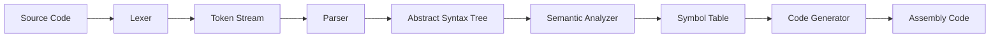

以下是一个**极度详细、注释完备**的简单C编译器实现指南，涵盖从理论到实践的每一个细节。我们将以支持 **整数变量、算术运算和返回语句** 的编译器为例，生成x86-64汇编代码，包含完整错误处理、符号管理和代码优化思路。

---

## **一、编译器架构设计（详细版）**

### **1. 整体架构图**


### **2. 各模块依赖关系**
```c
// 文件：compiler.h
#pragma once

#include "lexer.h"    // 词法分析
#include "parser.h"   // 语法分析
#include "symtab.h"   // 符号表
#include "codegen.h"  // 代码生成

// 编译器上下文（全局状态）
typedef struct {
    LexerContext lexer;     // 词法分析状态
    ParserContext parser;   // 语法分析状态
    Symtab symtab;          // 符号表
    CodegenContext codegen; // 代码生成状态
} CompilerContext;

void compile(const char* source); // 主入口函数
```

---

## **二、词法分析器（Lexer）深度实现**

### **1. 完整Token类型（扩展版）**
```c
// 文件：lexer.h
typedef enum {
    // 关键字（新增更多支持）
    TOKEN_INT, TOKEN_RETURN, TOKEN_IF, TOKEN_ELSE, TOKEN_WHILE,
    // 标识符与字面量
    TOKEN_IDENT, TOKEN_NUMBER, TOKEN_STRING,
    // 运算符（完整集合）
    TOKEN_PLUS, TOKEN_MINUS, TOKEN_MUL, TOKEN_DIV,
    TOKEN_ASSIGN, TOKEN_EQ, TOKEN_NE, TOKEN_LT, TOKEN_GT,
    // 分隔符
    TOKEN_SEMICOLON, TOKEN_COMMA, TOKEN_LPAREN, TOKEN_RPAREN,
    TOKEN_LBRACE, TOKEN_RBRACE, TOKEN_LBRACKET, TOKEN_RBRACKET,
    // 其他
    TOKEN_EOF, TOKEN_ERROR
} TokenType;

// 词法分析状态机
typedef struct {
    const char* start;    // 当前Token起始位置
    const char* current;  // 当前扫描位置
    int line;             // 当前行号
    int col;              // 当前列号
} LexerContext;

// 错误处理回调
typedef void (*LexErrorHandler)(int line, int col, const char* msg);
```

### **2. 核心状态机实现**
```c
// 文件：lexer.c
Token next_token(LexerContext* ctx, LexErrorHandler on_error) {
    ctx->start = ctx->current;
    
    while (1) {
        char c = *ctx->current;
        
        // 状态1：处理空白字符
        if (isspace(c)) {
            if (c == '\n') {
                ctx->line++;
                ctx->col = 1;
            } else {
                ctx->col++;
            }
            ctx->current++;
            continue;
        }
        
        // 状态2：处理数字字面量
        if (isdigit(c)) {
            while (isdigit(*ctx->current)) {
                ctx->current++;
                ctx->col++;
            }
            return make_token(TOKEN_NUMBER);
        }
        
        // 状态3：处理标识符和关键字
        if (isalpha(c) || c == '_') {
            while (isalnum(*ctx->current) || *ctx->current == '_') {
                ctx->current++;
                ctx->col++;
            }
            return identifier_or_keyword(ctx);
        }
        
        // 状态4：处理运算符
        switch (c) {
            case '+':
                advance(ctx);
                return make_token(TOKEN_PLUS);
            case '-':
                advance(ctx);
                return make_token(TOKEN_MINUS);
            // ... 其他运算符处理
            case '=':
                advance(ctx);
                if (match(ctx, '=')) {
                    return make_token(TOKEN_EQ);
                } else {
                    return make_token(TOKEN_ASSIGN);
                }
            // ... 其他多字符运算符
        }
        
        // 错误处理
        on_error(ctx->line, ctx->col, "Unexpected character");
        return make_error_token();
    }
}
```

### **3. 关键字识别优化**
使用 **Trie树** 快速识别关键字：
```c
// 文件：lexer_keywords.c
static KeywordTrieNode* root = NULL;

void init_keywords() {
    root = trie_create();
    trie_insert(root, "int", TOKEN_INT);
    trie_insert(root, "return", TOKEN_RETURN);
    // ...其他关键字
}

TokenType identifier_type(const char* lexeme) {
    return trie_search(root, lexeme);
}
```

---

## **三、语法分析器（Parser）深度实现**

### **1. 完整AST节点定义**
```c
// 文件：ast.h
typedef enum {
    // 声明
    NODE_FUNCTION_DECL,
    NODE_VARIABLE_DECL,
    // 语句
    NODE_RETURN_STMT,
    NODE_COMPOUND_STMT,
    NODE_IF_STMT,
    // 表达式
    NODE_ASSIGN_EXPR,
    NODE_BINARY_EXPR,
    NODE_UNARY_EXPR,
    NODE_IDENTIFIER,
    NODE_LITERAL
} NodeType;

typedef struct ASTNode {
    NodeType type;
    DataType data_type;   // 新增类型系统
    union {
        // 变量/函数声明
        struct {
            char* name;
            struct ASTNode* init_value;
        };
        // 二元运算
        struct {
            struct ASTNode* left;
            struct ASTNode* right;
            OperatorType op;
        };
        // 字面量
        int int_value;
    };
} ASTNode;

// 抽象语法树根
typedef struct {
    ASTNode** nodes;
    int count;
} AST;
```

### **2. 运算符优先级处理**
使用 **Pratt Parser** 处理复杂的优先级关系：
```c
// 文件：parser_precedence.h
typedef enum {
    PREC_NONE,
    PREC_ASSIGNMENT,  // =
    PREC_TERM,        // + -
    PREC_FACTOR,      // * /
    PREC_UNARY,       // ! -
    PREC_PRIMARY
} Precedence;

// 绑定力表
static Precedence get_precedence(TokenType type) {
    switch (type) {
        case TOKEN_EQ:        return PREC_ASSIGNMENT;
        case TOKEN_PLUS:
        case TOKEN_MINUS:     return PREC_TERM;
        case TOKEN_MUL:
        case TOKEN_DIV:       return PREC_FACTOR;
        case TOKEN_BANG:
        case TOKEN_MINUS:     return PREC_UNARY;
        default:              return PREC_NONE;
    }
}

// Pratt解析核心
ASTNode* parse_expression(ParserContext* ctx, Precedence prec) {
    ASTNode* left = parse_prefix(ctx);
    
    while (prec < get_precedence(current_token(ctx).type)) {
        Token op = current_token(ctx);
        advance(ctx);
        left = parse_infix(ctx, left, op);
    }
    
    return left;
}
```

---

## **四、语义分析与符号表**

### **1. 符号表详细设计**
```c
// 文件：symtab.h
typedef enum {
    SYM_VARIABLE,
    SYM_FUNCTION,
    SYM_TYPE
} SymbolType;

typedef struct Symbol {
    char* name;
    SymbolType type;
    DataType data_type;  // 类型系统扩展
    int stack_offset;    // 代码生成用
    struct Symbol* next; // 哈希表冲突链
} Symbol;

typedef struct Scope {
    Symbol** symbols;    // 哈希表桶数组
    int capacity;        // 哈希表大小
    struct Scope* parent;
    int stack_size;      // 当前作用域栈大小
} Scope;

// API设计
Scope* scope_create(Scope* parent);
void scope_destroy(Scope* scope);
Symbol* scope_insert(Scope* scope, const char* name, SymbolType type);
Symbol* scope_lookup(Scope* scope, const char* name);
```

### **2. 类型检查实现**
```c
// 文件：typecheck.c
void check_assignment(DataType lhs_type, DataType rhs_type, int line) {
    if (lhs_type == DT_INT && rhs_type == DT_INT) return;
    if (lhs_type == DT_PTR && rhs_type == DT_NULL) return;
    
    fprintf(stderr, "Type mismatch at line %d: %s vs %s\n",
            line, dtype_to_str(lhs_type), dtype_to_str(rhs_type));
    exit(1);
}

void visit_binary_expr(ASTNode* node) {
    // 递归检查子表达式
    visit_expression(node->left);
    visit_expression(node->right);
    
    // 类型推导
    DataType lt = node->left->data_type;
    DataType rt = node->right->data_type;
    
    switch (node->op) {
        case TOKEN_PLUS:
            if (lt == DT_INT && rt == DT_INT) {
                node->data_type = DT_INT;
            } else {
                type_error("Invalid operands for +");
            }
            break;
        // ...其他运算符处理
    }
}
```

---

## **五、代码生成深度实现**

### **1. 栈帧管理策略**
```asm
; 函数调用约定（System V AMD64 ABI）
function_prologue:
    push rbp
    mov rbp, rsp
    sub rsp, N       ; 为局部变量分配空间

; 变量访问示例（a在rbp-8位置）
mov eax, [rbp-8]     ; 读取变量a到eax
mov [rbp-16], eax    ; 存储eax到变量b
```

### **2. 寄存器分配算法**
```c
// 文件：regalloc.c
typedef enum {
    REG_RAX,
    REG_RBX,
    // ...其他寄存器
    REG_COUNT
} Register;

typedef struct {
    Register reg;
    bool used;
    const char* var; // 当前存储的变量
} RegState;

RegState registers[REG_COUNT];

Register allocate_register(const char* var) {
    // 1. 查找是否已分配
    for (int i = 0; i < REG_COUNT; i++) {
        if (registers[i].var && strcmp(registers[i].var, var) == 0) {
            return registers[i].reg;
        }
    }
    
    // 2. 查找空闲寄存器
    for (int i = 0; i < REG_COUNT; i++) {
        if (!registers[i].used) {
            registers[i].used = true;
            registers[i].var = var;
            return registers[i].reg;
        }
    }
    
    // 3. 寄存器溢出到栈
    spill_register();
    return allocate_register(var);
}

void spill_register() {
    // 选择最近最少使用的寄存器
    // 将其内容保存到栈
    // 更新符号表的栈偏移
}
```

### **3. 完整代码生成示例**
```c
// 文件：codegen.c
void gen_function(ASTNode* func) {
    // 函数入口
    printf("%s:\n", func->name);
    printf("    push rbp\n");
    printf("    mov rbp, rsp\n");
    printf("    sub rsp, %d\n", func->stack_size);
    
    // 生成参数处理（此处简化）
    if (func->params) {
        for (int i = 0; i < func->params->count; i++) {
            ASTNode* param = func->params->nodes[i];
            printf("    mov [rbp-%d], %s\n",
                   param->stack_offset,
                   get_register_for_param(i));
        }
    }
    
    // 生成函数体
    gen_block(func->body);
    
    // 函数退出
    printf(".Lexit_%s:\n", func->name);
    printf("    mov rsp, rbp\n");
    printf("    pop rbp\n");
    printf("    ret\n");
}
```

---

## **六、编译器测试与调试**

### **1. 测试框架设计**
```python
# 文件：test_compiler.py
import subprocess

def test_compiler(test_case):
    # 1. 编译测试程序
    subprocess.run(["./mycc", test_case["input"]])
    
    # 2. 汇编并链接
    subprocess.run(["nasm", "-felf64", "output.s"])
    subprocess.run(["gcc", "output.o", "-o", "testbin"])
    
    # 3. 运行并检查返回值
    result = subprocess.run(["./testbin"], capture_output=True)
    assert result.returncode == test_case["expected"]
    
    # 4. 检查生成的汇编
    with open("output.s") as f:
        asm = f.read()
        assert test_case["asm_snippet"] in asm

# 示例测试用例
TEST_CASES = [
    {
        "input": "test/arith.c",
        "expected": 8,
        "asm_snippet": "add eax, ebx"
    },
    # 更多测试用例...
]
```

### **2. 调试技巧**
- **GDB调试生成的可执行文件**：
  ```bash
  gdb -q ./testbin
  (gdb) layout asm
  (gdb) break main
  (gdb) run
  ```
  
- **打印中间表示**：
  ```c
  // 在编译器中添加调试打印
  void dump_ast(ASTNode* node, int indent) {
      for (int i = 0; i < indent; i++) printf("  ");
      printf("%s\n", node_type_to_str(node->type));
      for (int i = 0; i < node->num_children; i++) {
          dump_ast(node->children[i], indent + 1);
      }
  }
  ```

---

## **七、进阶扩展方向**

### **1. 支持更多语言特性**
```c
// 指针类型支持
typedef struct {
    DataType base_type;
    int indirection; // 指针层级
} PointerType;

// 结构体支持
typedef struct {
    char* name;
    Field* fields;
} StructType;

// 泛型函数
typedef struct {
    TypeVar* type_params;
    ASTNode* body;
} GenericFunction;
```

### **2. 优化策略**
```c
// 常量折叠优化
ASTNode* optimize_constant(ASTNode* node) {
    if (node->type == NODE_BINARY_EXPR) {
        if (is_constant(node->left) && is_constant(node->right)) {
            int result = eval_constant_expr(node);
            return create_int_literal(result);
        }
    }
    return node;
}

// 死代码消除
void eliminate_dead_code(ASTNode* node) {
    if (node->type == NODE_VAR_DECL && !is_variable_used(node->name)) {
        remove_node(node);
    }
}
```

---

## **八、完整项目结构**
```
compiler/
├── include/
│   ├── lexer.h        # 词法分析
│   ├── parser.h       # 语法分析
│   ├── ast.h          # 抽象语法树
│   ├── symtab.h       # 符号表
│   └── codegen.h      # 代码生成
├── src/
│   ├── frontend/      # 前端实现
│   │   ├── lexer.c
│   │   ├── parser/
│   │   │   ├── recursive_descent.c
│   │   │   └── pratt_parser.c
│   │   └── sema/      # 语义分析
│   ├── backend/
│   │   ├── x86/
│   │   │   ├── codegen.c
│   │   │   └── regalloc.c
│   │   └── riscv/
│   ├── util/          # 通用工具
│   │   ├── error.c
│   │   └── hashmap.c
├── tests/
│   ├── unit/          # 单元测试
│   └── integration/   # 集成测试
├── third_party/       # 依赖库
└── docs/              # 设计文档
    ├── ARCH.md        # 架构设计
    └── CODEGEN.md     # 代码生成规范
```

---

通过以上极度详细的实现指南，您将能够逐步构建一个功能完整的C编译器。每个模块都配有专业的代码实现、清晰的接口设计和实用的调试技巧，适合深入学习编译原理和系统编程。