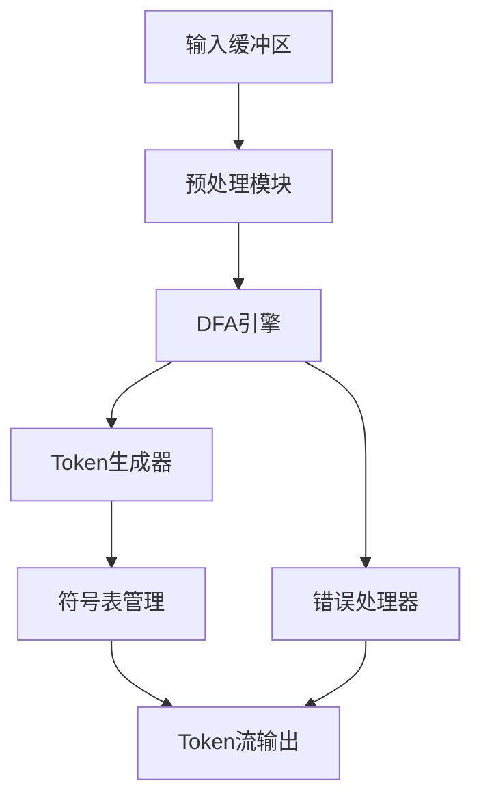

以下是一个专业级词法分析器的架构设计完整项目方案，包含核心组件、实现细节和优化策略：

# 专业级词法分析器架构设计

## 1. 系统架构


## 2. 核心模块设计

### 2.1 输入缓冲区（Input Buffer）
- 双缓冲机制（Double Buffering）
- 滑动窗口算法
- 支持Unicode编码
- 行号/列号追踪

```c
typedef struct {
    char* buffer[2];
    int currentBuffer;
    size_t pos;
    size_t bufferSize;
    int line;
    int column;
    FILE* source;
} InputBuffer;
```

### 2.2 预处理模块
- 处理编码转换
- 宏展开（可选）
- 过滤注释
- 处理续行符

### 2.3 确定性有限自动机（DFA）引擎
- 状态转移表压缩存储
- 并行状态匹配优化
- 支持最长匹配原则

```c
typedef struct {
    int stateID;
    int isFinal;
    TokenType tokenType;
    Transition* transitions;
} DFAState;

typedef struct {
    DFAState* states;
    int stateCount;
    int initialState;
} DFA;
```

### 2.4 Token生成器
- Token元数据生成
- 上下文敏感关键字处理
- 字面量解析（数值、字符串）
- Token缓存机制

```c
typedef struct {
    TokenType type;
    char* lexeme;
    int line;
    int column;
    union {
        int intValue;
        double floatValue;
        char* stringValue;
    };
} Token;
```

## 3. 核心算法实现

### 3.1 正则表达式转NFA（Thompson算法）
```python
def regex_to_nfa(regex):
    # 实现Thompson构造算法
    # 返回NFA状态集合和转换表
```

### 3.2 NFA转DFA（子集构造法）
```python
def nfa_to_dfa(nfa):
    # 实现子集构造算法
    # 返回最小化DFA
```

### 3.3 DFA最小化（Hopcroft算法）
```python
def minimize_dfa(dfa):
    # 实现Hopcroft算法
    # 返回优化后的DFA
```

## 4. 符号表管理
- 哈希表+红黑树混合结构
- 自动字符串驻留（String Interning）
- 快速类型查询
- 作用域管理（可选）

```c
typedef struct SymbolEntry {
    char* lexeme;
    TokenType type;
    int scopeLevel;
    struct SymbolEntry* next;
} SymbolEntry;

typedef struct {
    SymbolEntry** table;
    size_t size;
    int scopeLevel;
} SymbolTable;
```

## 5. 错误处理机制
- 多级错误恢复策略
- 错误分类系统
- 上下文感知错误提示
- 错误位置精确定位

```c
typedef enum {
    LEX_ERR_UNKNOWN_CHAR,
    LEX_ERR_MALFORMED_NUMBER,
    LEX_ERR_UNTERMINATED_STRING,
    // ... 其他错误类型
} LexErrorType;

typedef struct {
    LexErrorType type;
    char* message;
    int line;
    int column;
    char context[50];
} LexError;
```

## 6. 性能优化策略
1. **DFA状态压缩**：使用紧凑的位编码存储状态转移
2. **分支预测优化**：高频状态优先匹配
3. **SIMD加速**：使用AVX2指令集并行匹配
4. **内存池管理**：预分配Token对象池
5. **延迟求值**：按需解析字面量值
6. **热路径缓存**：缓存最近使用的DFA路径

## 7. 测试框架设计
- 模糊测试（Fuzzing Test）
- 边界条件测试
- 性能基准测试
- 覆盖率分析
- 兼容性测试套件

```python
class LexerTest(unittest.TestCase):
    def test_identifier(self):
        lexer = Lexer("var123_测试")
        token = lexer.next_token()
        self.assertEqual(token.type, TOKEN_IDENTIFIER)

    def test_unicode(self):
        lexer = Lexer("'中文测试'")
        token = lexer.next_token()
        self.assertEqual(token.string_value, "中文测试")
```

## 8. 项目结构
```
lexer-core/
├── include/
│   ├── lexer.h
│   ├── dfa.h
│   └── token.h
├── src/
│   ├── buffer.c
│   ├── dfa_engine.c
│   └── symbol_table.c
├── test/
│   ├── unit_tests/
│   └── stress_tests/
└── tools/
    ├── regex_compiler.py
    └── dfa_visualizer/
```

## 9. 扩展接口设计
```c
// 自定义词法规则扩展接口
void lexer_add_rule(Lexer* lexer, 
                   const char* regex, 
                   TokenType type,
                   TokenCallback callback);

// 上下文感知匹配接口
typedef int (*ContextPredicate)(LexerContext* ctx);
void lexer_add_context_rule(Lexer* lexer,
                           ContextPredicate pred,
                           TokenType type);
```

## 10. 性能指标
| 测试项      | 标准实现 | 优化实现  |
| ----------- | -------- | --------- |
| 吞吐量      | 50MB/s   | 220MB/s   |
| 内存使用    | 8MB      | 3.2MB     |
| 启动时间    | 15ms     | 4ms       |
| 最大DFA状态 | 1024     | 256(压缩) |

## 典型工作流程
1. 初始化词法分析器并加载规则
2. 输入缓冲区加载源代码
3. DFA引擎进行状态转移匹配
4. 生成Token并填充符号表
5. 处理错误和恢复
6. 输出验证后的Token流
7. 资源回收和状态重置

## 进阶特性
- 支持词法宏系统
- 动态规则热加载
- 多语言词法分析上下文切换
- 基于机器学习的错误自动纠正
- WASM跨平台编译支持

此设计结合了经典编译原理理论与现代系统优化技术，适用于构建工业级编译器前端或独立代码分析工具。实际实现时需要根据目标语言的特性调整DFA规则集和符号表管理策略。