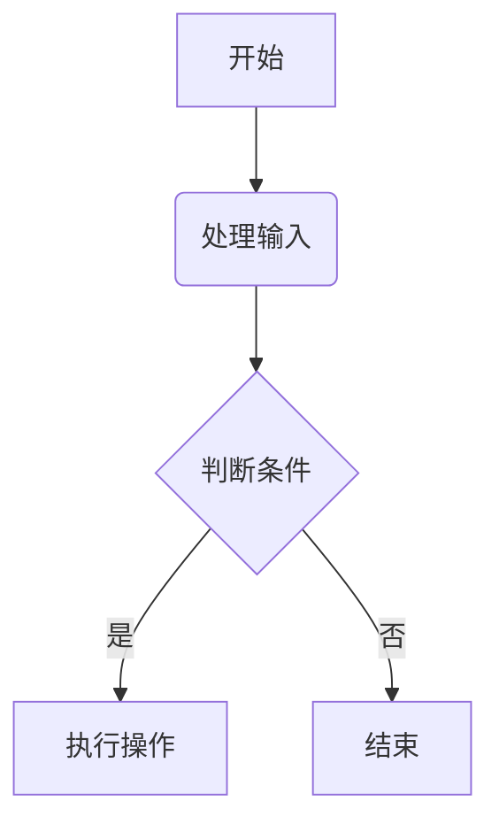

## 如何写出规范层次清晰的 Markdown 文档

Markdown 是一种轻量级的标记语言，广泛用于编写技术文档、博客文章、README 文件等，因其简洁的语法和跨平台兼容性已成为事实标准。它的简洁语法使得文档易于阅读和编写，但要写出层次清晰、结构明了的 Markdown 文档，仍然需要一些技巧和规范。本文将介绍如何通过合理的结构、清晰的标题、适当的格式化和工具辅助，写出高质量的 Markdown 文档。

---

### **一、明确文档的目标与受众**

在开始编写 Markdown 文档之前，首先要明确文档的目标和受众。不同的目标和受众决定了文档的内容深度、语言风格以及结构安排。

- **目标**：是介绍某个工具的使用方法？还是记录项目的开发过程？或者是撰写一篇教程？
- **受众**：是面向技术人员？还是面向非技术背景的用户？

明确了这些之后，你才能更好地组织内容，确保文档的层次符合受众的需求。

---

### **二、使用清晰的标题结构**

标题是文档的骨架，合理的标题结构能够帮助读者快速理解文档的层次和内容。Markdown 的标题通过 `#` 来定义，支持六级标题（`#` 到 `######`），通常建议使用 H1-H3 级标题来组织文档，最多推荐使用到H4层级。

#### **2.1 一级标题（`#`）**

一级标题通常用于文档的主标题，表示文档的核心主题。每个文档通常只有一个一级标题。

```text
# 主标题
```

#### **2.2 二级标题（`##`）**

二级标题用于划分文档的主要部分。每个主要部分可以包含多个子部分。

```text
## 章节标题
```

#### **2.3 三级标题（`###`）**

三级标题用于进一步细分二级标题下的内容。

```text
### 小节标题
```

#### **2.4 四级标题（`####`）**

四级标题用于进一步细分三级标题下的内容。

```text
#### 细分小节标题（尽量少用）
```

#### **2.5 黄金法则**

**使用一致的标题层级**：避免跳过某些层级。例如，不要直接从一级标题跳到三级标题，这样会让文档结构显得混乱。

**避免过多的层级嵌套**：通常情况下，建议文档的标题层级不要超过四级，过多的层级会让文档显得过于复杂，难以阅读。

**标题应简短且具有描述性**：标题应该简短、明确，并能够概括该部分内容的核心信息。避免使用模糊的标题，如“其他”、“杂项”等。

```text
# 如何安装软件
## 安装前的准备工作
## 安装步骤
## 常见问题及解决方法
```

---

### **三、合理使用段落和换行**

Markdown 中的段落通过空行分隔，换行则通过在行尾添加两个空格或使用 `<br>` 标签实现。

#### **3.1 段落分隔**

段落之间使用空行分隔，确保每个段落的内容独立且清晰。

```text
这是第一段。

这是第二段。
```

#### **3.2 换行**

在需要换行的地方，使用两个空格或 `<br>` 标签。

```text
这是第一行。  
这是第二行。
```

#### **3.3 文字混合规范**

在撰写文档时，尤其是技术文档、学术论文或正式的商业文档，中文、英文和符号的使用规范非常重要。以下是一些常见的规范和建议，帮助你确保文档的专业性和可读性。

```text
- 中文与英文之间应留有空格：为了提高可读性，中文与英文单词之间通常需要留一个空格。

- 中文与数字之间通常不需要空格，除非数字是英文单位的一部分。

- 英文单词后的标点符号应使用英文标点，且标点符号前通常不留空格，后通常留一个空格（逗号、句号等）。

- 中文句子中的标点符号应使用全角符号，且标点符号前后通常不留空格，如逗号（，）、句号（。）等。

- 中文中数字与单位之间通常不加空格，英文中数字与单位之间通常加空格（某些特定单位除外，如角度符号°）。

- 数学符号，在文档中使用数学符号时，且标点符号前后通常留一个空格，确保符号清晰且符合上下文。

- 正式场合使用大写数字：在正式文档中，金额、日期等通常使用大写数字（壹、贰、叁等）以避免篡改，非正式场合使用阿拉伯数字：日常文档中，通常使用阿拉伯数字（1, 2, 3 等）。

- 英文标题通常使用首字母大写（Title Case）或全部大写（UPPERCASE），正文中英文单词通常使用首字母大写（专有名词、句首等），其余部分小写。
```

#### **3.4 黄金法则**

| 要素     | 规范说明                 | 示例                                    |
| -------- | ------------------------ | --------------------------------------- |
| 主题集中 | 每段只表达一个核心观点   | API调用需鉴权，每段只描述一个观点       |
| 长度控制 | ≤4行（移动端友好）       | 超过7行必须拆分段落                     |
| 段落间距 | 段间空一行，段首不空格   | 段落A↩ ↩ 段落B                          |
| 语气要求 | 陈述句优先，避免感叹语气 | 错误：切记不能这样做！ 正确：禁止该操作 |

---

### **四、使用列表**

列表是 Markdown 文档中常用的元素，能够有效提升文档的可读性。使用列表来组织信息，可以帮助你将复杂的信息分解为更小的部分，使文档更具条理性，Markdown 支持无序列表（`-` 或 `*`）和有序列表（数字加点）。

#### **4.1 无序列表**

无序列表使用 `-`、`*` 或 `+` 表示，适用于列举项目。

```text
- 项目一
- 项目二
- 项目三
```

#### **4.2 有序列表**

有序列表使用数字加点表示，适用于有顺序的项目。

```text
1. 第一步
2. 第二步
3. 第三步
```

#### **4.3 最佳实践**

**有序列表最佳实践：**

```text
1. 主要步骤
   1.1 子步骤说明
   1.2 使用缩进保持层级
   
2. 注意事项
   - 混合无序列表
   - [ ] 任务列表增强交互性
```

**无序列表增强方案：**

```text
主条目
- 二级条目（符号交替增强识别）
  - 三级条目
```

**列表使用原则：**

- **并列内容**：优先使用-或*无序列表
- **操作步骤**：必须使用1. 2. 3.有序列表
- **嵌套限制**：最多两级列表（避免三层嵌套）

```text
### 错误结构（过度嵌套） 
#### 4.1.1 功能特性 
##### A. 实时计算 
##### B. 批量处理 

### 正确结构（扁平化处理） 
### 4.1 功能特性 
**（1）实时计算**：支持流式数据处理...   
**（2）批量处理**：每日定时执行任务...
```

---

### **五、使用代码块**

使用代码块展示代码或命令 Markdown 中的代码块可以通过三个反引号（```）来定义，并可以指定语言以实现语法高亮。表格和引用能够帮助更好地组织和展示信息。

#### **5.1 代码块**

代码块用于展示代码片段，使用三个反引号（```）包裹代码。

~~~python
def hello_world():
    print("Hello, World!")

```python
def hello_world():
    print("Hello, World!")
```
~~~

#### **5.2 表格**

表格使用 `|` 和 `-` 来定义表头和分隔线。

| 列1   | 列2   | 列3   |
| ----- | ----- | ----- |
| 数据1 | 数据2 | 数据3 |

```text
| 列1 | 列2 | 列3 |
| --- | --- | --- |
| 数据1 | 数据2 | 数据3 |
```

#### **5.3 引用**

引用使用 `>` 表示，适用于引用他人的话或强调某段内容。

> 这是引用的内容。

```text
> 这是引用的内容。
```

#### **5.4 最佳实践**

**代码块最佳实践：**

~~~text
# 正确示例（指定语言类型）
```python
def hello_world():
    print("Hello, World!")
```
# 错误示例（无语言标识）
```
def hello_world():
    print("Hello, World!")
```

# 高级技巧：
- 使用`diff`语法显示变更
- 添加代码说明注释
- 超长代码需拆分段落
~~~

**引用块最佳实践：**

```text
> 标准引用（适用于常规说明）

> **NOTE**  
> 提示类信息使用加粗标签

> **WARNING**  
> 警告信息建议空行分隔
```

**表格最佳实践：**

| 参数        | 类型   | 必填 | 说明                |
| ----------- | ------ | ---- | ------------------- |
| user_id     | string | 是   | 用户唯一标识        |
| max_retries | int    | 否   | 默认3次（范围1-10） |

```text
| 参数        | 类型   | 必填 | 说明                 |
|-------------|--------|------|----------------------|
| `user_id`   | string | 是   | 用户唯一标识         |
| max_retries | int    | 否   | 默认3次（范围1-10）  |

# 排版要点：
- 使用管道符对齐工具
- 关键字段用反引号包裹
- 数值范围用括号说明
```

---

### **六、使用链接和图片**

链接和图片能够丰富文档内容，提升文档的视觉效果。Markdown 中的链接可以通过方括号和圆括号来定义，链接文字放在方括号中，链接地址放在圆括号中。图片的插入方式与链接类似，只是在前面加上一个感叹号。

#### **6.1 链接**

链接使用 `[文本](URL)` 格式。

```text
[Google](https://www.google.com)
```

#### **6.2 图片**

图片使用 `` 格式。

```text

```

#### **6.3 图文混排规范**

图1：架构示意图（标注宽度和对齐方式)

```text
{: width="60%" align=right }
*图1：架构示意图（标注宽度和对齐方式）*
```

#### **6.4 最佳实践**

- 图片下方必须添加说明
- 控制图片宽度在60%-80%
- 复杂图示建议使用 Mermaid 语法

---

### **七、文档工程化方案**

#### **7.1 TOC（目录）提升导航体验**

对于较长的文档，建议在开头添加一个目录（Table of Contents），帮助读者快速定位到感兴趣的部分。虽然 Markdown 本身不支持自动生成 TOC，但许多 Markdown 编辑器（如 Typora、VS Code 插件等）都支持自动生成目录。

```text
## 目录
- [章节1](#章节1)
- [章节2](#章节2)
- [章节3](#章节3)

<!-- TOC -->
- [一、前言](#一前言)
- [二、层级架构设计原则](#二层级架构设计原则)
  - [2.1 标题分级系统](#21-标题分级系统)
  - [2.2 列表结构优化](#22-列表结构优化)
<!-- /TOC -->
```

#### **7.2 专业级文档模板**

```text
# 文档标题

[TOC] <!-- 自动生成目录 -->

## 概述
- 编写目的
- 目标读者
- 文档版本

## 功能描述
### 核心特性
### 系统架构

## 环境要求
### 硬件环境
### 软件环境

## 使用指南
### 安装步骤
1. 基础安装
   pip install package-name
2. 配置验证
   pkg-name verify

## API参考
| 端点 | 方法 | 参数 |
|---|---|---|
| `/users` | GET | `page=int` |

## 常见问题
## 附录

<!-- /TOC -->

> **NOTE**  
> 本文档持续更新，最新版本请访问[文档中心](url)
```

#### **7.3 模块化写作**

模块化写作 是一种将文档内容分解为独立、可复用的模块（或组件）的写作方法。每个模块专注于一个特定的主题或功能，并可以独立编写、维护和组合，从而提升文档的灵活性、一致性和可维护性。这种方法特别适用于大型项目或需要频繁更新的文档，例如技术文档、用户手册、API 文档等。

**使用 Markdown 文件分割模块**：

- 将文档的不同部分保存为单独的 Markdown 文件，每个模块可以作为一个单独的文件提交，方便追踪变更历史。例如

```text
/docs
├── header.md        # 文档头部模板
├── installation.md  # 安装指南
├── api-reference.md # API 参考
└── footer.md        # 文档尾部模板
```

- 在主文档中通过工具引用这些模块。例如

```text
<!-- 主文档 -->
[//]: # (引入头部模板)
{{ include "header.md" }}

## 安装指南
{{ include "installation.md" }}

## API 参考
{{ include "api-reference.md" }}

[//]: # (引入尾部模板)
{{ include "footer.md" }}
```

**使用工具支持模块化**：

- 静态站点生成器（如 Docusaurus、Hugo、Jekyll）通常支持模块化写作。例如 Hugo 使用短代码（Shortcodes）嵌入模块化内容。
- Markdown 扩展工具（如 `markdown-it` 或 `remark` 插件）可以实现 `include` 功能。

**示例：模块化写作的实际应用**

假设你正在编写一个项目的文档，可以按照以下方式模块化：

- 创建模块文件：每个模块可以作为一个单独的文件

```text
<!-- components/header.md -->
[//]: # (文档头部模板)

# 项目名称
**版本**：v2.1.0  
**最后更新**：2023-08-20

---

<!-- components/installation.md -->
## 安装指南

1. 下载最新版本的软件包。
2. 解压并运行安装程序。
3. 配置环境变量。

---

<!-- components/footer.md -->
[//]: # (文档尾部模板)

> Copyright © 2023 Your Company. All rights reserved.
```

- 组合模块：在主文档中引用这些模块

```text
<!-- README.md -->
{{ include "components/header.md" }}

{{ include "components/installation.md" }}

{{ include "components/footer.md" }}
```

- 渲染结果：最终生成的文档会包含所有模块的内容

```text
# 项目名
**版本**：v2.1.0  
**最后更新**：2023-08-20

---

## 安装指南

1. 下载最新版本的软件包。
2. 解压并运行安装程序。
3. 配置环境变量。

---

> Copyright © 2023 Your Company. All rights reserved.
```

**模块化写作的工具推荐:**

- Docusaurus：专为技术文档设计，支持模块化写作和多语言文档。
- Hugo：静态站点生成器，支持短代码和模块化内容。
- MkDocs：简单易用的文档生成工具，支持 Markdown 和插件扩展。
- GitBook：提供模块化文档管理和在线协作功能。
- Include 插件：如果使用纯 Markdown，可以通过插件（如 `markdown-it-include`）实现模块化。

#### **7.4 脚注与版本控制集成**

在 Markdown 文档中添加版本历史记录表是一种常见的做法，用于记录文档的更新内容、作者和日期。这是 Markdown 中的脚注（Footnote）语法。脚注通常用于在文档中添加额外的注释或参考资料，而不会打断正文的阅读流。

[1] 2023-12-01 新增API说明

[2] 2024-03-15 更新错误代码表

```text
[^1]: 2023-12-01 新增API说明
[^2]: 2024-03-15 更新错误代码表
```

#### **7.5 排版美化技巧**

**强调与分割:**

```text
**重点内容** 使用粗体  
*补充说明* 使用斜体  
~~已废弃内容~~ 使用删除线

---

分隔线上下需要空行
```

**注释批注:**

```text
> **注意**：需要特别注意的操作步骤  
> **警告**：存在数据丢失风险的操作
```

**颜色标注:**

```text
<span style="color:red">紧急事项</span>
<span style="color:#008000">成功状态</span>
```

#### **7.6 扩展功能应用**

**Mermaid流程图:**

~~~text

~~~

**数学公式:**

$$
f(x) = \int_{-\infty}^\infty \hat f(\xi)\,e^{2 \pi i \xi x} \,d\xi
$$

```text
$$
f(x) = \int_{-\infty}^\infty \hat f(\xi)\,e^{2 \pi i \xi x} \,d\xi
$$
```

**自定义锚点:**

返回顶部

```text
[返回顶部](#文档标题)
```

#### **7.7 最佳实践**

**避免过度装饰：**Markdown 的优势在于简洁，因此不建议过多使用复杂的格式（如粗体、斜体、下划线等）。适度使用这些格式可以突出重点，但过度使用会分散读者注意力。

```text
**重要提示**：请确保在安装前备份数据。
```

**保持格式一致性:** 在整个文档中，保持格式的一致性非常重要。例如，标题层级结构正确，所有的标题都应使用相同的样式，所有的代码块都应使用相同的缩进等。

---

### **八、使用工具辅助**

编写 Markdown 文档时，使用合适的工具可以大大提高效率和质量。

#### **8.1 Markdown 编辑器**

使用支持实时预览的 Markdown 编辑器，如 Typora、VS Code 等，能够实时查看文档效果。

#### **8.2 格式化工具**

使用格式化工具如 Prettier、Vale、 Markdownlint 来自动格式化 Markdown 文档，确保文档风格一致。

- Prettier：自动化格式优化，是一个流行的代码格式化工具，旨在通过自动化的格式优化来提升代码的可读性和一致性。它支持多种编程语言（如 JavaScript、TypeScript、HTML、CSS、JSON 等），并且可以与大多数现代编辑器和构建工具集成。
- Vale： 是一个强大的工具，用于自动化检查文档的写作风格和语法问题。它可以与 Markdown 文件无缝集成，并根据预定义的规则集（如 Google、Microsoft 的写作风格指南）进行检查。
- Markdownlint：格式检查工具，是一款具有明确规则库的静态语法分析工具，旨在保证 Markdown 文档语法的标准和一致性，它规定了许多 Markdown 规则并实时对文档进行检查，防止一些语法错误，维持文档风格的统一，使用此工具有助于形成一个良好的写作习惯和规范。
- Mermaid Live Editor：是一个在线工具，用于实时编辑和预览 Mermaid 图表。Mermaid 是一种基于文本的图表描述语言，允许用户通过简单的语法生成复杂的图表（如流程图、序列图、甘特图等）。Mermaid Live Editor 的核心功能之一是 **语法校验**，它可以帮助用户快速发现并修复图表代码中的语法错误。

#### **8.3 自动生成目录**

使用 doctoc 或 VS Code 的 Markdown All in One 插件自动生成 [TOC] 目录。

#### **8.4 样式补充（CSS 扩展）**

Markdown 允许你在文档中嵌入 HTML，因此你可以直接在 Markdown 文件中插入 HTML 标签和 `<style>` 块来定义样式，当你使用支持 HTML 嵌入的 Markdown 渲染器（如 GitHub Pages、Jekyll 等）时，这种写法会生效。

```text
<style>
/* 中文首行缩进 */
p { text-indent: 2em; }  
/* 图片居中 */
img { display: block; margin: 0 auto; }
</style>
```

---

### **九、总结**

写出层次清晰、结构明了的 Markdown 文档，关键在于合理使用标题、段落、列表、代码块等元素，并通过工具辅助提升文档质量。遵循以上建议，你将能够编写出易于阅读和维护的 Markdown 文档。通过以上步骤和技巧，你可以轻松编写出层次清晰、结构明了的 Markdown 文档。无论是技术文档、博客文章还是项目说明，清晰的文档结构都能帮助读者更好地理解内容。
