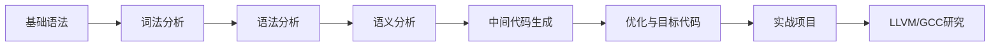

# C语言编译器学习大纲

---

## **一、基础概念与背景**
### 1. 编译器的作用与分类
   - **定义**：编译器的作用（源代码→目标代码）
   - **分类**：
     - 解释器 vs 编译器
     - 单趟编译器 vs 多趟编译器
     - 交叉编译器（如`arm-none-eabi-gcc`编译嵌入式程序）
   - **典型编译器链**：预处理器→编译器→汇编器→链接器

### 2. 编译流程的七个阶段
   - **流程图**：
     
     ```
     词法分析 → 语法分析 → 语义分析 → 中间代码生成 → 代码优化 → 目标代码生成 → 链接
     ```
   - **示例**：
     
     ```c
     // 输入代码
     int a = 10 + 5 * 2;
     // 词法分析后：INT, ID(a), EQ, NUM(10), PLUS, NUM(5), MULT, NUM(2)
     ```

### 3. C语言标准与编译器实现
   - **ANSI C (C89/C90)** vs **C99** vs **C11** vs **C17**
   - **编译器差异**：
     - GCC的`-std=c11`选项
     - MSVC对C99支持的限制（如变长数组）

---

## **二、词法分析（Lexical Analysis）**
### 1. 正则表达式与词法单元（Token）
   - **实践工具**：Lex/Flex
   - **案例**：编写`.l`文件识别C语言基础语法
     ```lex
     %%
     "int"   { return INT; }
     [0-9]+  { yylval = atoi(yytext); return NUMBER; }
     "+"     { return PLUS; }
     ```

### 2. 手写词法分析器
   - **状态机实现**：
     ```c
     typedef enum { START, IN_NUM, IN_ID } State;
     State current_state = START;
     while ((c = getchar()) != EOF) {
         switch(current_state) {
             case START:
                 if (isdigit(c)) current_state = IN_NUM;
                 ...
         }
     }
     ```

### 3. 常见问题与调试
   - **边界情况**：`0x1F`（十六进制数）、`123UL`（后缀）
   - **错误处理**：未闭合的字符串（`"Hello`）

---

## **三、语法分析（Syntax Analysis）**
### 1. 上下文无关文法（CFG）
   - **BNF表示法**：
     ```
     <expression> ::= <term> | <expression> "+" <term>
     <term>       ::= <factor> | <term> "*" <factor>
     <factor>     ::= NUMBER | "(" <expression> ")"
     ```

### 2. 自顶向下 vs 自底向上分析
   - **递归下降分析器**：
     ```c
     void parse_expression() {
         parse_term();
         while (lookahead == '+') {
             match('+');
             parse_term();
             // 生成中间代码：ADD
         }
     }
     ```
   - **工具实践**：Yacc/Bison
     ```bison
     %token INT NUMBER PLUS
     %%
     expression: term | expression PLUS term;
     ```

### 3. 语法错误恢复
   - **恐慌模式恢复**：跳过到下一个分号
   - **案例**：缺失分号的错误提示
     ```
     error: expected ';' before 'return'
     ```

---

## **四、语义分析与中间代码**
### 1. 符号表管理
   - **数据结构设计**：
     ```c
     typedef struct Symbol {
         char *name;
         int type;    // INT, FLOAT, etc.
         int scope;
         struct Symbol *next;
     } Symbol;
     ```

### 2. 类型检查与转换
   - **隐式转换规则**：
     ```c
     int a = 10;
     float b = a + 3.14; // int→float转换
     ```

### 3. 中间表示（IR）
   - **三地址码示例**：
     ```
     t1 = 5 * 2
     t2 = 10 + t1
     a = t2
     ```
   - **抽象语法树（AST）**：
     ```c
     typedef struct ASTNode {
         int op;       // 操作符（如ADD、MUL）
         struct ASTNode *left, *right;
         int value;    // 叶子节点值
     } ASTNode;
     ```

---

## **五、代码优化与目标代码生成**
### 1. 优化技术
   - **常量折叠**：
     ```c
     // 优化前
     int a = 10 + 5 * 2;  // 计算为20
     // 优化后
     int a = 20;
     ```
   - **死代码消除**：
     ```c
     if (0) { /* 代码块 */ } // 直接删除
     ```

### 2. 目标代码生成
   - **x86汇编示例**：
     ```asm
     ; C代码: int a = 10 + 5*2
     mov eax, 5
     imul eax, 2    ; 5*2=10
     add eax, 10    ; 10+10=20
     mov [a], eax
     ```

### 3. 寄存器分配算法
   - **图着色算法**：解决寄存器冲突
   - **示例**：对表达式`(a+b)*(c+d)`的寄存器分配

---

## **六、实践项目**
### 1. 实现微型C编译器（TCC-like）
   - **功能范围**：
     - 支持`int`、`if/else`、`while`循环
     - 生成x86汇编或LLVM IR
   - **代码结构**：
     ```
     /src
       ├── lexer.c     # 词法分析
       ├── parser.c    # 递归下降解析
       ├── codegen.c   # 生成汇编
       └── symbol.c    # 符号表管理
     ```

### 2. 使用LLVM框架
   - **关键步骤**：
     1. 创建LLVM模块与函数
     2. 生成IR代码：
        ```llvm
        define i32 @main() {
          %1 = add i32 10, 20
          ret i32 %1
        }
        ```
     3. 调用`lli`执行IR或生成目标文件

### 3. 交叉编译器开发
   - **案例**：为RISC-V架构生成代码
     ```bash
     clang -target riscv32-unknown-elf -S input.c
     ```

---

## **七、高级主题**
### 1. JIT编译技术
   - **LibJIT示例**：动态编译执行代码
     ```c
     jit_context_t context = jit_context_create();
     jit_function_t func = jit_function_create(context, signature);
     // 生成指令：jit_insn_add(func, a, b);
     jit_function_compile(func);
     jit_function_apply(func, args, &result);
     ```

### 2. 编译器安全漏洞
   - **缓冲区溢出检测**：
     ```c
     // 开启GCC栈保护
     gcc -fstack-protector-all program.c
     ```

### 3. 现代编译器架构
   - **GCC的GIMPLE中间表示**：
     ```c
     // 原始代码：a = b + c * d;
     // GIMPLE表示：
     t1 = c * d;
     a = b + t1;
     ```

---

## **八、学习资源**
### 1. 推荐书籍
   - 《Compilers: Principles, Techniques, and Tools》（龙书）
   - 《Modern Compiler Implementation in C》（虎书）
   - 《Engineering a Compiler》

### 2. 开源项目
   - **TinyCC**（适合学习的微型C编译器）
   - **LLVM官方教程**（实现Kaleidoscope语言）
   - **GCC源码分析**（研究GIMPLE和RTL）

### 3. 工具链
   - **Flex/Bison**：词法/语法分析生成器
   - **ANTLR**：多语言支持的解析器生成器
   - **Clang AST Viewer**：可视化C代码的AST

---

## **九、学习路径建议**


通过这个大纲，学习者可以逐步掌握从理论到实践的完整编译器开发技能，最终具备修改或开发真实编译器的能力。