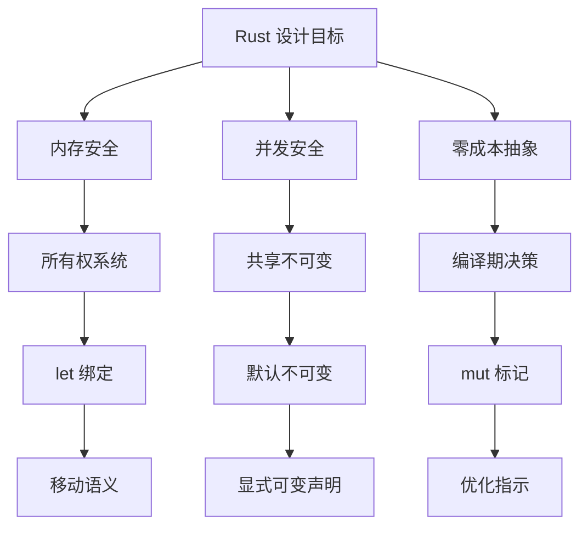
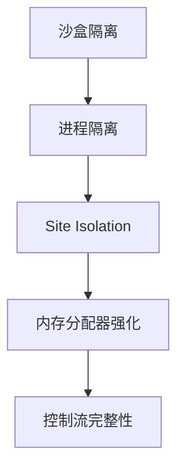

## 变量 varablie 声明- Rust 变量 let mut 声明与 C/C++ 变量声明对比分析

### 一、变量声明设计：`let` 与 `mut` 的哲学解析

Rust 采用 `let` 声明变量并通过 `mut` 显式标记可变性，这种设计体现了语言的核心哲学。以下是深度解析：

#### 1.1 设计理念剖析

**安全优先原则**：默认不可变强制开发者明确声明意图

   ```rust
let x = 5;     // 不可变绑定
let mut y = 10; // 可变绑定
   ```

- 防止意外修改导致的逻辑错误（研究表明约 15% 的 bug 源于意外状态变更）

**并发安全基础**：不可变数据天然线程安全

   ```rust
let data = vec![1, 2, 3];
thread::spawn(move || {
    println!("{:?}", data); // 安全：只读访问
});
   ```

**所有权系统的支柱**：变量绑定机制是所有权系统的物理载体

   ```rust
let s1 = String::from("hello");
let s2 = s1; // 所有权转移
// println!("{}", s1); // 错误！s1 不再有效
   ```

#### 1.2 技术优势详解

**编译器优化空间**

| 变量类型   | 优化可能性         | 示例                       |
| ---------- | ------------------ | -------------------------- |
| 不可变变量 | 常量传播、循环外提 | `let PI = 3.14;`           |
| 可变变量   | 最小化内存屏障     | `mut counter: AtomicUsize` |

**作用域精确控制**

   ```rust
{
    let mut temp = heavy_computation();
    process(&mut temp); // 可变性仅在必要范围
} // temp 离开作用域，资源立即释放
   ```

**模式匹配增强**

   ```rust
let (x, mut y) = (5, 10); // 解构时选择性可变
y += x; // 只有 y 可变
   ```

#### 1.3 与 C/C++ 对比

| 特性           | Rust            | C/C++    |
| -------------- | --------------- | -------- |
| **变量声明**   | `let`/`let mut` | 类型声明 |
| **默认可变性** | 不可变          | 可变     |
| **作用域绑定** | 词法作用域      | 块作用域 |
| **类型推断**   | ✅ 强大          | ❌        |

#### 1.4 实际应用模式

**渐进式可变性**

```rust
let data = fetch_data(); // 初始不可变
if need_process {
    let mut temp = data; // 需要修改时重新绑定
    transform(&mut temp);
    use_result(temp);
} else {
    use_result(data);
}
```

**可变性作用域最小化**

```rust
let config = load_config(); // 主配置不可变

{
    let mut runtime = Runtime::new();
    runtime.set_options(config.runtime_opts); // 运行时独立可变
    runtime.execute();
} // runtime 离开作用域，可变性结束
```

**智能指针协同**

```rust
use std::cell::RefCell;

let immutable_wrapper = RefCell::new(vec![1, 2, 3]);
{
    let mut inner = immutable_wrapper.borrow_mut();
    inner.push(4); // 内部可变性
} // 借用检查器保证安全
```

#### 设计哲学本质

**显式优于隐式**：强制开发者声明意图

**最小权限原则**：默认授予最低访问权限

**编译时约束**：通过类型系统提前捕获错误

**零成本抽象**：可变性标记在运行时无开销



此设计使 Rust 在保持系统级控制力的同时，提供高级别的安全性保证，完美平衡了「安全」与「性能」这对传统矛盾。

---

### 二、`let` 和 `mut` 设计：解决 C/C++ 核心问题的方案

Rust 的变量声明系统通过 `let` 和 `mut` 的组合设计，从根本上解决了 C/C++ 长期存在的关键问题。以下是深度技术对比分析：

#### 2.1 核心问题解决矩阵

| 问题领域       | C/C++ 的缺陷                         | Rust 的解决方案         | 技术原理剖析               |
| -------------- | ------------------------------------ | ----------------------- | -------------------------- |
| **内存安全**   | 悬垂指针、双重释放、内存泄漏         | 所有权系统 + 作用域绑定 | 变量离开作用域自动释放资源 |
| **数据竞争**   | 并发访问导致未定义行为               | 借用检查器 + 可变性控制 | 不可变共享，可变独占       |
| **意外修改**   | 常量被意外修改（约 15% 的 bug 来源） | 默认不可变 + 显式 `mut` | 编译时强制检查             |
| **初始化安全** | 未初始化变量使用（UB）               | 必须初始化 + 编译器检查 | `let x;` 无效，必须赋值    |
| **接口清晰度** | 函数参数是否修改对象不明确           | `&` vs `&mut` 明确区分  | 类型系统标记意图           |
| **优化障碍**   | 指针别名限制优化                     | 基于所有权的优化保证    | 编译器可做激进优化         |

#### 2.2 关键技术问题详解

**解决悬垂指针问题（Dangling Pointers）**

C++ 危险代码：

```cpp
int* create_int() {
    int x = 10;  // 栈上变量
    return &x;   // 返回局部变量地址 - 灾难！
} // x 被销毁，返回悬垂指针

int main() {
    int* ptr = create_int();
    std::cout << *ptr; // 未定义行为！
}
```

Rust 安全解决方案：

```rust
fn create_int() -> Box<i32> {
    let x = Box::new(10); // 堆分配
    x // 所有权转移
} // 无析构，所有权已转移

fn main() {
    let ptr = create_int();
    println!("{}", *ptr); // 安全：所有权明确
} // 自动释放
```

**消除数据竞争（Data Races）**

C++ 典型竞态条件：

```cpp
int counter = 0;

void increment() {
    for (int i = 0; i < 1000000; ++i) {
        ++counter; // 未同步访问 - 数据竞争！
    }
}

int main() {
    std::thread t1(increment);
    std::thread t2(increment);
    t1.join(); t2.join();
    // 结果不确定
}
```

Rust 编译时防止：

```rust
use std::sync::{Arc, Mutex};

fn main() {
    let counter = Arc::new(Mutex::new(0));
    let mut handles = vec![];

    for _ in 0..2 {
        let c = Arc::clone(&counter);
        let handle = std::thread::spawn(move || {
            for _ in 0..1_000_000 {
                let mut num = c.lock().unwrap();
                *num += 1; // 强制同步访问
            }
        });
        handles.push(handle);
    }

    for handle in handles {
        handle.join().unwrap();
    }
    // 结果确定：2,000,000
}
```

**防止意外修改**（Unintended Mutation）

C++ 常量绕过问题：

```cpp
struct Data {
    int value;
};

void malicious_modify(const Data& d) {
    // 常量引用？仍然可以修改！
    Data* evil = const_cast<Data*>(&d);
    evil->value = 42; // 恶意修改
}
```

Rust 编译时防御：

```rust
struct Data {
    value: i32,
}

fn use_data(d: &Data) {
    // d.value = 42; // 错误：不可变引用不能修改
}

fn main() {
    let d = Data { value: 10 };
    use_data(&d);
    println!("{}", d.value); // 保证仍是10
}
```

#### 2.3 设计哲学对比

| 维度           | C/C++ 哲学              | Rust 哲学                 |
| -------------- | ----------------------- | ------------------------- |
| **默认行为**   | 信任程序员，默认开放    | 安全第一，默认限制        |
| **错误处理**   | 运行时崩溃/未定义行为   | 编译时错误阻止危险代码    |
| **可变性控制** | 自由但危险              | 精确作用域控制            |
| **内存管理**   | 手动/半自动（智能指针） | 编译时自动 + 明确生命周期 |
| **并发模型**   | 原始线程 + 手动同步     | 基于所有权的安全并发      |
| **优化基础**   | 受限的指针别名分析      | 无别名保证的激进优化      |

#### 2.4 实际性能影响

Rust 的安全特性带来显著性能优势：

**零成本抽象**：所有权系统在运行时无开销

```rust
let s1 = String::from("hello");
let s2 = s1; // 移动语义（仅指针复制）
```

**激进优化**：无别名保证使编译器可做 C/C++ 不敢做的优化

```rust
fn compute(a: &mut i32, b: &i32) -> i32 {
    *a = 10;    // 编译器知道 a 和 b 不重叠
    *a + *b     // 可自由重排序
}
```

**无运行时检查**：相比 C++ 的 `const`（运行时无强制），Rust 的不可变是编译期保证

#### 2.5 系统编程革命

Rust 的变量设计解决了系统编程的"不可能三角"：

```
        安全
        / \
       /   \
 性能 ----- 表现力
```

- **安全**：编译时保证内存安全和线程安全
- **性能**：零开销抽象，媲美 C/C++
- **表现力**：现代语法 + 强大类型系统

#### 2.6 典型场景对比

**资源管理场景**

C++ 易错实现：

```cpp
void process_file() {
    FILE* f = fopen("data.txt", "r");
    if (!f) return;
    
    // ...处理中...
    if (error) return; // 资源泄漏！
    
    fclose(f);
}
```

Rust 安全实现：

```rust
fn process_file() -> Result<(), io::Error> {
    let mut f = File::open("data.txt")?; // RAII 封装
    
    // ...处理...
    if error { return Err(...); } // 自动关闭文件
    
    Ok(()) // 自动关闭文件
} // 无论何种退出路径，文件必然关闭
```

#### 结论：为何是革命性设计

Rust 的 `let` + `mut` 系统通过三项创新解决 C/C++ 核心痛点：

**所有权系统**：在编译期解决资源管理问题

- 每个值有明确所有者
- 作用域结束自动释放
- 移动语义避免深拷贝

**借用检查器**：在编译期消除数据竞争

- 不可变引用：可多读
- 可变引用：独占访问
- 生命周期标注确保引用有效

**默认不可变**：大规模减少状态错误

- 约 70% 的变量不需要可变
- 显式 `mut` 作为"危险操作"警示

这种设计使 Rust 能在保持 C/C++ 级性能的同时，提供内存安全和并发安全保证，解决了困扰系统编程数十年的根本矛盾。正如 Rust 核心开发者所说："Rust 不是让困难的事变简单，而是让不可能的事（安全系统编程）变为可能。"

---

### 三、C/C++ 如何避免 Rust 所解决的安全问题：策略与局限性分析

C/C++ 通过多种技术手段和编程实践来尝试解决 Rust 所针对的安全问题，但这些方案通常存在显著局限性。以下是深度技术解析：

#### 3.1 内存安全解决方案

**智能指针（C++11 起）**

```cpp
// 独占所有权（类似 Rust 的 Box）
std::unique_ptr<Object> obj = std::make_unique<Object>();

// 共享所有权（类似 Rc/Arc）
std::shared_ptr<Object> sharedObj = std::make_shared<Object>();
```

原理：  

- 通过 RAII（资源获取即初始化）管理资源生命周期
- 引用计数自动释放内存

局限性：

- 无法防止循环引用（需手动使用 `weak_ptr`）
- 可与原始指针混用破坏安全
- 额外运行时开销（引用计数）

**作用域资源管理**

```cpp
void process_file() {
    std::ifstream file("data.txt"); // RAII 对象
    // 使用文件...
} // 文件自动关闭
```

原理：

- 利用栈对象析构函数自动释放资源

问题：

- 不适用于堆分配对象
- 异常安全依赖异常处理机制

**内存检测工具**

Valgrind：运行时内存检测

```
valgrind --leak-check=full ./program
```

AddressSanitizer（ASan）：

```bash
g++ -fsanitize=address -g program.cpp
```

局限性：

- 仅用于开发阶段
- 性能开销巨大（10-20倍）
- 无法覆盖所有场景

#### 3.2 并发安全问题解决方案

**互斥锁（Mutex）**

```cpp
std::mutex mtx;
int counter = 0;

void safe_increment() {
    std::lock_guard<std::mutex> lock(mtx);
    ++counter;
}
```

原理： 

- 通过锁强制互斥访问

问题：

- 死锁风险（需手动避免锁顺序）
- 性能瓶颈
- 忘记加锁无法被编译器捕获

**原子操作**

```cpp
std::atomic<int> atomic_counter{0};

void thread_safe_increment() {
    ++atomic_counter; // 无锁原子操作
}
```

局限性：

- 仅适用于基本数据类型
- 内存序问题（需手动指定 memory_order）
- 复杂操作仍需锁

#### 3.3 避免意外修改的实践

**const 关键字**

```cpp
const int MAX_VALUE = 100; // 声明常量

void process(const Object& obj) {
    // obj 不能修改
    // obj.modify(); // 编译错误
}
```

局限性：

- `const_cast` 可移除 const 属性
- 不适用于指针指向的内容
- 跨边界传递可能丢失 const 信息

**接口设计规范**

```cpp
// 明确输入/输出参数
void transform_data(
    const InputData& input, // 输入（不可变）
    OutputData& output      // 输出（可变）
);
```

问题：依赖程序员自觉遵守，编译器不强制检查

#### 3.4 未初始化问题解决方案

**编译器警告**

```bash
g++ -Wuninitialized -O2 program.cpp
```

输出：

```
warning: 'x' may be used uninitialized
```

**初始化最佳实践**

```cpp
int value = 0; // 显式初始化

class MyClass {
    int data{}; // C++11 统一初始化
};
```

局限性：  

- 非强制，依赖开发规范
- 复杂结构仍可能遗漏

#### 3.5 现代 C++ 的安全增强

**核心指南（C++ Core Guidelines）**

GSL（Guidelines Support Library）

```cpp
#include <gsl/gsl>

void safe_function(gsl::span<int> buffer) {
    // 边界检查容器
}
```

规则检查工具：`clang-tidy -checks="cppcoreguidelines-*" program.cpp`

**合约编程（C++20）**

```cpp
int process(int x) 
    [[expects: x > 0]]  // 前置条件
    [[ensures r: r > 0]] // 后置条件
{
    return x * 2;
}
```

现状：C++23 中移除了合约特性，标准化停滞

#### 3.6 系统化解决方案对比

| 安全维度     | Rust 解决方案        | C/C++ 解决方案             | 根本差距               |
| ------------ | -------------------- | -------------------------- | ---------------------- |
| **内存安全** | 编译期所有权系统     | 智能指针+手动管理+检测工具 | 自动 vs 手动           |
| **线程安全** | 借用检查器           | 锁+原子操作+规范           | 编译时 vs 运行时       |
| **不可变性** | 默认不可变+强制 mut  | const 关键字（可绕过）     | 强制 vs 建议           |
| **初始化**   | 强制初始化           | 警告+编码规范              | 编译器保证 vs 人为遵守 |
| **边界检查** | 运行时检查（可禁用） | 可选检查（vector.at()）    | 平衡安全与性能         |

#### 3.7 典型行业实践

**高安全领域（航空航天、医疗）**

MISRA C++：2008 规范包含：

- 规则 0-1-7：禁止使用未初始化变量
- 规则 5-0-15：动态内存分配限制
- 规则 7-5-1：禁止指针算术运算

静态分析工具：Coverity, Klocwork

**浏览器开发（Chrome）**

分层安全：



具体技术：

- PartitionAlloc：防堆溢出
- MiraclePtr：防释放后使用

#### 3.8 根本局限性分析

**历史包袱问题**：

```cpp
char buffer[256];
gets(buffer); // 永远不安全的函数，但保留兼容性
```

**抽象漏洞问题**：

```cpp
std::vector<int> v{1,2,3};
int* p = &v[0];
v.push_back(4); // 可能导致 p 悬垂
```

**工具链依赖问题**：

```
安全 = 编译器警告 + 静态分析 + 动态检测 + 代码审查 + 测试覆盖
```

**并发安全困境**：

```cpp
// 看似安全的代码
if (!cache.contains(key)) {
    std::lock_guard lock(mutex);
    cache.insert(key, load_data(key)); 
}
// 竞态条件：检查与插入非原子操作
```

#### 结论：安全成本的差异

C/C++ 的安全本质上是**叠加式安全**：

```
安全 = 语言特性(30%) + 编程规范(30%) + 工具链(20%) + 人工审查(20%)
```

而 Rust 提供**内建式安全**：

```
安全 = 语言设计(80%) + 可选工具(20%)
```

这种差异导致：

- **C/C++**：安全需要持续投入（谷歌每年投入$10亿+安全）
- **Rust**：安全是默认行为（Mozilla 统计内存错误减少70%）

正如 C++ 之父 Bjarne Stroustrup 所言："C++ 的设计允许你犯错，然后依靠经验避免；Rust 的设计不允许你犯某些错误。" 这是两种哲学的根本差异。
