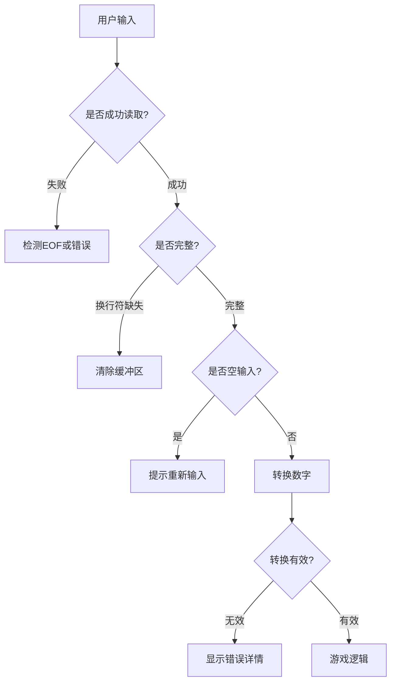

# 猜数字游戏代码深度分析

下面是对您提供的猜数字游戏代码的详细分析，包含完整注释和关键知识点解释：

```c
#include <stdio.h>     // 标准输入输出函数
#include <stdbool.h>   // 布尔类型支持
#include <stdlib.h>    // 内存分配、随机数、类型转换等
#include <string.h>    // 字符串处理函数
#include <time.h>      // 时间函数（用于随机数种子）
#include <errno.h>     // 错误号定义
#include <limits.h>    // 整数类型范围限制

/*
关键知识点：
1. 随机数生成原理及种子初始化
2. 安全的用户输入处理（避免缓冲区溢出）
3. 输入缓冲区清除技巧
4. EOF(文件结束符)处理机制
5. 错误处理（errno, perror, feof）
6. 类型安全转换（strtol函数）
7. 输入验证（空输入、超长输入、无效数字）
*/

#define MAX_IN 50  // 输入缓冲区最大长度

/*
清除输入缓冲区
- 目的：移除输入流中多余的字符（包括换行符）
- 原理：循环读取字符直到遇到换行符或EOF
- 注意：当流处于EOF状态时，此函数无法清除EOF状态
*/
void clear_input_buffer() {
    int c = 0;
    // 读取并丢弃字符直到换行符或EOF
    while ((c = getchar()) != '\n' && c != EOF);
}

/*
生成指定范围内的随机整数
- 参数：min - 最小值, max - 最大值
- 原理：使用rand()生成伪随机数，通过取模运算限制范围
- 种子初始化：使用当前时间初始化随机数生成器
- 静态变量：确保只初始化一次种子
*/
int random_int(int min, int max) {
    static int seeded = 0; // 静态变量，仅初始化一次
    
    if (!seeded) {
        // 使用当前时间作为随机数种子
        srand(time(NULL));
        seeded = 1; // 标记已初始化
    }
    
    // 生成[min, max]范围内的随机整数
    return rand() % (max - min + 1) + min;
}

int main() {
    printf("猜数字游戏 - C语言初学者练习\n");
    
    // 生成1-100之间的随机数
    int secret_number = random_int(1, 100);
    int guess = 0;       // 用户猜测的数字
    int guess_count = 0; // 猜测次数计数器
    
    // 输入缓冲区
    char inputs[MAX_IN];

    // 游戏主循环
    while (true) {
        printf("请输入你的猜测(1-100): ");
        
        /* 
        使用fgets安全读取输入：
        - 避免scanf的缓冲区溢出风险
        - 正确处理EOF和错误情况
        */
        if (!fgets(inputs, sizeof(inputs), stdin) {
            // 处理输入失败情况
            if (feof(stdin)) {
                /* 
                EOF处理：
                - Ctrl+D (Linux/macOS) 或 Ctrl+Z+Enter (Windows)
                - 清除EOF状态标志，允许继续输入
                */
                printf("检测到文件结束符(EOF).\n");
                clearerr(stdin); // 重置流的错误和EOF标志
            } else {
                // 处理其他读取错误
                perror("输入读取错误"); // 打印系统错误信息
            }
            // 清除可能的残留输入
            clear_input_buffer();
            continue; // 跳过本次循环，重新尝试
        }
        
        // 检查输入是否完整（是否有换行符）
        size_t len = strlen(inputs);
        if (len > 0 && inputs[len - 1] != '\n') {
            /*
            输入过长处理：
            - 用户输入超过缓冲区大小
            - 需要清除缓冲区中剩余字符
            */
            printf("输入过长，请重新输入.\n");
            clear_input_buffer(); // 清除剩余输入
            continue;
        }
        
        // 检查空输入（直接回车）
        if (inputs[0] == '\n') {
            printf("输入不能为空，请重新输入.\n");
            continue;
        }
        
        /* 
        使用strtol进行安全的数字转换：
        - 比atoi更安全，提供错误检测
        - 可以检测溢出和无效输入
        */
        char* endptr = NULL; // 指向第一个无法转换的字符
        errno = 0; // 重置错误标志
        long val = strtol(inputs, &endptr, 10); // 10进制转换
        
        // 验证转换结果
        if (
            inputs == endptr ||   // 没有转换任何数字
            *endptr != '\n'  ||   // 输入中有非数字字符（除结尾换行符）
            errno == ERANGE  ||   // 转换结果超出long范围
            val < INT_MIN    ||   // 转换结果小于int最小值
            val > INT_MAX         // 转换结果大于int最大值
        ) {
            // 详细错误信息
            if (inputs == endptr) {
                printf("无效输入：未检测到数字.\n");
            } else if (*endptr != '\n') {
                printf("无效输入：包含非数字字符 '%c'.\n", *endptr);
            } else if (errno == ERANGE) {
                printf("数值超出范围：%s\n", 
                       (val == LONG_MAX) ? "过大" : "过小");
            }
            continue;
        }
        
        // 类型安全转换（long到int）
        guess = (int)val;
        guess_count++; // 增加猜测次数
        
        // 游戏逻辑判断
        if (guess > secret_number) {
            printf("太大了！\n");
        } else if (guess < secret_number) {
            printf("太小了！\n");
        } else {
            // 猜中数字
            printf("恭喜！你猜对了！\n");
            printf("神秘数字是 %d，你用了 %d 次尝试.\n", 
                   secret_number, guess_count);
            break; // 结束游戏循环
        }
    }
    
    return 0; // 程序正常退出
}
```

## 关键知识点详解

### 1. 安全的用户输入处理
- **问题**：直接使用`scanf`可能导致缓冲区溢出和未处理输入
- **解决方案**：
  - 使用`fgets`读取整行输入（避免溢出）
  - 检查输入长度防止截断
  - 使用`strtol`进行类型安全转换
  - 验证转换结果的有效性

### 2. 随机数生成原理
- `rand()`函数生成伪随机数序列
- `srand(time(NULL))`用当前时间初始化随机数种子
  - 静态变量确保只初始化一次
- 取模运算`rand() % (max - min + 1) + min`将随机数映射到指定范围

### 3. EOF处理机制
- **EOF本质**：文件结束符是状态标志而非数据
- **检测**：使用`feof(stdin)`检查EOF状态
- **清除**：`clearerr(stdin)`重置错误和EOF标志
- **用户触发**：
  - Linux/macOS: Ctrl+D
  - Windows: Ctrl+Z后回车

### 4. 输入验证策略


### 5. 错误处理技术
- `errno`：系统错误代码变量
- `perror`：打印可读的错误信息
- `feof`：检测文件结束状态
- `clearerr`：重置流错误状态
- 详细错误分类：
  - 输入过长
  - 空输入
  - 非数字字符
  - 数值溢出
  - 范围不符

### 6. 缓冲区清除技巧
- `clear_input_buffer`函数循环读取并丢弃字符
- 使用场景：
  - 输入过长时清除剩余字符
  - 输入失败后清除可能残留数据
- 局限性：无法清除EOF状态（需要`clearerr`）

## 改进建议

1. **增加游戏重玩功能**：
   ```c
   char play_again;
   printf("再玩一次? (y/n): ");
   fgets(inputs, sizeof(inputs), stdin);
   if (inputs[0] == 'y' || inputs[0] == 'Y') {
       // 重置游戏状态
   }
   ```

2. **添加猜测次数限制**：
   ```c
   if (guess_count >= MAX_GUESSES) {
       printf("尝试次数已达上限! 神秘数字是 %d\n", secret_number);
       break;
   }
   ```

3. **优化随机数生成**：
   ```c
   // 使用更均匀的分布方法
   return min + (int)((double)rand() / (RAND_MAX + 1.0) * (max - min + 1));
   ```

4. **增强用户反馈**：
   ```c
   // 根据接近程度给出提示
   int diff = abs(guess - secret_number);
   if (diff > 50) printf("差得远呢!\n");
   else if (diff > 20) printf("接近了!\n");
   else printf("就差一点了!\n");
   ```

这个实现展示了C语言中安全输入处理、错误处理和游戏逻辑的最佳实践，特别适合初学者学习如何处理常见的输入验证问题和边界情况。