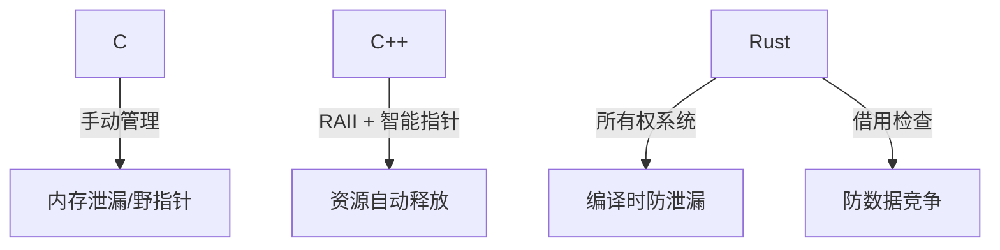
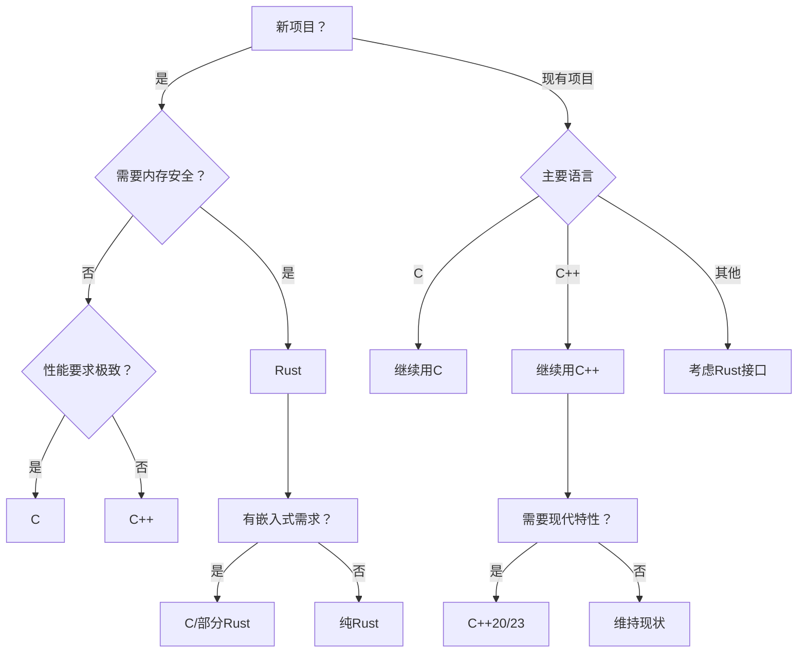

# 四、通过猜数游戏对比分析 C/C++与Rust 语言的设计哲学

下面将从更广泛的维度，通过具体实例深入对比三种语言在猜数游戏实现上的差异，揭示其设计哲学和适用场景。

### 4.1 类型系统与安全性

以下这三个代码示例展示了不同编程语言的类型系统如何影响代码的安全性，尤其是编译时的类型检查能力

**C示例（弱类型检查）**：

```c
// 宏定义无编译期类型检查
#define MAX 100
int secret = rand() % MAX; // 可能为负

// 问题：C语言的类型系统较弱
// rand() 返回 int，可能是负数
// % 运算符结果符号与被除数相同（C99标准）即使MAX是正数，secret仍可能为负
//
// 风险：运行时潜在错误，需额外检查

// 推荐的安全实践
// 强制非负结果：使用位掩码或绝对值（需谨慎处理 INT_MIN）
int secret = abs(rand()) % MAX; // 注意：abs(INT_MIN) 可能溢出
// 使用无符号类型：转换到无符号整数再取模
unsigned int secret = (unsigned int)rand() % MAX;
// 范围校正函数：封装安全取模函数
int safe_mod(int value, int max) {
    int mod = value % max;
    return (mod >= 0) ? mod : mod + max;
}
```

问题：C语言的类型系统较弱

`rand()` 返回值特性：

- `rand()` 函数返回 `int` 类型（有符号整数），理论上可能返回负数（尽管标准实现通常返回 `0` 到 `RAND_MAX` 的非负数）。
- 风险：若实现不符合标准（或环境异常），可能返回负数，导致后续计算错误。

`%` 运算符的行为

- 在 C99 标准中，`a % b` 的结果符号与 `a`（被除数）相同。
- 风险：即使模数 `MAX` 是正数，若 `rand()` 返回负数，`secret = rand() % MAX` 的结果可能为负

根本原因：C 的弱类型系统不保证值范围，`rand()` 可能返回负数 + `%` 结果依赖被除数符号 → 潜在负结果。

解决方案：始终检查并校正负数结果，或使用无符号类型/范围限制函数，确保 `secret` 在预期范围内（如 `[0, MAX-1]`）。

**C++示例（较强类型检查）**：

```cpp
// 使用模板约束
template<typename T>
concept Integral = std::is_integral_v<T>;  // 概念定义：必须是整型

auto generate_secret(Integral auto min, Integral auto max) {
    // 编译期类型检查
}

// 改进：编译期类型检查
// 使用 C++20概念(concept) 约束模板参数
// 编译时确保 min/max 必须是整型
// 比 C 更早捕获类型错误
//
// 局限：仍需自行实现范围检查（比如防止负数）

// 完整安全实现示例
#include <concepts>
#include <random>

// 概念约束 + 范围检查 + 安全随机数
auto safe_generate_secret(std::integral auto min, std::integral auto max) {
    if (min < 0 || max < 0) throw std::range_error("Negative bounds");
    if (min >= max) throw std::invalid_argument("Invalid range");
    
    // 使用现代 C++ 随机数引擎 (避免 rand() 的缺陷)
    std::random_device rd;
    std::uniform_int_distribution dist(min, max - 1);
    
    return dist(rd); // 保证结果在 [min, max-1] 范围内
}
```

核心改进：编译期类型检查

概念约束 (Concept)

- `Integral` 概念使用 `std::is_integral_v<T>` 在编译期验证类型
- 如果调用时传入非整型（如 `float`、`string`），代码无法编译

对比 C 语言的弱点

- C 中可能隐式转换的意外行为被彻底杜绝 ```int secret = rand() % (int)"hello"; // 编译通过但行为未定义```
- C++20 概念直接阻止此类错误

剩余局限：仍需运行时检查,尽管概念解决了类型安全问题，但仍有其他问题需手动处理

- 值范围验证：仍需检查值有效性，需检查负数范围与无效范围
- 负数的取模问题：即使类型正确，仍需处理负数的取模行为（同 C 语言问题）

**Rust示例（最强类型安全）**：

```rust
// 编译期保证无符号
let secret: u32 = rng.gen_range(1..=100); 
// 尝试赋值为-1会直接编译错误

// 优势：
// u32明确表示无符号32位整数
// 范围1..=100在编译期和运行时都保证非负
// 尝试赋负值会触发编译错误（类型不匹配）
// 所有权系统进一步防止内存安全问题
```

核心安全机制解析

无符号整数类型 (`u32`)

- `u32` 明确表示 32 位无符号整数，范围固定为 `0..=4,294,967,295`
- 尝试赋值为负值会直接导致编译错误

范围表达式 (`1..=100`)

- `1..=100` 是包含两端的闭区间（1 到 100 的所有整数）
- 在编译期和运行时双重保障

**关键差异总结**

|     特性     |               C/C++                |               Rust               |
| :----------: | :--------------------------------: | :------------------------------: |
|   类型推断   |            有限（auto）            |          强（let绑定）           |
|   类型系统   | 弱类型，允许隐式转换和宏定义无类型 |       强类型，禁止危险转换       |
|   整数范围   |           需手动验证范围           | 类型(`u32`) + 范围表达式双重保障 |
|   负值风险   |     `rand() % N` 可能产生负值      |      无符号类型彻底杜绝负值      |
|   内存安全   |         需手动管理，易出错         |        所有权系统自动保障        |
| 错误检测时机 |             运行时崩溃             |       编译期捕获大多数错误       |

Rust通过严格的编译时检查（类型+所有权）实现了最高级别的安全性，而C需要开发者自己处理所有边界情况。C++介于两者之间，通过现代特性逐步增强安全性。

### 4.2 内存管理维度

**底层内存管理对比**

|    操作    |             栈分配             |             堆分配             |
| :--------: | :----------------------------: | :----------------------------: |
|  数据类型  | 固定大小（如 `struct`、`u32`） | 动态大小（如 `String`、`Vec`） |
|  存储方式  |           直接存储值           |     存储指针（指向堆内存）     |
|  生命周期  |       通常短（函数局部）       |       可能长（跨作用域）       |
|  分配速度  |       极快（移动栈指针）       |      较慢（需调用分配器）      |
|  释放速度  |        自动（栈帧弹出）        |           需手动释放           |
| 缓存友好性 |          高（局部性）          |      低（可能缓存未命中）      |
|  适用场景  |       临时变量、小型数据       |       大型数据、动态集合       |

**内存申请释放深度对比**：

C：手动管理，完全控制但高风险

```c
// C: 字符串缓冲区
char* read_line() {
    char input[BUF_SIZE];         // 栈分配 - 内存自动管理（函数结束时释放）
    char* buf = malloc(BUF_SIZE); // 堆内存 - 必须手动释放
    fgets(buf, BUF_SIZE, stdin);
    return buf; 								  // 调用者需记得free
}
// 模式一：固定大小栈缓冲区 `char input[BUF_SIZE];`
// 特性：
// - 栈分配 - 内存自动管理（函数结束时释放）
// - 固定大小
// 
// 风险：
// - 输入超过 `BUF_SIZE-1` 时被截断（`fgets()` 保留一个字符给 `\0`）
// - 恶意输入可精心构造超长数据引发缓冲区溢出（若使用 `gets()` 而非 `fgets()`）
// 
// "手动清除"问题
// - 若存储敏感数据（如密码），需显式擦除，`memset(input, 0, BUF_SIZE); // 防止内存残留敏感数据`
//
// 模式二：动态分配堆内存 `char* buf = malloc(BUF_SIZE);`
// 特性与风险：
// - 堆分配 - 需手动管理内存
// - 内存泄漏风险 - 调用者可能忘记释放
// - 所有权模糊 - 返回指针时未明确传递所有权责任
// - 同固定大小风险 - 仍有缓冲区截断/溢出问题

// 动态分配游戏状态
typedef struct {
    int secret;
    int attempts;
    int max_attempts;
} GameState;
// 创建游戏状态（堆分配）
GameState* create_game(int max_attempts) {
    GameState* game = malloc(sizeof(GameState));
    if (!game) return NULL;
    
    game->secret = rand() % 100 + 1;
    game->attempts = 0;
    game->max_attempts = max_attempts;
    return game;
}
// 销毁游戏状态（需手动调用）
void destroy_game(GameState* game) {
    free(game); // 必须显式释放
}

// 风险场景
void play_game() {
    GameState* game = create_game(10);
    game->secret = 42;
    // ...游戏逻辑...
    // 忘记调用 destroy_game(game) → 内存泄漏
    // 多次调用 destroy_game(game) → 双重释放
    destroy_game(game);
    game->attempts = 5; // 访问已释放内存 → 未定义行为
}
// 主要风险：
// - 内存泄漏 (Memory Leak)，忘记调用 destroy_game(game) → 内存永远无法回收，每局游戏泄漏 sizeof(GameState) 内存（通常 12-16 字节）长时间运行的游戏服务器可能因此耗尽内存
// - 双重释放 (Double Free)，二次释放 → 程序崩溃或安全漏洞，可能导致堆损坏，被利用于执行任意代码（高危安全风险）
// - 悬空指针 (Dangling Pointer)，访问已释放内存 → 未定义行为，轻则数据损坏，重则程序崩溃
// - 未检查分配失败，若 malloc 返回 NULL 则 `game->secret = 42;` 崩溃 
```
C++：RAII + 智能指针模式，半自动管理

```cpp
// 在 C++ 编程中，RAII（Resource Acquisition Is Initialization）、智能指针 和 析构函数 是密切相关的概念，它们都用于管理资源的生命周期。尽管它们的目标一致，但它们的作用和实现方式有所不同。以下是详细的对比和解释：
//
// 1. RAII（Resource Acquisition Is Initialization）
// 定义：
// - RAII 是一种编程范式，其核心思想是将资源的获取与对象的初始化绑定在一起，并通过对象的生命周期来管理资源的释放。
// 核心原则：
// - 资源（如内存、文件句柄、网络连接等）在对象构造时获取。
// - 资源在对象析构时自动释放。
// 特点：
// - 自动化管理：通过对象的生命周期自动管理资源，避免手动释放资源导致的错误（如忘记释放或重复释放）。
// - 异常安全：即使程序在运行过程中抛出异常，RAII 也能确保资源被正确释放。
//
// 2. 智能指针
// 定义：
// - 智能指针是一种基于 RAII 的工具，用于管理动态内存的分配和释放。C++ 标准库提供了多种智能指针类型，如 std::unique_ptr、std::shared_ptr 和 std::weak_ptr。
// 工作原理：
// - 智能指针本质上是一个类模板，封装了原始指针，并在其内部实现了资源管理逻辑。
// - 当智能指针对象销毁时，会自动释放其管理的资源。
// 常见智能指针：
// std::unique_ptr：独占所有权，不能复制，只能移动。
// std::shared_ptr：共享所有权，引用计数机制。当最后一个 shared_ptr 销毁时，资源会被释放。
// std::weak_ptr：不增加引用计数，用于解决循环引用问题。

// C++ RAII 示例解析：std::string 的内存安全
std::string read_line() {
    std::string buf; // 自动管理内存
    std::getline(std::cin, buf);
    return buf; // 值语义自动转移
}
// RAII 机制工作原理（资源获取即初始化）
// - 构造时分配：创建 std::string 对象时自动分配所需内存，`std::string buf; 默认构造空字符串（不分配堆内存）`
// - 析构时释放：离开作用域时自动调用析构函数释放内存，`{ std::string local = "Hello"; } // 此处自动调用 ~string() 释放内存`
// - 动态扩容：getline 根据输入长度自动调整内存，`std::getline(std::cin, buf); // 处理任意长度输入`
// - 返回值优化 (RVO)：现代编译器消除拷贝开销，`return buf; // 通常直接构造在调用方内存空间`

class GameSession {
public:
    GameSession(int max_attempts) 
        : secret_(generate_secret()), 
          max_attempts_(max_attempts) {}
    
    ~GameSession() {
        // 自动调用析构函数，即使空实现，也会自动调用成员析构
    }
    
private:
    int secret_;
    int attempts_ = 0;
    int max_attempts_;
    std::vector<Player> players_; // 自动管理元素内存
};

// 优势
void play_game() {
    auto game = std::make_unique<GameSession>(10); // 智能指针
    // 函数结束时自动释放内存
    // 即使抛出异常也能保证释放
}
// RAII（资源获取即初始化）
// - 构造时获取资源：对象创建时初始化所有成员
// - 析构时释放资源：对象销毁时自动调用析构函数
//
// 智能指针内存管理 `auto game = std::make_unique<GameSession>(10);`
// - std::unique_ptr 独占所有权
// - 离开作用域时自动删除对象
// - 不可复制（防止双重释放）
//
// 成员自动管理 `std::vector<Player> players_;`
// - vector 自动管理元素内存
// - GameSession 析构时自动调用 vector 析构

// 最佳实践场景
class FileHandler { // 资源封装
public:
    FileHandler(const std::string& path) : file_(fopen(path.c_str(), "r")) {}
    ~FileHandler() { if(file_) fclose(file_); }
private:
    FILE* file_;
};
void database_transaction() { // 异常安全事务
    auto conn = std::make_unique<DBConnection>(); // DBConnection 的析构函数中会检查事务状态，若未提交则自动回滚
    																							// std::unique_ptr 保证连接一定会被释放，避免资源泄漏
    conn->begin();
    // 操作1...
    // 操作2...（此处可能抛出异常） 即使操作1/2中抛出异常，栈展开（stack unwinding）也会触发 conn 析构
    conn->commit(); // 成功提交
} // 失败时自动回滚，无论是否异常，conn 析构时都会自动调用 rollback()

std::vector<std::unique_ptr<GameObject>> objects; // 多态安全，安全存储派生类对象
objects.push_back(std::make_unique<Player>());    // 创建Player对象
objects.push_back(std::make_unique<Enemy>());     // 创建Enemy对象
// 自动调用正确析构函数，当vector析构时：
// - 自动调用每个 unique_ptr 的析构器
// - 通过虚函数表正确调用 Player/Enemy 的析构函数
//
// 多态安全：基类 GameObject 必须有虚析构函数，确保正确调用子类析构
// 所有权明确：unique_ptr 表示独占所有权，禁止拷贝但允许移动
// 零内存泄漏：容器生命周期结束时自动释放所有对象
// 传统危险做法：用裸指针 vector<GameObject*> 需手动 delete，易导致内存泄漏或双重释放
```
C++ 的 RAII 和智能指针提供了强大的资源管理能力，这些机制共同构成了 C++ 的「资源安全边界」，将开发者从手动管理中解放出来，其设计思想与 Rust 的所有权系统有相似之处（但 Rust 通过编译器强制执行更彻底），Rust 的所有权系统在 RAII 基础上通过编译期检查，在以下方面提供了更强保障：

- 消除数据竞争

- 保证移动后不可访问

- 显式空值处理

- 安全并发编程

两者都优于 C 语言手动管理，但 Rust 的编译器强制检查提供了更深层的安全保障。

Rust：所有权系统，编译时保证安全

```rust
fn read_line() -> String {
    let mut buf = String::new(); // 在堆上分配可变的String，大小不固定，必须堆分配
    io::stdin().read_line(&mut buf).unwrap(); // 安全地修改借用
    buf // 所有权转移给调用者
} // 若未转移所有权，此处自动调用drop释放内存
// 关键机制解析
// 所有权初始化
// - String::new() 在堆上分配内存，buf 成为其唯一所有者
// - 变量默认不可变，需显式声明 mut 才能修改
//
// 借用检查
// - read_line(&mut buf) 通过可变引用（&mut）借用 buf
// - 编译器保证：在借用期间，不允许其他任何访问（包括读或写）
// - 完全避免了数据竞争（Data Race）
//
// 所有权转移
// - 通过返回 buf 将所有权移交给调用者（移动语义）
// - 若此处不返回 buf，函数结束时自动调用 drop 释放内存
//
// 错误处理
// - unwrap() 表示快速失败（生产代码应改用 ? 或模式匹配）
// - 若读取失败会 panic，但内存仍然安全（不会泄漏或出现悬垂指针）

struct GameState {
    secret: u32,  // 不可变字段（默认）
    attempts: u32, // 可变状态
    max_attempts: u32, // 常量配置
}
impl GameState {
    fn new(max_attempts: u32) -> Self {
        GameState {
            secret: rand::thread_rng().gen_range(1..101), // 1-100随机数
            attempts: 0,
            max_attempts, // 字段简写语法
        }
    }
} // 不需要显式析构
fn play_game() {
    let game = GameState::new(10); // 栈分配：编译期已知大小，直接存储在栈上（移动栈指针即可），复制成本低但所有权严格
    let boxed_game = Box::new(GameState::new(10)); // 堆分配：Box 将数据放在堆上，返回智能指针
    
    // 所有权转移示例
    let game2 = game; // game所有权转移，不能再使用game
    // println!("{:?}", game);  // 编译错误！game已失效
    
    // 借用检查
    let ref1 = &boxed_game; // 不可变借用
    let ref2 = &boxed_game; // 允许多个不可变借用
    let mut_ref = &mut boxed_game; // 错误！已有不可变借用
}
// 结构体定义与初始化
// - 自动析构：无需手动实现 Drop，Rust 会自动回收内存（无论栈还是堆）
// - 字段控制：所有字段默认不可变，需要修改需声明 mut（如后续的 attempts）
//
// 所有权转移
// - 栈分配：game 直接存储在栈上，复制成本低但所有权严格
// - 堆分配：Box 将数据放在堆上，返回智能指针
// - 移动语义：赋值操作默认转移所有权（浅拷贝），原变量失效，对比 C++：需要手动实现移动构造函数/赋值运算符才能达到类似效果
//
// 借用检查规则
// 共享 vs 独占：
// - 不可变借用（&T）：允许多个只读访问
// - 可变借用（&mut T）：同一时间只能有一个，且排斥其他所有访问
// - 编译器强制：违反规则会直接报错，彻底杜绝数据竞争

// 典型使用场景
// 安全的多线程访问
let shared_game = Arc::new(Mutex::new(GameState::new(10))); <=> C++	shared_ptr<mutex>
// GameState：需要被多个线程共享的游戏状态	本身不是线程安全的
// Mutex：提供互斥访问（同一时间只允许一个线程修改数据），获取锁失败时阻塞线程
// Arc：原子引用计数器，允许数据被多个所有者共享，使用原子操作增减计数，无数据竞争
//
// Arc（原子引用计数）和 Mutex（互斥锁） 的组合是线程安全的黄金标准：
// 编译期线程安全检查：
// 普通引用（&T）不能跨线程，必须用 Arc 包装
// Mutex 保证：只有获取锁后才能访问数据
// 
// 死锁预防：
// 自动释放锁（RAII模式），离开作用域时自动释放锁
//
// 内存安全：
// 最后一个 Arc 被丢弃时自动清理 GameState
// 不会出现悬垂指针或内存泄漏
//
// Rust 的这种设计使得：
// - 线程安全成为编译期属性而非运行时发现的问题
// - 没有性能惩罚（与手动正确编写的 C++ 代码效率相同）
// - 开发者无法意外绕过保护机制
```

Rust 通过编译期的所有权系统 + 借用检查器 这些机制使得：

- 内存安全（无泄漏/野指针）
- 无需垃圾回收（零运行时开销）
- 线程安全无需运行时检查
- 资源管理无需手动释放

所有检查都在编译期完成，运行时零额外开销，这种机制比 C++ 的 RAII 更严格（编译器而非程序员负责检查），比 Java/Go 的 GC 更高效（无停顿和额外内存占用）。

**完整对比表格与详细解释**：

内存安全对比



关键差异总结

|   差异类型   |           C 语言方案           |             C++ 方案              |                   Rust 方案                   |
| :----------: | :----------------------------: | :-------------------------------: | :-------------------------------------------: |
| 内存管理方式 |  手动`malloc/free`（易出错）   | RAII保障 + 智能指针（半自动控制） | 编译期RAII保障 + 所有权系统（全自动安全控制） |
|  所有权管理  |      指针传递（责任不明）      |    拷贝/移动语义（值语义明确）    |        编译期强制转移（类型系统保证）         |
|   错误处理   | 错误码/空指针检查（依赖自觉）  | 错误码 + 异常机制（可能资源泄漏） |      `Result/Option`类型（强制显示处理）      |
|   接口边界   |       文档约定（无强制）       |        文档约定（无强制）         |          类型系统强制（编译时检查）           |
|  零成本抽象  |               无               |    是（模板元编程、虚表中等）     |              是（无运行时开销）               |
|   性能特性   | 完全控制内存布局（潜在高性能） |   平衡控制与安全（STL简化管理）   |          编译时安全保证（无GC开销）           |

风险与安全机制

|   风险类型   |             C 语言             |              C++ RAII 解决方案               |              Rust 解决方案              |
| :----------: | :----------------------------: | :------------------------------------------: | :-------------------------------------: |
|   内存泄漏   |     需手动`free`（常遗漏）     |  RAII模式 + 智能指针（作用域结束自动释放）   |     RAII模式（离开作用域自动释放）      |
|  缓冲区溢出  | 固定大小缓冲区风险（高危漏洞） | `std::string/vector`动态调整（自动边界管理） | 动态扩容 + 编译期检查（`panic!`防溢出） |
| 敏感数据处理 |   手动`memset`清除（易遗漏）   |        需手动清除（可能被优化器删除）        |    自动安全擦除（`Drop` trait保证）     |
|   双重释放   |      可能发生（程序崩溃）      |    `unique_ptr`防拷贝（移动后原指针失效）    |      所有权转移（原变量立即失效）       |
|   悬空指针   |     常见错误（未定义行为）     |    智能指针可缓解（但原始指针仍存在风险）    |      借用检查器拦截（编译期错误）       |
|   分配失败   |   需手动检查`NULL`（常忽略）   |          `new`抛异常（需捕获处理）           |    `Box`分配失败`panic!`（可控崩溃）    |
|   未初始化   |     内容未定义（安全风险）     |      构造函数保证初始化（值类型需手动）      |       变量必须初始化（编译强制）        |
|   线程安全   |       不可靠（数据竞争）       |             需手动同步（易出错）             |      编译期检查（`Send+Sync`特征）      |

### 4.3 错误处理机制

**异常处理 vs 错误码对比**

|   特性   |           异常处理           |           错误码           |
| :------: | :--------------------------: | :------------------------: |
| 错误信息 |   丰富（类型+消息+调用栈）   |   有限（通常只有错误码）   |
| 错误传播 |       自动跨多层调用栈       |       需手动逐层返回       |
| 性能开销 |    较高（尤其抛出异常时）    |            极低            |
| 可忽略性 | 不可忽略（未处理会终止程序） |          可被忽略          |
| 资源清理 |     自动（通过析构函数）     |         需手动管理         |
| 适用场景 |   应用层、桌面/服务器程序    | 系统编程、嵌入式、内核开发 |

**典型差异**：

C 错误: 错误码 + 全局状态 `if (fgets(...) == NULL) { /* 处理错误 */ }`

```c
// 使用枚举明确定义错误类型，提高可读性
enum GameError {
    INVALID_INPUT,
    OUT_OF_RANGE,
    IO_ERROR
};
// 使用strtol进行安全转换，通过end指针和errno检测错误
int parse_input(const char* input, int* output) {
    char* end;
    errno = 0;  // 重置全局错误状态
    long val = strtol(input, &end, 10);
    
    // 检查转换错误
    if (errno == ERANGE) return OUT_OF_RANGE; // 错误码：值超出long范围
    if (*end != '\0') return INVALID_INPUT;   // 错误码：存在非法字符
    
    *output = (int)val;
    return 0; // 成功
}
// 根据错误码执行对应操作（如打印错误信息）
void handle_error(int error) {
    switch(error) {
        case INVALID_INPUT: printf("无效输入"); break;
        // ...
    }
}
// 缺点：
// 错误信息传递不透明 
// - 错误码（如INVALID_INPUT）缺乏上下文信息（例如具体是哪个输入无效）。
// - 调试时需要额外日志或断言才能定位问题根源。
// 
// 容易忽略错误检查
// - 编译器不会强制检查返回值，程序员可能遗漏错误处理，导致后续逻辑出错。
// 
// 全局 errno 在多线程中不安全
// - errno是全局变量，多线程中可能被其他函数覆盖，即使现代系统用线程局部存储（TLS）实现errno，仍依赖具体实现
//
// 错误传递繁琐
// - 深层嵌套调用时，需层层传递错误码

// 改进建议：
// - 增强错误信息
struct Error {
    int code;
    const char* message;  // 添加错误描述
};
// - 强制错误检查：使用[[nodiscard]]属性（C2x）标记必须检查的返回值
[[nodiscard]] enum GameError parse_input(...);
// - 避免全局状态：改用函数返回错误详情（而非依赖errno）
long safe_strtol(const char* str, int* error) {
    // 内部处理errno，返回错误码给调用方
    *error = local_errno;
    return result;
}
// - 统一错误处理模式：类似Linux内核的ERR_PTR模式，通过指针返回错误
//
// 函数设计：
// - 函数返回 int* 类型指针
// - 成功时返回指向有效结果的指针
// - 失败时返回一个"错误指针"：(intptr_t) 是类型转换，确保在不同平台上指针和整数的转换安全，-INVALID_INPUT 是一个负的错误码（类似Linux内核的错误码如 -EINVAL），将错误码强制转换为指针类型返回
//
// 为什么这样设计？
// - 统一返回类型：不需要额外的输出参数或复杂的结构体
// - 兼容性：利用了指针和整数在某些情况下的可互换性
// - 效率：避免了额外的内存分配只为返回错误码
// 
// 这种模式在需要频繁处理错误的系统编程中很常见，能提供简洁高效的错误处理机制。
int* parse_input(...) {
    if (error) return (int*) (intptr_t) - INVALID_INPUT;  // 用指针传递错误
    return &result;
}
int *result = parse_input(...);
if (IS_ERR(result)) {  // 假设有类似Linux的IS_ERR宏
    int err = PTR_ERR(result);  // 提取错误码
    // 处理错误
} else {
    // 使用正常结果
}
// 错误码：简单直观，性能高，但易忽略检查，信息有限
// 全局errno：兼容标准库，但非线程安全，隐式依赖全局状态
// 最佳实践：在关键路径使用错误码+错误描述结构体；避免依赖全局状态；对重要函数强制返回值检查
```
C++ 异常: 异常机制 `try { num = std::stoi(input) } catch (...) { ... }`
```cpp
// 自定义异常类
class InputError : public std::runtime_error {
public:
    InputError(const std::string& msg, int error_code)
        : std::runtime_error(msg), code_(error_code) {}
    
    int code() const { return code_; }
private:
    int code_;
};
// 继承自标准库的 runtime_error，保留了标准异常的特性
// 添加了 error_code 字段存储特定错误码
// 通过 what() 继承获取错误描述，通过 code() 获取错误码

// 输入解析函数
int parse_input(const std::string& input) {
    try {
        size_t pos;
        int val = std::stoi(input, &pos);   // 尝试转换字符串为整数
        // 检查是否整个字符串都被转换
        if (pos != input.size()) {
            throw InputError("包含非数字字符", 1001);  // 抛出自定义异常
        }
        return val;
      // 捕获标准库可能抛出的范围异常
    } catch (const std::out_of_range&) {
        throw InputError("数字超出范围", 1002);  // 重新抛出自定义异常
    }
}

// 使用场景
void play_game() {
    try {
        int guess = parse_input("123abc");  // 触发异常
      // 捕获并处理自定义异常
    } catch (const InputError& e) {
        // 输出：错误[1001]: 包含非数字字符
        std::cerr << "错误[" << e.code() << "]: " << e.what();
    }
}

// 优势：
// 丰富的错误信息
// - 同时携带错误描述（what()）和错误码（code()）
// - 支持动态生成错误信息：throw InputError("无效输入: " + input, 1003)
//
// 类型安全的错误传递
// - 强类型异常类（InputError vs NetworkError）
// 编译器会检查异常类型匹配
// 
// 自动调用栈展开
// - 异常会跨多层调用栈直接跳到 catch 块
void layer1() { layer2(); }  // 不需要错误检查代码
void layer2() { layer3(); }  // 不需要错误检查代码
void layer3() { parse_input("abc"); } // 直接抛出异常
//
// 不可忽略的错误
// - 未处理的异常会导致程序终止（相比错误码可被忽略更安全）
// - 清晰的错误传播路径
//
// 资源自动清理（RAII）
void process() {
    File f("data.txt");  // 构造函数打开文件
    int val = parse_input(get_input());
    // 如果抛出异常，f 的析构函数会自动关闭文件
} 
// 缺点：
// 运行时开销
// - 异常处理机制需要额外的内存和 CPU 资源
// - 在未抛出异常时也有少量开销（约 1-3% 性能损失）
// - 抛出异常时开销显著（约 10-100x 普通函数返回）
//
// 可能被禁用（嵌入式系统）
// - 嵌入式系统（资源受限环境）
// - 实时系统（无法预测执行时间）
// - 使用 -fno-exceptions 编译选项的项目
//
// 代码复杂度
// - 需要理解异常安全保证（基本、强、无抛出）
// - 不正确的使用可能导致资源泄漏
//
// 跨二进制边界问题
// - 在动态库边界抛出/捕获异常需要特殊处理
// - 不同编译器实现的异常机制可能不兼容

// 最佳实践建议
// 适用场景：
// - 用户输入处理
// - 文件/网络 I/O
// - 资源分配失败
//
// 避免场景：
// - 高频执行的代码路径
// - 程序常规控制流
// - 构造函数失败（改用工厂函数）

// 设计原则：
// 好的实践：定义清晰的异常层次
class NetworkError : public std::runtime_error { /* ... */ };
class TimeoutError : public NetworkError { /* ... */ };
//
// 不好的实践：抛出基础类型
throw 42; // 避免！
// 这种异常处理机制提供了更强大的错误管理能力，但需要权衡其带来的运行时开销和实现复杂度。

// 现代 C++ 改进
// 现代 C++（C++17 及以上）中一种更安全、更清晰的错误处理方式，使用 std::expected（C++23）或类似模式（如 std::optional + 自定义错误）来替代传统的错误码或异常。
std::expected<int, InputError> safe_parse(const std::string& input) {
    if (/* 无效输入 */) 
        return std::unexpected(InputError(...));
    return value;
}
// std::expected<T, E>（C++23）：
// - 表示一个可能成功（返回类型 T）或失败（返回错误类型 E）的操作。
// - 类似 Rust 的 Result<T, E> 或 Haskell 的 Either 类型。
// - 若函数成功，直接返回 T 类型的值；失败则返回 std::unexpected<E> 包装的错误
//
// InputError：
// - 自定义的错误类型，可以是枚举、结构体或任何可复制的类型。
enum class InputError {
    InvalidFormat,
    OutOfRange,
    EmptyInput
};
// 使用方法：
auto result = safe_parse("123");
if (result) { // 检查是否成功
    int value = *result; // 解引用获取值
} else {
    InputError err = result.error(); // 获取错误
    // 处理错误...
}
// 对比传统方式
// 返回错误码 (int)，简单，无开销，无法携带额外信息，易被忽略
// 异常 (try/catch)，错误信息丰富，自动传播，性能开销大，可能被滥用
// std::expected，显式错误处理，类型安全，需要 C++23（或第三方库）
//
// 替代方案（C++17）如果尚未支持 C++23，可以用以下组合模拟类似行为
// - std::optional + 错误码
std::pair<std::optional<int>, InputError> parse(...);
// - 第三方库：tl::expected（C++11/14/17 兼容的实现）
//
// 为什么推荐这种方式？
// - 显式性：调用方必须主动检查错误，避免遗漏。强制错误处理，用户必须通过 if (result) 或 .error() 显式处理错误
// - 类型安全：编译器强制处理成功/失败分支，减少运行时错误。
// - 无开销：不依赖异常机制，性能与错误码相当。
// - 可扩展性：错误类型 E 可以是任意复杂的数据结构（如包含错误描述字符串）
```
Rust: Result类型 + 模式匹配  `let num: u32 = input.trim().parse().expect("解析失败");`

```rust
// 简单使用示例
fn parse_input(input: &str) -> Result<u32, ParseIntError> {
    input.trim().parse()
}
match parse_input("42") {
    Ok(num) => println!("数字: {}", num),
    Err(e) => println!("错误: {}", e),
}

#[derive(Debug)]
enum GameError {
    InvalidInput,
    OutOfRange(u32, u32),     // 携带额外数据（最小值和最大值）
    IoError(std::io::Error),  // 包装其他错误类型
}
// 自定义错误枚举
// - 使用枚举定义所有可能的错误类型
// - 可以携带附加信息（如 OutOfRange 携带有效范围）
// - #[derive(Debug)] 自动实现调试输出
// - 可以包装其他错误类型（如 IoError 包装标准 I/O 错误）

fn parse_input(input: &str) -> Result<u32, GameError> {
    input.trim().parse::<u32>()  
        .map_err(|_| GameError::InvalidInput)   // 转换错误类型
        .and_then(|n| {  // 链式调用
            if n < 1 || n > 100 {
                Err(GameError::OutOfRange(1, 100))  // 返回带数据的错误
            } else {
                Ok(n) // 成功值
            }
        })
}
// 解析函数实现
// - 返回类型为 Result<u32, GameError>（成功返回 u32，失败返回 GameError）
// - 使用 parse::<u32>() 尝试字符串转换
// - map_err 将标准错误转换为自定义错误
// - and_then 在转换成功后执行额外检查

fn main() -> Result<(), Box<dyn std::error::Error>> {
    match parse_input("123abc") { // 模式匹配处理不同错误
        Ok(n) => println!("猜数: {}", n),
        Err(GameError::InvalidInput) => eprintln!("无效输入"),
        Err(GameError::OutOfRange(min, max)) => 
            eprintln!("超出范围: {}-{}", min, max),
        Err(e) => return Err(Box::new(e)),  // 转换为trait对象向上传播
    }
    
    // ?运算符简化错误传播
    let guess = parse_input("42")?; // 自动处理错误
    Ok(()) // 成功返回
}
// 主函数中的错误处理
// - main() 函数可以返回 Result 类型
// - 使用模式匹配处理不同错误情况
// - ? 运算符自动传播错误
// - Box<dyn Error> 作为错误trait对象，可以容纳任何实现了 Error trait 的类型

// 优势：
// 强制错误处理
// - 编译时检查：编译器会警告未处理的 Result
// - 无法忽略错误：必须显式处理 Ok 和 Err 情况
// - 减少错误遗漏：比 C/C++ 的错误码更安全
//
// 零成本抽象
// - 无运行时开销：Result 是普通枚举，编译后是标签联合体
// - 内存高效：大小等于最大变体的大小（u32 + GameError）
// - 无额外分配：不像异常处理需要堆分配
// 
// 丰富的错误组合
// - 错误转换：使用 map_err 轻松转换错误类型
// - 错误链：保留原始错误上下文
// - 第三方集成：thiserror 和 anyhow 等库简化错误处理
//
// 无缝与异步代码集成
// - 在 async 函数中同样使用 ? 运算符
// - 与 Future 和 async/await 完美配合
// - 错误处理方式在同步和异步代码中保持一致
//
// 模式匹配的完备性
// - 编译器强制处理所有可能的错误变体
// - 当添加新的错误类型时，编译器会提示需要更新匹配分支
// - 提供详尽的错误处理路径

// 实际应用模式
// - 链式错误处理
fn process_file(path: &str) -> Result<(), GameError> {
    let content = std::fs::read_to_string(path)
        .map_err(GameError::IoError)?;  // 转换错误类型
    let value = parse_input(&content)?;  // 自动传播错误
    // 更多处理...
    Ok(())
}
//
// - 错误转换与包装
// 实现 From<ParseIntError> 到自定义错误类型的转换
impl From<std::num::ParseIntError> for GameError {
    fn from(_: ParseIntError) -> Self {
        GameError::InvalidInput // // 将标准库错误转换为自定义错误
    }
}
// ? 运算符 自动转换错误并传播，
// 若 parse() 返回 Err(ParseIntError)，会自动调用 From 实现转换为 GameError，然后提前返回错误。
let value: u32 = input.parse()?;
//
// - 组合子方法
// 提供默认值
let num = parse_input(input).unwrap_or(0);
// 链式处理
parse_input(input)
    .and_then(|n| validate(n))
    .or_else(|_| fallback());
```

Rust 的 `Result` 类型和模式匹配错误处理机制：

- 通过类型系统强制错误处理

- 提供零成本抽象，无运行时开销

- 支持丰富的错误信息和组合

- 与异步代码完美集成

- 通过模式匹配确保处理完备性

**错误处理差异对比**

|   特性   |                  C（错误码 + 全局 errno）                   |                   C++（异常机制 + 错误码）                   |                 Rust（Result<T, E> + panic）                 |
| :------: | :---------------------------------------------------------: | :----------------------------------------------------------: | :----------------------------------------------------------: |
| 错误类型 |             整数错误码，全局`errno`，无类型安全             |             任意异常类型，标准异常体系，类型安全             |      显式`Result<T, E>`枚举，错误类型可自定义，类型安全      |
| 错误处理 | 需检查每个函数返回值，处理`errno`，易忽略错误，嵌套处理复杂 | `try-catch` 块处理转换错误，可混合使用错误码，可能被意外忽略 | 强制处理所有可能的错误，`?`运算符简化错误传播，模式匹配确保处理完备性 |
|   性能   |               轻量级，仅整数比较，无额外开销                |  异常抛出时开销大，栈展开成本高，正常流程无开销，可能被禁用  | 无开销（Result 正常流程，编译期优化），内存布局高效，``panic`时开销大 |
| 错误转换 |                       手动转换错误码                        |                   需要手动在`catch`中转换                    |         通过 `From` 自动完成，`?` 运算符自动调用转换         |

这种错误处理方式结合了传统返回码的效率和异常处理的表达力，使 Rust 在系统编程和高可靠性应用中表现出色。

### 4.4 并发模型支持

**并发模型对比**：

|   **模型类型**   |    **核心概念**    |    **通信方式**    |     **同步机制**     |    **典型应用场景**    |      **代表语言/框架**       |        **优点**        |          **缺点**          |
| :--------------: | :----------------: | :----------------: | :------------------: | :--------------------: | :--------------------------: | :--------------------: | :------------------------: |
|     共享内存     |  线程共享内存空间  |    直接内存访问    | 锁、信号量、原子操作 |  高性能计算、游戏引擎  |      C/C++、Java、Rust       |      高性能、直观      | 易死锁/数据竞争、调试困难  |
|    Actor模型     | 独立Actor处理消息  |    异步消息传递    |    消息队列、邮箱    | 分布式系统、高并发服务 |  Erlang、Akka (Scala/Java)   |    高容错性、易扩展    | 消息传递开销、状态管理复杂 |
|     CSP模型      |    通过通道通信    |   通道(Channel)    |     通道阻塞机制     |   高并发IO、数据管道   | Go、Rust (`std::sync::mpsc`) | 清晰数据流、避免锁竞争 |      通道可能成为瓶颈      |
|     数据并行     | 数据集分割并行处理 | 隐式(通过数据划分) |       屏障同步       |  科学计算、大数据处理  |  MPI、OpenMP、Rayon (Rust)   |   高吞吐量、负载均衡   |      数据依赖处理复杂      |
|     事件循环     | 单线程处理异步事件 |   回调/事件队列    |     事件队列调度     |    GUI、网络服务器     |     JavaScript、Node.js      | 高IO效率、避免线程切换 |    CPU密集型任务性能低     |
|    Fork-Join     |   任务分解与合并   |      共享内存      |       任务屏障       |   递归算法、分治问题   |   Java ForkJoinPool、C++17   | 负载均衡、自动任务窃取 |       任务划分需均匀       |
|     GPU并行      |   大规模数据并行   |      显存共享      |  Warp同步、原子操作  |   图形渲染、深度学习   |      CUDA、OpenCL、SYCL      |       超高吞吐量       |       数据传输开销大       |
|    协程/纤程     |   用户态轻量线程   |   共享内存/通道    |      协作式调度      |      高并发微服务      |    Go(goroutine)、Kotlin     |   低开销(微秒级切换)   |      无法利用多核CPU       |
| Reactive Streams |  数据流响应式处理  |     异步流管道     |       背压机制       |      实时数据处理      | RxJS、Project Reactor (Java) |      弹性流量控制      |        学习曲线陡峭        |

**并发示例**：

C 语言并发 pthread 示例

```c
// C 的线程不安全示例
int counter = 0;

void* increment(void* arg) {
    for (int i = 0; i < 10000; i++) {
        counter++; // 数据竞争！
    }
    return NULL;
}
// 问题：多个线程同时访问共享变量 counter
// 风险：数据竞争导致结果不确定（实际值 < 预期值）

// C 的线程 pthread 示例
typedef struct {
    GameState* game;
    int player_id;
} ThreadData;
// 线程安全的游戏状态管理
void* player_thread(void* arg) {
    ThreadData* data = (ThreadData*)arg;
    
    while (true) {
        int guess = get_player_guess(data->player_id);
        // 使用互斥锁保护共享状态
        pthread_mutex_lock(&data->game->lock);
        int result = check_guess(data->game, guess);
        pthread_mutex_unlock(&data->game->lock);
        
        if (result == 0) {
            printf("玩家%d获胜!\n", data->player_id);
            break;
        }
    }
    return NULL;
}
// 关键组件：
// - ThreadData：线程参数结构体（传递共享状态）
// - pthread_mutex_t lock：互斥锁保护共享资源
// - pthread_mutex_lock/unlock：加锁/解锁操作
int main() {
    GameState game;
    pthread_mutex_init(&game.lock, NULL); // 初始化互斥锁
    
    pthread_t threads[4];
    ThreadData data[4];
    // 创建4个玩家线程
    for (int i = 0; i < 4; i++) {
        data[i] = (ThreadData){&game, i};
        pthread_create(&threads[i], NULL, player_thread, &data[i]);
    }
    // 等待所有线程结束
    for (int i = 0; i < 4; i++) {
        pthread_join(threads[i], NULL);
    }
    
    pthread_mutex_destroy(&game.lock);  // 销毁互斥锁
}

// 并发风险详解：
//
// - 死锁风险
// 场景：忘记解锁或异常路径未解锁
pthread_mutex_lock(&lock);
if (error) return; // 可能提前返回或抛出异常，忘记解锁！
pthread_mutex_unlock(&lock);
// 后果：其他线程永久阻塞
// 解决方案：
#define LOCK(mtx) do { \  // 使用锁的包装器
    int res = pthread_mutex_lock(mtx); \ // 对互斥锁 mtx 加锁，并检查返回值
    if (res != 0) abort(); \ // 如果加锁失败（返回值 res != 0），调用 abort() 终止程序
} while(0)
#define UNLOCK(mtx) pthread_mutex_unlock(mtx) // 直接调用 pthread_mutex_unlock 解锁，不检查返回值
// 更健壮的版本（C11支持） 宏的副作用 若 mtx 是带副作用的表达式（如 mutex++），宏可能多次求值（应避免）
// 改用内联函数替代宏，可避免宏的副作用问题，同时保持性能。
inline void lock_mutex(pthread_mutex_t *mtx) {
    int res = pthread_mutex_lock(mtx);
    if (res != 0) {
        perror("Failed to lock mutex");
        exit(EXIT_FAILURE);
    }
}
//
// - 条件竞争
// 场景：检查与操作分离
// 错误示例：检查与操作非原子化
if (game->winner == -1) { // 检查
    // 此处可能被其他线程修改
    game->winner = player_id; // 操作
}
// 后果：多个玩家同时"获胜"，多个线程可能同时通过 if 检查，导致多个玩家被错误标记为获胜者。
// 解决方案：在锁的保护下完成整个原子操作
// 使用互斥锁（Mutex）保护临界区
pthread_mutex_t game_mutex = PTHREAD_MUTEX_INITIALIZER;
void declare_winner(int player_id) {
    pthread_mutex_lock(&game_mutex);  // 加锁，锁覆盖整个操作：检查 (if) 和赋值 (=) 必须在同一锁的保护下。
    if (game->winner == -1) {         // 检查（原子化）
        game->winner = player_id;     // 操作（原子化）
    }
    pthread_mutex_unlock(&game_mutex); // 解锁，锁的粒度：锁的范围应尽可能小，但必须覆盖所有共享数据的访问。
}
// 使用原子操作（C11或编译器扩展）
#include <stdatomic.h>
atomic_int winner; // 声明为原子变量
void declare_winner(int player_id) {
    int expected = -1;
    atomic_compare_exchange_strong(&winner, &expected, player_id);
}
// 原理：atomic_compare_exchange_strong 会原子地检查 winner == expected，如果是则更新为 player_id，否则失败。
// 为什么能避免条件竞争？
// 原子性：比较和交换操作在硬件层面不可分割，其他线程无法中间介入。
// 可见性：原子变量的修改立即对其他线程可见（无缓存一致性问题）。
// 与互斥锁方案的对比
// 特性    原子操作方案	                     互斥锁方案
// 性能	   更高（无锁，硬件级原子指令）	        较低（需上下文切换）
// 适用场景	简单变量（int/pointer）的原子修改	复杂临界区（多变量操作）
// 可扩展性	仅限单一原子变量	                可保护任意代码块
// 错误处理	需手动检查返回值	                锁失败可重试或记录
//
// - 锁粒度问题
// 过粗：锁范围太大降低并发性
// 过细：锁范围太小导致保护不足
// 优化：最小化临界区范围
pthread_mutex_lock(&lock);
printf("玩家%d猜测:%d\n", player_id, guess); // 包含IO等耗时操作
pthread_mutex_unlock(&lock);
//
// - 资源管理问题
// 忘记调用 pthread_join 导致僵尸线程
// 忘记销毁互斥锁导致资源泄漏
// 线程参数生命周期管理不当

// 高级同步技术
// - 条件变量：
// 核心作用
// 线程间事件通知：允许线程在某个条件不满足时休眠，直到其他线程显式唤醒它。
// 避免忙等待：替代低效的 while (!condition); 轮询。
pthread_cond_t cond = PTHREAD_COND_INITIALIZER;  // 静态初始化条件变量
// 典型使用模式：
// 等待线程
pthread_mutex_lock(&lock);
while (!condition) {                 // 必须用while（避免虚假唤醒）
    pthread_cond_wait(&cond, &lock); // 1. 释放锁 2. 阻塞 3. 被唤醒后重新获取锁
}
// 此时 condition == true
pthread_mutex_unlock(&lock);
// 通知线程
pthread_mutex_lock(&lock);
condition = true;              // 修改条件
pthread_cond_signal(&cond);    // 唤醒一个等待者（或 broadcast 唤醒所有）
pthread_mutex_unlock(&lock);
// 注意事项
// 必须搭配互斥锁：pthread_cond_wait 会原子性地释放锁并进入等待。
// 虚假唤醒：即使没有 signal，线程也可能被唤醒，因此必须用 while 而非 if 检查条件。
//
// 性能优化：
// signal：唤醒一个线程（适用于单消费者）。
// broadcast：唤醒所有线程（适用于多消费者或条件复杂时）。
//
// - 读写锁
// 核心作用
// 区分读/写操作：允许多个读线程并发，但写线程独占访问。
// 提高读密集型性能：读操作无需互斥。
pthread_rwlock_t rwlock = PTHREAD_RWLOCK_INITIALIZER;  // 静态初始化
// 读操作（允许多线程并发）
pthread_rwlock_rdlock(&rwlock);    // 读锁（共享）
printf("Data: %d\n", shared_data); // 安全读取
pthread_rwlock_unlock(&rwlock);    // 释放锁
// 写操作（独占访问）
pthread_rwlock_wrlock(&rwlock);    // 写锁（独占）
shared_data = 42;                  // 安全修改
pthread_rwlock_unlock(&rwlock);    // 释放锁 
// 注意事项
// 锁升级问题：不能直接从读锁升级为写锁（可能导致死锁）。
// 公平性：某些实现可能导致写线程饥饿（需检查文档）。
//
// 适用场景：
// 读频率远高于写（如配置管理、缓存系统）。
// 写操作耗时短（避免阻塞读线程过久）。
//
// - 线程局部存储
// 核心作用
// 线程私有数据：每个线程拥有变量的独立副本，避免同步开销。
// 替代全局变量：解决全局变量在多线程环境中的竞争问题。
__thread int per_thread_counter; // GCC扩展，每个线程独立实例
void* thread_func(void* arg) {
    per_thread_counter = 0;      // 仅修改当前线程的副本
    printf("%d\n", per_thread_counter); // 读取当前线程的值
}
#include <threads.h>
thread_local int per_thread_counter;  // 需C11支持
// 典型应用场景
// 线程ID或上下文：如每个线程的随机数种子、数据库连接。
// 性能计数器：统计各线程的任务数量，无需锁。
// 递归锁：记录当前线程的加锁次数。
// 
// 注意事项
// 初始化：thread_local 变量每个线程会独立初始化（基本类型默认为0）。
// 动态库问题：某些平台中，__thread 在动态库中可能行为异常。
// 内存成本：每个线程会复制变量，大量 TLS 变量可能增加内存占用。
//
// 技术	       用途	           优势	                 缺点
// 条件变量	   线程间事件通知	  避免忙等待，精准唤醒	   需搭配互斥锁
// 读写锁	    读多写少场景	   读操作高并发	           写线程可能饥饿
// 线程局部存储	线程私有数据	    无锁，零竞争	         内存占用较高
// 
// 选择建议
// 需要等待条件 → 条件变量 + 互斥锁（例如：生产者-消费者模型）
// 高频读低频写 → 读写锁（例如：缓存系统、配置管理）
// 线程独立状态 → 线程局部存储（例如：线程上下文、性能统计）

// C 并发编程最佳实践
// 锁使用原则
// - 按固定顺序获取多个锁（避免死锁）
// 错误示例：可能死锁
void transfer(Account *a, Account *b, int amount) {
    pthread_mutex_lock(&a->lock);  // 线程1：锁a → 尝试锁b
    pthread_mutex_lock(&b->lock);  // 线程2：锁b → 尝试锁a
    // ...转账操作...
}
// 正确做法：统一按地址顺序加锁
void transfer(Account *a, Account *b, int amount) {
    if (a < b) {  // 强制锁顺序
        pthread_mutex_lock(&a->lock);
        pthread_mutex_lock(&b->lock);
    } else {
        pthread_mutex_lock(&b->lock);
        pthread_mutex_lock(&a->lock);
    }
    // ...转账操作...
}
// 原因：避免两个线程以不同顺序请求锁，导致循环等待（死锁）。
//
// - 使用锁的持有时间尽可能短
// 错误示例：锁范围过大
void process_data() {
    pthread_mutex_lock(&lock);
    data = load_from_disk();  // 耗时IO操作（持有锁！）
    result = compute(data);   // 耗时计算（持有锁！）
    pthread_mutex_unlock(&lock);
}
// 正确做法：仅保护共享数据
void process_data() {
    Data temp = load_from_disk();  // 无锁操作
    int res = compute(temp);       // 无锁操作
    pthread_mutex_lock(&lock);
    shared_result = res;           // 临界区极短
    pthread_mutex_unlock(&lock);
}
// 原因：减少锁竞争，提高并发性能。
// 
// - 避免在持有锁时调用外部函数
// 危险代码
void unsafe_func() {
    pthread_mutex_lock(&lock);
    external_api();  // 可能阻塞、递归调用或触发回调
    pthread_mutex_unlock(&lock);
}
// 风险：
// 外部函数可能间接请求同一锁（导致死锁）。
// 若外部函数阻塞，所有依赖该锁的线程会被阻塞。
//
// - 错误处理：锁操作的返回值检查 
int result = pthread_mutex_lock(&lock);
if (result == EDEADLK) {    // 检测死锁
    fprintf(stderr, "Deadlock detected!\n");
    // 处理策略：终止线程或回滚操作
} else if (result != 0) {   // 其他错误（如EINVAL）
    perror("pthread_mutex_lock failed");
    exit(EXIT_FAILURE);
}
// 常见错误码：
// EDEADLK：当前线程已持有该锁（可重入锁除外）。
// EINVAL：锁未初始化或参数非法。
//
// 线程安全设计 线程安全的阻塞队列实现
// 数据结构定义
typedef struct {
    int *buffer;                // 队列缓冲区
    int capacity;               // 最大容量
    int count;                  // 当前元素数
    int head, tail;             // 头尾指针
    pthread_mutex_t lock;       // 互斥锁
    pthread_cond_t not_empty;   // 非空条件（消费者等待）
    pthread_cond_t not_full;    // 非满条件（生产者等待）
} SafeQueue;
// 入队操作（生产者）
void safe_enqueue(SafeQueue *q, int item) {
    pthread_mutex_lock(&q->lock);
    // 队列满时阻塞等待
    while (q->count == q->capacity) {
        pthread_cond_wait(&q->not_full, &q->lock);
    }
    // 入队操作
    q->buffer[q->tail] = item;
    q->tail = (q->tail + 1) % q->capacity;
    q->count++;
    // 唤醒一个消费者
    pthread_cond_signal(&q->not_empty);
    pthread_mutex_unlock(&q->lock);
}
// 出队操作（消费者）
int safe_dequeue(SafeQueue *q) {
    pthread_mutex_lock(&q->lock);
    // 队列空时阻塞等待
    while (q->count == 0) {
        pthread_cond_wait(&q->not_empty, &q->lock);
    }
    // 出队操作
    int item = q->buffer[q->head];
    q->head = (q->head + 1) % q->capacity;
    q->count--;
    // 唤醒一个生产者
    pthread_cond_signal(&q->not_full);
    pthread_mutex_unlock(&q->lock);
    return item;
}
// 关键设计点
// 双重条件变量：
// not_empty：消费者等待队列非空。
// not_full：生产者等待队列非满。
//
// while循环检查条件：
// 防止虚假唤醒（pthread_cond_wait可能意外返回）。
//
// 先修改后唤醒：
// 确保其他线程被唤醒时，条件已满足（如先count++再signal）

// 性能优化
// 无锁数据结构：对性能敏感场景，考虑原子操作或无锁队列（如liblfds）。
// 读写锁替代：读多写少时用pthread_rwlock_t。
//
// 总结：并发编程黄金法则
// 最小化临界区：锁范围内只包含必要操作。
// 死锁预防：统一锁顺序、避免嵌套锁、超时机制。
// 错误处理：检查所有线程API的返回值。
// 条件变量配合谓词：总是用while检查条件，而非if。
```
C 语言的 pthread 并发编程：

优点：底层控制能力强、跨平台支持（POSIX标准）、无运行时开销

挑战：手动管理所有同步原语、编译器不提供安全保证、易出现死锁、数据竞争等并发问题

关键实践：

- 始终使用锁保护共享状态
- 检查所有 pthread 函数的返回值
- 使用 RAII 模式管理资源（在 C 中手动实现）
- 优先使用高级抽象（如线程池库）

C++：std::thread + 原子操作

```cpp
// 原子操作：原子计数器实现
std::atomic<int> counter{0};
void increment() {
    for (int i = 0; i < 10000; i++) {
        counter.fetch_add(1, std::memory_order_relaxed);
    }
}
// 安全机制：
// std::atomic<int>：保证对整数的操作是原子的
// fetch_add()：原子加法操作
// memory_order_relaxed：最宽松的内存顺序，只保证原子性，不保证顺序

// std::thread + 原子操作
class ConcurrentGame { // 线程安全的游戏类
public:
    void player_turn(int player_id) {
        while (true) {
            int guess = get_player_guess(player_id);
            // RAII 锁管理
            std::lock_guard<std::mutex> lock(mutex_);
            if (check_guess(guess)) {
                std::cout << "玩家" << player_id << "获胜!\n";
                winner.store(player_id, std::memory_order_relaxed);
                break;
            }
        }
    }

private:
    std::mutex mutex_;
    std::atomic<int> winner = -1;
};
// 关键组件：
// std::mutex：互斥锁保护共享状态
// std::lock_guard：RAII 锁管理器（自动释放锁）
// std::atomic<int>：原子变量存储获胜者

int main() { // 线程管理与启动
    ConcurrentGame game;
    std::vector<std::thread> threads;
    
    for (int i = 0; i < 4; ++i) {
        threads.emplace_back(&ConcurrentGame::player_turn, &game, i);
    }
    
    for (auto& t : threads) {
        t.join();
    }
}
// 现代特性：
// std::vector<std::thread>：类型安全的线程容器
// emplace_back：直接在容器中构造线程对象
// 成员函数绑定：&Class::method, &object, args

// C++ 并发改进详解：
// - RAII锁管理
{
    std::lock_guard<std::mutex> lock(mutex_); // 构造时加锁
    // 临界区代码
} // 析构时自动解锁
// 优势：
// 异常安全：即使抛出异常也能正确释放锁
// 防止忘记解锁
// 支持作用域锁（std::scoped_lock 用于多个锁）
//
// 原子操作避免数据竞争
std::atomic<int> shared_value = 0;
// 原子操作
shared_value.store(42);                   // 原子存储
int current = shared_value.load();        // 原子加载
int prev = shared_value.fetch_add(5);     // 原子加法
bool success = shared_value.compare_exchange_strong(prev, new_val);
// 内存顺序：
// memory_order_relaxed	仅原子性，性能最快
// memory_order_acquire/release	临界区同步，性能中等
// memory_order_seq_cst	顺序一致性，性能最慢
// 
// 类型安全线程创建
// 相比 C 的 void* 参数，C++ 提供类型安全绑定
std::thread t(&MyClass::method, &obj, arg1, arg2);  // 绑定成员函数
std::thread t([&] {  // 使用 lambda
    obj.method(arg1, arg2);
});

// 并发模式最佳实践
// - 读写锁优化
// 核心思想
// 读多写少场景：允许多个线程并发读，但写操作独占访问。
// C++17 的 shared_mutex：比传统互斥锁性能更高。
#include <shared_mutex>
class ThreadSafeData {
    mutable std::shared_mutex mtx;  // mutable 允许 const 方法修改
    Data data; // 被保护的数据
public:
    // 读操作（多个线程可同时进入）
    Data read() const {
        std::shared_lock lock(mtx); // 共享锁（读锁）
        return data;                // 安全读取
    }
    // 写操作（独占访问）
    void write(const Data& new_data) {
        std::unique_lock lock(mtx); // 独占锁（写锁）
        data = new_data;            // 安全修改
    }
};
// 关键点
// std::shared_lock：允许多个读线程同时持有锁。
// std::unique_lock：写线程独占，阻塞所有读/写操作。
// 适用场景：配置管理、缓存系统等读远多于写的场景。
// 
// - 无锁编程
// 核心思想
// 原子操作替代锁：通过 std::atomic 实现线程安全，避免锁竞争。
// 高性能但复杂：适合极端低延迟场景（如高频交易）。
class LockFreeQueue {
    struct Node {
        std::atomic<Node*> next; // 原子指针
        int value;
    };
    
    std::atomic<Node*> head; // 原子头指针
    std::atomic<Node*> tail; // 原子尾指针
    
public:
    void push(int value) {
        Node* new_node = new Node{nullptr, value}; // 新节点
        Node* old_tail = tail.exchange(new_node); // 原子交换尾指针
        old_tail->next.store(new_node); // 链接旧尾节点到新节点
    }
};
// 关键点
// tail.exchange(new_node)：原子地更新尾指针，返回旧值。
// ABA问题：需额外机制（如版本号）处理，此处未展示。
// 适用场景：超高性能队列（如任务调度、消息传递）。
// 
// - 线程池实现
// 核心思想
// 避免频繁创建/销毁线程：复用固定数量的工作线程处理任务。
// 任务队列 + 条件变量：线程空闲时等待任务，有任务时唤醒。
class ThreadPool {
    std::vector<std::jthread> workers;  // C++20 可中断线程
    std::queue<std::function<void()>> tasks; // 任务队列
    std::mutex queue_mutex;             // 保护任务队列
    std::condition_variable cv;         // 线程间通知
    bool stop = false;                  // 停止标志
    
public:
    ThreadPool(size_t threads) {
        for(size_t i = 0; i < threads; ++i) {
            workers.emplace_back([this] {
                while(true) {
                    std::function<void()> task;
                    {
                        // 等待任务或停止信号
                        std::unique_lock lock(queue_mutex);
                        cv.wait(lock, [this]{ return stop || !tasks.empty(); });
                        // 如果停止且无任务，退出线程
                        if(stop && tasks.empty()) return;
                        // 取任务
                        task = std::move(tasks.front());
                        tasks.pop();
                    }
                    task(); // 执行任务（无锁状态）
                }
            });
        }
    }
  
    // 添加任务
    template <typename F>
    void enqueue(F&& f) {
        {
            std::unique_lock lock(queue_mutex);
            tasks.emplace(std::forward<F>(f));
        }
        cv.notify_one(); // 唤醒一个线程
    }

    ~ThreadPool() {
        {
            std::unique_lock lock(queue_mutex);
            stop = true; // 设置停止标志
        }
        cv.notify_all(); // 唤醒所有线程退出
    }  
};
// 关键点
// 任务队列：使用 std::queue 存储待执行任务。
//
// 条件变量：
// cv.wait(lock, predicate)：线程阻塞，直到 predicate 为真。
// cv.notify_one() / cv.notify_all()：唤醒等待线程。
//
// 优雅关闭：
// 析构函数设置 stop = true 并通知所有线程退出。
// C++20 的 jthread：支持自动中断（比 std::thread 更安全）。
//
// 三种模式对比
// 模式	   优点	             缺点	                        适用场景
// 读写锁	读操作高并发	     写操作可能饥饿	               配置管理、缓存系统
// 无锁队列	极致性能，无锁竞争	实现复杂，需处理ABA问题	         高频交易、实时系统
// 线程池	避免线程创建开销，  任务调度灵活	任务队列可能成为瓶颈	Web服务器、批量数据处理
//
// 选择建议
// 需要高并发读 → 读写锁（shared_mutex）。
// 超低延迟需求 → 无锁数据结构（谨慎使用！）。
// 任务并行处理 → 线程池（平衡资源与吞吐量）。

// C++ 并发风险与解决方案
// - 死锁场景
// 风险：两个线程以不同顺序请求锁，导致互相等待（循环依赖）。
void thread1() { // 线程1：先锁A，再锁B
    std::lock_guard lock1(mutexA);
    std::lock_guard lock2(mutexB); // 可能死锁
}
void thread2() { // 线程2：先锁B，再锁A
    std::lock_guard lock2(mutexB);
    std::lock_guard lock1(mutexA); // 相反顺序
}
// 解决方案：
// C++17 多锁 RAII std::scoped_lock（推荐）
void safe_operation() {
    std::scoped_lock lock(mutexA, mutexB); // 原子获取多个锁
    // ...
}
// 自动解决死锁：内部使用死锁避免算法（如按地址顺序加锁，解锁时按相反顺序释放 保证不会出现循环等待）。
// RAII风格：离开作用域自动释放锁。
// 手动统一锁顺序
void thread_safe_func() {
    if (&mutexA < &mutexB) {  // 按内存地址排序
        std::lock_guard lock1(mutexA);
        std::lock_guard lock2(mutexB);
    } else {
        std::lock_guard lock2(mutexB);
        std::lock_guard lock1(mutexA);
    }
}
//
// - 虚假唤醒
// 问题场景：线程可能被操作系统意外唤醒，导致条件未满足时继续执行产生逻辑错误或数据损坏。
std::unique_lock lock(mutex);
cv.wait(lock); // 可能虚假唤醒，即使没有 notify
// 解决方案：始终使用谓词（Predicate）检查条件。
cv.wait(lock, []{ return !queue.empty(); }); // 只有队列非空时才继续
// wait 内部逻辑：
// 释放锁并阻塞。
// 被唤醒后重新获取锁。
// 检查谓词，若为 false 则继续等待。
// 相当于 while (!condition) cv.wait(lock)
//
// - ABA 问题：无锁栈 中的 ABA 问题
// 风险：
// 线程1 读取 old_top = A
// 线程1 被挂起
// 线程2 弹出 A → 弹出 B → 压入 A（地址相同但内容已变）
// 线程1恢复 compare_exchange 成功（看到地址相同）
// 导致数据结构损坏
Node* old_top = top.load();
Node* new_node = new Node(data);
do {
    new_node->next = old_top;
} while(!top.compare_exchange_weak(old_top, new_node)); // 可能 ABA
// 解决方案：使用带标签指针或 RCU
// 带标签指针（Tagged Pointer）
struct TaggedPtr {
    Node* ptr;
    uintptr_t tag; // 每次修改递增
};
std::atomic<TaggedPtr> top;
// 比较时同时检查指针和标签
// 即使地址相同，标签不同也会失败
//
std::atomic<uintptr_t> top; // 指针+计数器
void push(Node* node) {
    uintptr_t old_top = top.load();
    uintptr_t new_top = (uintptr_t)node | ((old_top + 1) << 48); // 高16位作为版本号
    // ... CAS操作
}
// 原理：通过指针高位存储版本号，每次修改递增
// RCU（Read-Copy-Update）
// 读操作：无锁访问
// 写操作：创建副本 → 修改副本 → 原子切换指针
// 延迟回收旧数据（确保无读者时回收）

// C++20/23 新特性
// - 可中断线程 (std::jthread)
std::jthread worker([](std::stop_token stoken) {
    while(!stoken.stop_requested()) {
        // 工作，可中断的任务
    }
});
worker.request_stop(); // 优雅停止
// 优势：
// 自动调用 join()，析构时自动等待线程结束，避免资源泄漏。
// 协作式中断：通过 stop_token 检查停止请求、支持注册停止回调。
// 避免暴力终止（pthread_cancel 的不安全性）
// 
// - 信号量 (std::counting_semaphore)
std::counting_semaphore<10> sema(0); // 最大10，初始0
// 生产者
sema.release(); // 增加信号量
// 消费者
sema.acquire(); // 阻塞直到信号量>0
// 应用场景：
// 限制并发访问数量（如连接池）
// 生产者-消费者模型
// 替代条件变量简化代码
//
// - 屏障 (std::barrier)
std::barrier sync_point(4); // 等待4个线程
void worker() {
    // 阶段1工作
    sync_point.arrive_and_wait(); // 等待所有线程
    // 阶段2工作（所有线程同步开始）
}
// 用途：多阶段并行计算（如MapReduce）。
// 工作原理：
// 每个线程调用 arrive_and_wait()
// 计数器减1
// 当计数器归零时：
// 执行完成回调（可选）
// 唤醒所有等待线程
// 重置计数器
//
// 适用场景：
// 并行计算的分阶段处理
// 迭代算法中的同步点
// 多线程测试的协调

// 并发编程最佳实践总结
// - 锁使用原则：RAII锁
// 优先使用 std::scoped_lock 管理多个锁
// 使用 std::lock_guard 管理单个锁
std::lock_guard lock(mtx);
// 锁的持有时间最小化
//
// - 原子操作选择：- 选择合适内存顺序
// 原子操作保证对共享变量的操作是不可分割的（其他线程不会看到中间状态），通过内存顺序（Memory Order）控制操作间的可见性顺序。
// 计数器：宽松顺序，只保证原子性，不保证操作顺序。
counter.fetch_add(1, std::memory_order_relaxed);
// 标志位：释放-获取顺序，release 保证之前的操作不会被重排到它之后。acquire 保证之后的操作不会被重排到它之前。
flag.store(true, std::memory_order_release);
if (flag.load(std::memory_order_acquire)) {...}
// 同步点：顺序一致性（默认），所有线程看到的操作顺序一致，需要全局内存屏障。
done.store(true, std::memory_order_seq_cst); // 全局同步
//
// - 使用标准库算法并行化
std::vector<int> data(1000);
std::for_each(std::execution::par, data.begin(), data.end(), [](int& x){
    x = process(x);
});
// - 线程池代替频繁创建线程
ThreadPool pool(4);
pool.enqueue_task([] { /* 任务 */ });
//
// - C++20 新特性应用：
// 线程管理：优先使用 std::jthread
// 资源限制：使用 std::counting_semaphore
// 阶段同步：使用 std::barrier
// 任务编排：std::latch（一次性屏障）
//
// - 无锁编程警示：
// 仅当性能瓶颈时使用
// 充分测试（使用 ThreadSanitizer）
// 优先使用标准库无锁容器
// 避免 ABA 问题（使用标签指针）
```
C++ 并发编程的优势：

- 类型安全：避免 `void*` 和不安全转换

- RAII 管理：自动释放锁和线程资源

- 内存模型：明确的原子操作内存顺序

- 高级抽象：`future/promise`、`async` 等

C++ 并发编程通过现代特性提供了比 C 更安全、更高效的并发解决方案，但开发者仍需理解底层原理以避免高级并发问题。

Rust：无惧并发的实现

```rust
// 线程安全保证示例 1 线程安全计数器
use std::sync::Arc;
use std::sync::Mutex;

let counter = Arc::new(Mutex::new(0)); // 创建受互斥锁保护的共享计数器
let mut handles = vec![]; // 存储线程句柄

for _ in 0..10 {
    let counter = Arc::clone(&counter); // 克隆原子引用计数指针
    handles.push(std::thread::spawn(move || { // 创建新线程
        let mut num = counter.lock().unwrap(); // 获取锁
        *num += 1; // 安全修改值
    }));
}
// 等待所有线程完成
for handle in handles {
    handle.join().unwrap();
}
// 编译期保证线程安全
// 安全机制解析：
// - Arc<T> (Atomic Reference Counting)：Arc的克隆由引用计数管理
// 线程安全的引用计数智能指针
// 允许多个线程共享数据所有权
// 当最后一个引用离开作用域时自动释放内存
// 
// - Mutex<T> (互斥锁)：Mutex确保独占访问
// 提供内部可变性（interior mutability）
// 通过 lock() 方法获取锁，返回 MutexGuard
// MutexGuard 实现 Deref 和 Drop，自动管理锁的生命周期
//
// - 编译器保证：编译器阻止跨线程不安全访问
// 所有权系统确保数据不会被多个线程同时修改
// 类型系统强制要求正确的同步原语使用
// 无法编译通过不安全的并发代码

// 线程安全保证示例 2 猜数字游戏
use std::sync::{Arc, Mutex};
use std::thread;
struct GameState {
    secret: u32,
    winner: Option<u32>, // 使用 Option 表示可能没有获胜者
}
fn main() {
    let game = Arc::new(Mutex::new(GameState {
        secret: rand::thread_rng().gen_range(1..101),
        winner: None,
    }));

    let mut handles = vec![];
    
    for player_id in 0..4 {
        let game = Arc::clone(&game);
        handles.push(thread::spawn(move || {
            loop {
                let guess = get_player_guess(player_id); // 获取玩家猜测
                
                let mut state = game.lock().unwrap(); // 获取锁
                if state.winner.is_some() { // 检查游戏是否已结束
                    break; // 游戏已结束
                }
                // 检查猜测是否正确
                if guess == state.secret {
                    state.winner = Some(player_id);
                    println!("玩家{}获胜!", player_id); // 设置获胜者
                    break;
                }
            }
        }));
    }
  
    for handle in handles {
        handle.join().unwrap();
    }
}
// 关键安全特性：
// - 共享状态管理：
// Arc<Mutex<GameState>> 安全地共享游戏状态
// 获胜者使用 Option<u32> 明确表示可能状态
// - 提前终止优化
// 减少不必要的锁竞争
// 避免无效的猜测处理
if state.winner.is_some() {
    break; // 发现已有获胜者立即退出
}
// - 锁作用域最小化：
// 锁仅在需要访问共享状态时持有
// 获取玩家猜测等操作在锁外部执行

// Rust 的并发安全保证
// - 所有权系统：
// 单一所有权原则：数据只有一个所有者
// 借用规则：多个不可变引用 或 单个可变引用在编译期防止数据竞争
//
// - Send 和 Sync trait：
// Send	类型可以安全地跨线程转移所有权	i32, Mutex<T>
// Sync	类型可以安全地跨线程共享引用	&i32, Arc<T>
// 编译器自动检查这些 trait 的实现
// 无法在线程间传递非 Send 类型
// 
// - 智能指针的并发安全：
// Arc<T>：原子引用计数（线程安全）
// Rc<T>：普通引用计数（非线程安全）
// 编译器阻止在线程间使用 Rc<T>
//
// - 无数据竞争保证：
// 不可能同时存在可变引用和不可变引用
// 不可能同时存在多个可变引用
// 在编译期消除所有数据竞争可能性

// Rust 的并发模式
// - 消息传递并发
use std::sync::mpsc; // 多生产者单消费者
let (tx, rx) = mpsc::channel();
thread::spawn(move || {
    tx.send("Hello from thread").unwrap();
});
println!("{}", rx.recv().unwrap());
// - 无锁并发
use std::sync::atomic::{AtomicU32, Ordering};
let counter = AtomicU32::new(0);
counter.fetch_add(1, Ordering::SeqCst);
// - 高级抽象，使用 Rayon 库实现并行迭代
use rayon::prelude::*;
let sum: i32 = (0..1000)
    .into_par_iter() // 转换为并行迭代器
    .map(|i| i * i)
    .sum();

// 为什么 Rust 能做到"无惧并发"
// - 编译期检查：
// 所有权和借用规则在编译时强制执行
// 无效的并发代码无法通过编译
// 
// - 零成本抽象：
// 安全抽象不引入运行时开销
// Mutex、Arc 等与手写不安全代码性能相当
//
// - 显式不安全标记：
unsafe {
    // 需要手动验证安全性的代码
}
// 隔离潜在不安全操作
// 要求开发者明确标注并验证安全性
//
// 生态系统支持：
// crossbeam：高级并发原语
// rayon：数据并行库
// tokio：异步运行时
```

Rust 的并发模型通过以下方式实现"无惧并发"：

- 所有权系统：在编译期防止数据竞争

- 类型系统：通过 `Send` 和 `Sync` trait 保证线程安全

- 智能指针：`Arc` 和 `Mutex` 安全组合管理共享状态

- 模式匹配：`Option` 和 `Result` 强制处理所有可能状态

- 零成本抽象：高性能的安全并发原语

Rust 的并发安全不是通过运行时检查实现的，而是通过编译器在编译期验证代码的正确性。这使得 Rust 程序既能达到 C++ 级别的性能，又能避免大多数并发错误，真正实现了"无惧并发"的目标。

**C、C++、Rust 线程模型深度全方位对比**

|   **特性**   |        **C 语言 (pthread)**         |                 **C++ (std::thread)**                  |          **Rust (std::thread)**           |
| :----------: | :---------------------------------: | :----------------------------------------------------: | :---------------------------------------: |
|   线程创建   |     `pthread_create` + 手动管理     |             `std::thread` 类型安全构造函数             |        `std::thread::spawn` + 闭包        |
| 线程安全保证 |            完全手动保证             |              RAII 部分保证，数据竞争可能               |     编译期保证（所有权 + Send/Sync）      |
| 数据竞争风险 |               高风险                |                        中等风险                        |           零风险（编译期阻止）            |
| 共享内存管理 |         原始指针 + 手动同步         |               `shared_ptr` + 锁/原子操作               |         `Arc<Mutex<T>>` 安全组合          |
|   同步原语   |    `pthread_mutex_t`, `sem_t` 等    | `std::mutex`, `std::atomic`, `std::condition_variable` |    `Mutex<T>`, `RwLock<T>`, `Atomic*`     |
|    锁管理    |            手动加锁/解锁            |           RAII (`lock_guard`, `unique_lock`)           |   RAII (`MutexGuard`) + 作用域自动释放    |
|   内存模型   |       无标准模型（平台相关）        |              C++11 内存模型（6种内存序）               |     Rust 内存模型（类似 C++，更严格）     |
|   错误处理   |             返回错误码              |                      异常或错误码                      |           `Result` 类型强制处理           |
| 线程局部存储 |           `pthread_key_t`           |                 `thread_local` 关键字                  | `#[thread_local]` 或 `std::thread_local!` |
|   消息传递   |             无内置支持              |                      无标准库支持                      |       标准库 `std::sync::mpsc` 通道       |
| 高级并发模型 |             需第三方库              |                      需 TBB 等库                       |     原生支持 async/await + `tokio` 等     |
|   死锁风险   |                极高                 |                           高                           |          中等（逻辑死锁仍可能）           |
| 资源泄漏风险 |       高（忘记 join/detach）        |                中（RAII 但需手动 join）                |          低（`JoinHandle` 管理）          |
|   原子操作   | `__atomic_*` 内置函数（编译器扩展） |                 `std::atomic<T>` 模板                  |       `std::sync::atomic::Atomic*`        |
|   内存安全   |               无保证                |                  部分保证（智能指针）                  |                编译期保证                 |
| 跨平台一致性 |           依赖 POSIX 实现           |                      标准库跨平台                      |               标准库跨平台                |
|   线程取消   |      `pthread_cancel`（危险）       |                       无原生支持                       |      协作式取消（`Drop` + 标志检查）      |
|   并发范式   |               命令式                |                   面向对象 + 函数式                    |              函数式 + 所有权              |
|   学习曲线   |         中等（需理解底层）          |                陡峭（内存模型 + 模板）                 |         陡峭（所有权 + 生命周期）         |
|     性能     |          最高（接近裸机）           |                    高（零成本抽象）                    |             高（零成本抽象）              |
|   典型问题   |    忘记解锁、悬垂指针、数据竞争     |                异常安全、数据竞争、死锁                |      生命周期约束、死锁（逻辑错误）       |
|   安全哲学   |            "信任程序员"             |                     "信任但有验证"                     |               "编译期验证"                |
|   现代特性   |                 无                  |        C++20：`jthread`, `semaphore`, `barrier`        |         async/await, 无锁数据结构         |

### 4.5 元编程能力

**示例差异**：

C语言：预处理器宏- 文本替换工具

```c
#define COMPARE(a, b) ((a) < (b) ? -1 : ((a) > (b) ? 1 : 0))
#define MIN(x, y) (((x) < (y)) ? (x) : (y))
#define MAX(x, y) (((x) > (y)) ? (x) : (y))

// 使用示例
int result = COMPARE(10, 20); // 返回 -1

// 工作原理：
// 文本替换：在编译前进行简单的文本替换
int result = ((10) < (20) ? -1 : ((10) > (20) ? 1 : 0)); // 预处理后实际代码
// 无类型检查：任何类型都可比较
// 无作用域：全局替换

// - 优点：
// 简单直观
// 零运行时开销
// 广泛支持
//
// - 致命缺点：
// 调试困难
#define SQUARE(x) (x * x)
int a = 5;
int b = SQUARE(a + 1); // 展开为 5 + 1 * 5 + 1 = 11 (非预期36)
// 无类型安全
COMPARE("hello", 123); // 编译通过但行为未定义
// 符号污染
#define min(a, b) ... // 可能覆盖标准库实现

// 最佳实践建议
// 仅用于简单常量定义和条件编译
// 避免复杂宏，改用函数
// 使用#pragma once替代头文件守卫
```

C++：模板元编程 - 编译时计算引擎

```cpp
// C++11 类型特征 is_pointer
template<typename T>
struct is_pointer {
    static constexpr bool value = false;  // 默认情况：非指针类型
};
template<typename T>
struct is_pointer<T*> {
    static constexpr bool value = true;  // 特化版本：指针类型
};
// 作用：检查类型 T 是否为指针。
// 原理：
// 主模板默认 value = false。
// 对 T* 的特化模板匹配指针类型，设置 value = true
// 使用示例：
static_assert(is_pointer<int*>::value);    // true
static_assert(!is_pointer<int>::value);    // false
// C++17 简化：可直接用 std::is_pointer_v<T>。

// C++17 编译时比较 compare<A, B>
template<auto A, auto B>
constexpr auto compare() {
    return A <=> B; // C++20 太空船操作符
}
// 作用：编译期比较两个值 A 和 B，返回 std::strong_ordering 类型结果。
// 返回值：
// std::strong_ordering::less（若 A < B）
// std::strong_ordering::equal（若 A == B）
// std::strong_ordering::greater（若 A > B）
// 使用示例：
constexpr auto result = compare<10, 20>();
static_assert(result == std::strong_ordering::less);
// 优势：
// 支持任意可比较类型（整数、浮点数、自定义类型等）。
// 编译期计算，零运行时开销。

// C++20 概念约束：Comparable
template<typename T>
concept Comparable = requires(T a, T b) {
    { a < b } -> std::convertible_to<bool>; // 要求 T 支持 < 操作且结果可转为 bool
};
template<Comparable T>
void sort(T& container) { ... }  // 仅接受满足 Comparable 的类型
// 作用：约束模板类型 T 必须支持 < 比较操作。
// 关键点：
// requires 子句定义语法要求。
// { a < b } 检查表达式是否合法。
// -> std::convertible_to<bool> 确保结果可转换为 bool。
// 使用示例
std::vector<int> v = {3, 1, 4};
sort(v);  // OK：int 支持 < 操作
struct Foo { int x; };
std::vector<Foo> f;
// sort(f);  // 错误：Foo 未定义 < 操作
// 对比传统 SFINAE
// C++17 之前需用 enable_if，概念（Concepts）更直观且错误信息友好
template<typename T, typename = std::enable_if_t<has_less_op<T>>>
void sort(T& container);

// 核心特性：
// 图灵完备：可在编译时完成任意计算
template<int N>
struct Fibonacci {
    static constexpr int value = Fibonacci<N-1>::value + Fibonacci<N-2>::value; // 编译时斐波那契计算
};
// 类型安全：模板实例化时进行类型检查
// 零成本抽象：生成的代码与手写等效
//
// 应用场景：
// 编译时向量计算
using Vec3D = std::array<double, 3>;
template<Vec3D A, Vec3D B>
constexpr auto dot_product = A[0]*B[0] + A[1]*B[1] + A[2]*B[2];
// 使用
constexpr double result = dot_product<{1.0, 2.0, 3.0}, {4.0, 5.0, 6.0}>;

// - 演进历程：
// C++98：基础模板
// C++11：类型特征、constexpr，通过模板特化提取类型属性
// C++14：放松的 constexpr
// C++17：if constexpr、折叠表达式，利用 constexpr 和模板参数计算
// C++20：概念(concepts)、太空船操作符，用语义化接口约束模板参数
//
// - 缺点：
// 编译时间指数级增长
// 错误信息晦涩难懂
// 调试困难（编译时计算）

// 关键结论
// 类型特征：C++元编程的基础工具，用于类型检查和属性提取。
// 编译时比较：将运行时逻辑转移到编译期，提升性能。
// 概念约束：取代复杂的 SFINAE，使模板接口更清晰安全。
// 现代 C++ 趋势：从模板元编程（TMP）向 constexpr 和概念（Concepts）迁移。

// 最佳实践建议
// 优先使用constexpr替代模板元编程
// 用概念(concepts)约束模板参数
// 避免递归深度超过256层的模板
```

Rust：过程宏 - 结构化代码生成

```rust
// 派生宏示例 
// 作用：自动为结构体或枚举实现指定的 trait（接口）
#[derive(Debug, PartialEq, Eq, PartialOrd, Ord)]
struct Point {
    x: i32,
    y: i32,
}
// 实现原理：编译器自动生成类似以下的代码
impl PartialEq for Point {
    fn eq(&self, other: &Self) -> bool {
        self.x == other.x && self.y == other.y
    }
}
// 限制：字段类型必须实现对应 trait（如 i32 已实现所有上述 trait）

// 属性宏示例
// 作用：通过属性语法修改或扩展代码的功能（常用于 Web 框架）。
#[route(GET, "/")]
fn index() { ... }
// 典型场景：
// Web 路由：将函数标记为特定 HTTP 路径的处理程序（如 actix-web、rocket）。
// 序列化：#[serde(rename = "name")] 指定字段的序列化名称。
// 测试：#[test] 标记测试函数。

// 函数宏示例
// 作用：像函数一样调用的宏，用于生成复杂代码。
json!({
    "name": "Alice",
    "age": 30
})
// 典型用例：
// 构造数据结构：如 json! 宏（来自 serde_json）快速创建 JSON 对象。
// 领域特定语言（DSL）：如 regex! 编译时正则表达式。

// 核心特性：
// - 卫生宏：避免符号冲突
macro_rules! min {
    ($a:expr, $b:expr) => {  // 安全使用：宏内部变量不会与外部冲突
        if $a < $b { $a } else { $b }
    }
} 
//
// - 过程宏：使用Rust代码操作Rust代码
#[proc_macro_derive(MyTrait)]  
pub fn my_derive(input: TokenStream) -> TokenStream {  // 自定义派生宏
    // 解析AST并生成代码
}
// 编译时执行：在编译阶段生成代码

// 高级元编程：
// 编译时类型反射
const fn type_name<T>() -> &'static str {
    std::any::type_name::<T>()
}
// 使用常量泛型
struct Matrix<const ROWS: usize, const COLS: usize> {
    data: [[f64; COLS]; ROWS],
}
impl<const R: usize, const C: usize> Matrix<R, C> {
    fn transpose(&self) -> Matrix<C, R> {
        // 编译时保证矩阵可转置
    }
}
// 技术原理：
// 词法分析：将输入解析为TokenStream
// 语法分析：构建抽象语法树(AST)
// 代码生成：输出新TokenStream
// 编译时执行：在编译器上下文中运行

// 强大应用：
// 编译时SQL校验
#[derive(Queryable)]
struct User {
    id: i32,
    name: String,
}
// 生成代码：
impl Queryable for User {
    fn query(query: &str) -> Result<Self> {
        // 编译时验证SQL与结构匹配
    }
}

// Rust 的宏系统分为 三类主要宏
// 声明宏（Declarative Macros）语法形式：macro_rules! 特点：通过模式匹配生成代码，类似 match 表达式。典型用途：代码复用、简化重复逻辑。
// 过程宏（Procedural Macros）特点：操作 Rust 的抽象语法树（AST），分为三类
// - 派生宏（Derive Macros）语法：#[derive(Trait)]，作用：为结构体或枚举自动实现 trait
// - 属性宏（Attribute Macros）语法：#[macro_name(args)]，作用：修饰函数、模块等，修改或扩展其行为，代码转换（如路由、序列化）
// - 函数式宏（Function-like Macros）语法：macro_name!(...) 作用：类似声明宏，但更灵活（直接操作 Token 流）生成表达式或语句（如 JSON）
// 内置宏（Built-in Macros）特点：由编译器直接提供，无需定义
//
// 关键结论
// 派生宏：减少样板代码，自动实现常见 trait。
// 属性宏：增强代码语义，广泛用于框架和库。
// 函数宏：提供灵活的元编程能力，适合 DSL。
// Rust 宏的优势：
// 编译期展开：零运行时开销。
// 语法扩展：可定义自定义语法（如 json!）。
// 类型安全：比 C/C++ 宏更安全（基于 Token 解析）

// 最佳实践建议
// 优先使用派生宏而非手动实现
// 使用macro_rules!创建声明宏
// 复杂逻辑使用过程宏
// 利用现有生态（如serde、thiserror
```

Rust的元编程系统在保留C/C++强大能力的同时，通过以下创新解决了历史问题：

- 卫生宏：消除符号冲突

- 过程宏：提供结构化AST操作

- 编译时安全：保证宏生成代码的内存安全

- 丰富生态：标准库和社区提供高质量宏

虽然C++模板元编程极其强大，但Rust通过更现代化的设计，在可维护性和安全性上实现了显著提升。对于新项目，特别是需要高度抽象和领域特定语言的场景，Rust的元编程能力提供了最佳平衡点。

**元编程能力对比**:

|  **特性**  |      **C宏**       |      **C++模板**       |     **Rust宏**     |
| :--------: | :----------------: | :--------------------: | :----------------: |
|  实现层面  |      预处理器      |         编译器         |       编译器       |
|  类型安全  |         无         |         强类型         |       强类型       |
|   作用域   |        全局        |      命名空间受限      |       卫生宏       |
| 图灵完备性 |         否         |           是           |         是         |
|  调试支持  |     几乎不可能     |          困难          |      相对容易      |
|  错误信息  |  指向宏展开后位置  |     模板实例化堆栈     |  指向原始输入位置  |
|  代码生成  |      文本替换      |       类型实例化       |      AST操作       |
|  执行阶段  |     预处理阶段     |         编译时         |       编译时       |
|  性能影响  |       零开销       |    编译时间可能剧增    | 编译时间增加但可控 |
|  典型应用  | 常量定义、条件编译 |   泛型容器、类型特征   | 派生特征、DSL创建  |
|  安全边界  |         无         | 类型安全但可能编译爆炸 | 内存安全+类型安全  |
|  学习曲线  |        简单        |          陡峭          |        中等        |

**元编程哲学差异**:

C语言：文本替换工具 `#ifdef _WIN32 #include <windows.h> #else #include <unistd.h> #endif`

- 哲学："足够简单"
- 应用：条件编译、平台适配

C++：编译时计算引擎 `constexpr std::array sorted = sort<original>(); // 编译时排序`

- 哲学："零成本抽象"
- 应用：高性能泛型库

Rust：结构化代码生成 `#[tokio::main] async fn main() { // 自动生成异步运行时启动代码 }`

- 哲学："安全元编程"
- 应用：消除样板代码

### 4.6 模式匹配样式

**示例对比**

C语言的switch语句：基础但受限：

```c
switch (compare(a, b)) {
    case -1: printf("Less"); break;
    case 0: printf("Equal"); break;
    case 1: printf("Greater"); break;
    default: printf("Unknown"); // 必须处理
}

// 核心限制：
// - 类型约束：
// 仅支持整数类型（int, char, enum）
// 不支持浮点数、字符串或自定义类型
float f = 3.14;
switch (f) { /* 编译错误：表达式类型无效 */ }
//
// - 贯穿问题(fallthrough)：
// 必须显式使用break，否则会继续执行后续分支
// 常见错误来源：
switch (status) {
    case 1: process_start(); // 忘记break
    case 2: process_finish(); // 会意外执行
}
// 
// - 模式能力薄弱：
// 只能匹配常量值
// 不支持范围匹配或复杂条件
int score = 85;
switch (score) {
    // 无法直接匹配范围，需多个case标签
    case 90: case 91: case 92: ... case 100: 
        grade = 'A';
        break;
}
// - 默认分支要求：
// 必须处理所有可能值
// 但编译器不检查穷尽性

// 底层实现：
// ; x86汇编示例
// cmp     eax, -1
// je      .LESS
// cmp     eax, 0
// je      .EQUAL
// cmp     eax, 1
// je      .GREATER
// jmp     .DEFAULT

// 最佳实践
// 简单状态机使用switch
// 复杂逻辑改用if-else链
// 始终添加default分支
#define HANDLE_CASE(c) case c: handle_##c(); break;
switch (code) {
    HANDLE_CASE(ERROR_A)
    HANDLE_CASE(ERROR_B)
    default: handle_unknown();
}
```

C++的模式匹配演进：

```cpp
// C++17前：访问者模式
// 基于std::variant和std::visit
std::variant<int, std::string, double> value = ...;
std::visit(overloaded {
    [](int i) { std::cout << "int: " << i; },
    [](double d) { std::cout << "double: " << d; },
    [](const std::string& s) { std::cout << "string: " << s; }
}, value);

// C++17结构化绑定
std::pair<int, std::string> p = {42, "answer"};
auto [num, text] = p; // 解构绑定

// C++20概念增强
// 使用概念约束类型
template<typename T>
concept Numeric = std::integral<T> || std::floating_point<T>;
auto handle(Numeric auto n) {
    if constexpr (std::integral<T>) {
        // 处理整数
    } else {
        // 处理浮点数
    }
}

// C++26提案模式匹配
// 提案中语法（尚未标准化）
inspect (shape) {
    <Circle> [r] => cout << "Circle radius: " << r;
    <Rectangle> [w, h] => cout << "Rect " << w << "x" << h;
    _ => cout << "Unknown shape";
}

// 优势与局限：
// 优势：类型安全、支持自定义类型、编译时优化、解构能力		
// 局限：语法冗余复杂、非语言原生特性、标准库依赖

// 最佳实践
// 优先使用std::variant+std::visit
// 利用结构化绑定
// 等待标准模式匹配
auto handle = overloaded{
    [](int i) { /* 处理int */ },
    [](float f) { /* 处理float */ },
    [](auto) { /* 默认处理 */ }
};
std::visit(handle, value);
```

Rust的完整模式匹配：

```rust
match a.cmp(&b) {
    Ordering::Less => println!("Less"),
    Ordering::Equal => println!("Equal"),
    Ordering::Greater => println!("Greater"),
    // 穷尽匹配检查
}

// 核心特性
// 值匹配
match x {
    1 => "one",
    2 | 3 => "two or three",
    4..=10 => "four to ten",
    _ => "other"
}
// 解构匹配
struct Point { x: i32, y: i32 }
let p = Point { x: 0, y: 7 };
match p {
    Point { x, y: 0 } => println!("On x axis at {x}"),
    Point { x: 0, y } => println!("On y axis at {y}"),
    Point { x, y } => println!("At ({x}, {y})"),
}
// 守卫条件
match num {
    n if n % 2 == 0 => "even",
    n if n % 3 == 0 => "multiple of three",
    _ => "other odd"
}
// 穷尽性检查
enum Result {
    Success,
    Failure(String),
    Timeout,
}
match result {
    Result::Success => ...,
    Result::Failure(msg) => ...,
    // 编译器错误：缺少Timeout分支
}
// 模式绑定
match get_option() {
    Some(value @ 1..=10) => println!("Small number: {}", value),
    Some(value) => println!("Large number: {}", value),
    None => println!("No value"),
}
// 匹配表达式返回值
let description = match temperature {
    t if t < 0.0 => "freezing",
    t if t < 15.0 => "cold",
    t if t < 25.0 => "warm",
    _ => "hot",
};

// 底层优化：
// 枚举匹配优化
enum Message {
    Quit,
    Move { x: i32, y: i32 },
    Write(String),
}
match msg {
    Message::Quit => ...,
    Message::Move { x, y } => ...,
    Message::Write(text) => ...,
}
// 编译后可能优化为：
// ; 伪汇编
// cmp     [msg.tag], 0
// je      .Quit
// cmp     [msg.tag], 1
// je      .Move
// cmp     [msg.tag], 2
// je      .Write

// 最佳实践
// 充分利用match穷尽性检查
// 优先解构而非字段访问
// 复杂逻辑使用守卫条件
match user {
    User::Admin { name, level } if level > 5 => ...,
    User::Guest => ...,
    // 编译器确保所有变体被覆盖
}

// 实际应用场景
//
// - 状态机处理
enum ConnectionState {
    Disconnected,
    Connecting(u32), // 重试次数
    Connected { id: u64, ping: u32 },
}
match state {
    Disconnected => start_connection(),
    Connecting(retries) if retries < 5 => retry(),
    Connecting(_) => abort(),
    Connected { id, ping } if ping > 1000 => reset(id),
    Connected { .. } => maintain(),
}
//
// - 错误处理
match read_config() {
    Ok(config) => run_with(config),
    Err(Error::Io(e)) if e.kind() == ErrorKind::NotFound => create_default(),
    Err(Error::Parse(e)) => log_error(e),
    Err(_) => panic!("Critical error"),
}
//
// 数据转换
let json = match data {
    Value::Null => "null".to_string(),
    Value::Bool(b) => b.to_string(),
    Value::Number(n) => n.to_string(),
    Value::String(s) => format!("\"{}\"", s),
    Value::Array(a) => a.iter().map(convert).collect(),
    Value::Object(o) => ...,
};

// 模式匹配的演进趋势
// - 函数式编程融合
result.map(|value| process(value)) // 函数式风格
      .unwrap_or_else(|err| handle_error(err));
// - 类型驱动开发
match network_event { // 穷尽匹配确保所有状态处理
    Event::Packet(packet) => ...,
    Event::Disconnect => ...,
    // 新增事件类型时，编译器会提示补充处理逻辑
}
// - 异步模式匹配
match tokio::select! {
    res = async_op1() => res,
    _ = sleep(Duration::from_secs(5)) => Err(Timeout),
} {
    Ok(data) => ...,
    Err(Timeout) => ...,
}
```

Rust的模式匹配系统代表了现代编程语言的发展方向：

- 表达力：支持从简单值匹配到复杂解构

- 安全性：编译时穷尽性检查消除未处理情况

- 性能：编译优化后与底层跳转表相当

- 可组合性：与枚举、结构体、守卫无缝集成

虽然C++通过库提供了类似能力，但Rust的语言级集成提供了更简洁、更安全的开发体验。C的switch语句在简单场景仍然有效，但在处理现代软件的复杂状态逻辑时显得力不从心。

模式匹配不仅仅是语法糖，它改变了开发者处理复杂条件逻辑的思维方式，使代码更易读、更易维护、更不易出错。随着C++26可能引入原生模式匹配，这一特性正成为系统级编程语言的标配能力。

**深度对比分析**

|   **能力**   |     **C**      |      **C++**       |       **Rust**        |
| :----------: | :------------: | :----------------: | :-------------------: |
|   支持类型   |   整数/枚举    |      任意类型      |       任意类型        |
|   模式种类   |     常量值     |      类型+值       | 常量/范围/解构/守卫等 |
|   变量绑定   |     不支持     |      有限支持      |       完整支持        |
|  穷尽性检查  |       无       |         无         |    编译时强制检查     |
|   默认分支   |  必需但非穷尽  |        可选        |       可选(`_`)       |
| 表达式返回值 |     不支持     |        支持        |         支持          |
|   类型安全   |       弱       |         强         |  极强（所有权系统）   |
|   解构能力   |       无       |     结构化绑定     |       完整解构        |
|   守卫条件   |       无       |         无         |         支持          |
|     性能     | 高效（跳转表） | 中等（虚函数开销） |   高效（编译优化）    |

### 4.7 代码抽象设计

**示例差异**：

C语言：面向过程编程

```c
// 全局状态 - 易导致不可预测的修改
int secret;
int attempts;

// 函数指针定义比较器
typedef int (*Comparator)(int, int);

// 使用函数指针实现策略模式
void play_game(Comparator cmp) {
    int user_guess = get_input();
    int result = cmp(user_guess, secret);
    // ...
}

// 游戏逻辑函数
void check_guess(int guess) {
    if (guess == secret) {
        printf("Correct! Attempts: %d\n", attempts);
    } else {
        attempts++;
        printf("Try again!\n");
    }
}

// 架构问题：
// - 全局状态导致高耦合度
// - 函数指针缺乏类型安全
// - 无封装性，状态可被任意修改
// - 难以扩展和维护
```

核心特点：

- 函数为中心：程序由一系列函数组成，数据通过参数传递
- 全局状态：使用全局变量管理共享状态
- 手动内存管理：需显式分配/释放内存
- 弱封装性：无真正的封装概念

C++：面向对象编程

```cpp
// OOP 设计
// 游戏会话类封装状态
class GameSession {
private:
    int secret;    // 私有状态
    int attempts;  // 访问受控
public:
    void check_guess(int guess) {
        if (guess == secret) {
            cout << "Correct! Attempts: " << attempts << endl;
        } else {
            attempts++;
            cout << "Try again!" << endl;
        }
    }
};

// 抽象比较器接口
class IComparator {
public:
    virtual ~IComparator() = default;
    virtual int compare(int a, int b) = 0;
};

// 具体比较器实现
class AbsoluteComparator : public IComparator {
public:
    int compare(int a, int b) override {
        return abs(a - b);
    }
};

// 使用多态的游戏逻辑
void play_game(const IComparator& cmp) {
    int guess = get_input();
    int result = cmp.compare(guess, secret);
    // ...
}

// 架构优势：
// - 封装保护内部状态
// - 多态支持灵活扩展
// - 模板提供类型安全泛型
// - RAII自动管理资源
// 
// 潜在问题：
// - 深层次继承导致脆弱基类问题
// - 虚函数调用开销
// - 可能过度设计（抽象工厂等模式滥用）
// - 内存安全问题仍需谨慎处理

// 虚函数（virtual）是实现运行时多态的关键机制，但会引入额外的运行时开销（如虚表查找、间接调用等）。如果需要高性能场景，可以采用以下方法避免或减少虚函数的开销：
//
// - 使用 CRTP（Curiously Recurring Template Pattern）
// 原理：通过模板静态多态替代虚函数动态多态。
// 优点：零运行时开销，编译期确定调用。
// 适用场景：
// 需要多态但拒绝运行时开销的库设计（如 Eigen、LLVM）。
// 性能敏感的模板元编程。
template <typename Derived>
class Base {
public:
    void Execute() {
        static_cast<Derived*>(this)->ImplExecute(); // 编译期绑定
    }
};
class Derived : public Base<Derived> {
public:
    void ImplExecute() { std::cout << "Derived::ImplExecute\n"; }
};
int main() {
    Derived d;
    d.Execute(); // 直接调用 Derived::ImplExecute，无虚表查找
}
//
// - 使用 std::variant + std::visit（C++17）
// 原理：用联合类型和模式匹配替代继承体系。
// 优点：避免虚函数调用，编译期类型分发。
// 适用场景：
// 有限数量的已知子类型（如状态机、AST 节点）。
// 需要比虚函数更高效的类型分发。
struct Circle { void Draw() const { std::cout << "Circle\n"; } };
struct Square { void Draw() const { std::cout << "Square\n"; } };
using Shape = std::variant<Circle, Square>;
void DrawShape(const Shape& shape) {
    std::visit([](const auto& s) { s.Draw(); }, shape); // 编译期分发
}
int main() {
    Shape shape = Circle();
    DrawShape(shape); // 直接调用 Circle::Draw
}
// 
// - 使用函数指针或 std::function
// 原理：手动管理函数调用，跳过虚表查找。
// 优点：灵活，可动态替换行为。
// 适用场景：
// 需要动态行为替换（如脚本系统）。
// 比虚函数更轻量的回调机制。
class GameObject {
public:
    using UpdateFunc = void(*)(GameObject*);
    UpdateFunc Update = nullptr; // 函数指针
};
void PlayerUpdate(GameObject* obj) { /* ... */ }
void EnemyUpdate(GameObject* obj) { /* ... */ }
int main() {
    GameObject player;
    player.Update = &PlayerUpdate; // 直接绑定函数
    player.Update(&player);        // 无虚函数开销
}
//
// - 使用策略模式（编译期注入）
// 原理：通过模板参数注入行为，避免运行时多态。
// 优点：高度优化，无运行时开销。
// 适用场景：
// 需要高度定制化的行为（如渲染策略、AI 行为树）。
// 嵌入式或实时系统。
template <typename DrawStrategy>
class Shape {
    DrawStrategy drawer;
public:
    void Draw() { drawer(*this); } // 编译期绑定
};
struct CircleDrawer {
    void operator()(Shape<CircleDrawer>&) { std::cout << "Circle\n"; }
};
int main() {
    Shape<CircleDrawer> circle;
    circle.Draw(); // 直接调用 CircleDrawer::operator()
}
// 
// - 使用 if constexpr（C++17）
// 原理：编译期条件分支，完全消除运行时判断。
// 优点：零开销，代码简洁。
// 适用场景：
// 类型已知的模板函数。
// 需要极致性能的泛型代码。
template <typename T>
void Draw(const T& shape) {
    if constexpr (std::is_same_v<T, Circle>) {
        std::cout << "Circle\n";
    } else if constexpr (std::is_same_v<T, Square>) {
        std::cout << "Square\n";
    }
}
int main() {
    Draw(Circle()); // 编译期生成 Circle 专用代码
}
//
// - 完全避免继承（数据导向设计）
// 原理：用数据数组 + 分支代替多态。
// 优点：缓存友好，适合批量处理（如游戏引擎 ECS）。
// 适用场景：
// 大规模对象处理（如粒子系统、实体组件系统）。
// 需要 SIMD 优化的场景。
struct GameObject {
    enum Type { Player, Enemy } type;
    void Update() {
        if (type == Player) { /* Player 逻辑 */ }
        else if (type == Enemy) { /* Enemy 逻辑 */ }
    }
};
std::vector<GameObject> objects;
for (auto& obj : objects) obj.Update(); // 无虚函数调用
```

核心特点：

- 类封装：使用类封装状态和行为
- 继承与多态：通过虚函数实现运行时多态
- 模板元编程：编译时泛型编程
- RAII：资源获取即初始化

Rust: 基于trait和所有权的系统

```rust
// 使用枚举表达游戏状态机
enum GameState {
    Ongoing { secret: u32, attempts: u32 },
    Finished { winner: String },
}
impl GameState {
    // 方法实现状态转换
    fn check_guess(&mut self, guess: u32) {
        match self {
            GameState::Ongoing { secret, attempts } => {
                if guess == *secret {
                    *self = GameState::Finished { 
                        winner: "Player".to_string() 
                    };
                } else {
                    *attempts += 1;
                }
            }
            GameState::Finished => {} // 已结束状态不处理
        }
    }
}

// 定义比较器trait
trait Comparator {
    fn compare(&self, a: u32, b: u32) -> Ordering;
}
// 实现具体比较器
struct AbsoluteComparator;
impl Comparator for AbsoluteComparator {
    fn compare(&self, a: u32, b: u32) -> Ordering {
        a.cmp(&b)
    }
}
// 泛型函数使用trait约束
fn play_game<C: Comparator>(cmp: C) {
    let guess = get_input();
    match cmp.compare(guess, secret) {
        Ordering::Equal => println!("Correct!"),
        Ordering::Less => println!("Too small"),
        Ordering::Greater => println!("Too big"),
    }
}

// 架构优势：
// - 状态机显式建模：
// 枚举变体携带不同数据
// 模式匹配强制处理所有状态
match game_state {
    Ongoing { .. } => /* 处理进行中 */,
    Finished { .. } => /* 处理结束状态 */,
}
// 
// - 零成本抽象：
// Trait在编译时静态分发
// 无虚函数调用开销
play_game(AbsoluteComparator); // 编译时生成特定类型代码
//
// - 内存安全架构：
// 所有权系统防止悬垂指针
// 借用检查器消除数据竞争
let state = GameState::Ongoing { ... };
let ref1 = &state;  // 不可变借用
let ref2 = &mut state; // 错误！已有不可变借用
//
// - 无缝错误处理：
fn load_game() -> Result<GameState, io::Error> {
    // 必须处理所有潜在错误
}
```

核心特点：

- Trait系统：类似接口的行为抽象
- 代数数据类型：枚举(enum)表达状态机
- 模式匹配：安全处理不同状态
- 所有权系统：编译时内存安全保证

**架构差异总结**：

| **特性** |       **C**        |            **C++**             |           **Rust**            |
| :------: | :----------------: | :----------------------------: | :---------------------------: |
| 核心范式 |      面向过程      |            面向对象            |       基于所有权和trait       |
| 状态管理 |      全局变量      |             类封装             |      枚举状态机 + 所有权      |
| 抽象机制 |      函数指针      |         虚函数 + 模板          |         Trait + 泛型          |
| 多态实现 |     无直接支持     |      运行时多态（虚函数）      |      静态分发（单态化）       |
| 错误处理 |       错误码       |          异常/错误码           | `Result`/`Option` + 模式匹配  |
| 内存安全 |      完全手动      |      部分自动（智能指针）      |          编译时保证           |
| 并发架构 |  脆弱（pthread）   | 复杂（std::thread + 原子操作） | 无惧（Arc/Mutex + Send/Sync） |
|  扩展性  |    低（需重构）    |        高（继承/模板）         |       极高（trait实现）       |
| 典型问题 | 内存泄漏、状态污染 |       切片问题、异常安全       |         生命周期标注          |
| 架构演进 |     模块化函数     |           类层次结构           |          组件化crate          |

**演进趋势分析**：

| **演进维度** |            **C**             |           **C++**            |         **Rust**          |       **核心改进点**       |
| :----------: | :--------------------------: | :--------------------------: | :-----------------------: | :------------------------: |
|   状态管理   |     全局变量 → 脆弱架构      |     类封装 → 易过度设计      |  显式状态机 → 可预测行为  |    从隐式共享到显式可控    |
|   多态实现   |           函数指针           |            虚函数            |           Trait           | 零成本抽象（无运行时开销） |
|   错误处理   | `if (ret != 0)` → 易忽略错误 | `try/catch` → 控制流不可预测 | `match result` → 强制处理 |   从被动检查到编译时强制   |
|   内存安全   |    手动管理 → 70%漏洞来源    |   智能指针 → 仍有误用可能    | 编译时检查 → 消除内存错误 |  从运行时崩溃到编译时保障  |

### 4.8 标准库功能

**示例对比**

C标准库：基础但原始

```c
#include <stdlib.h>
#include <time.h>

srand(time(NULL)); // 随机数初始化
int r = rand(); // 基本随机数

// 核心特性：
// - 最小化设计：仅提供操作系统交互的基本抽象
// 文件操作：fopen/fread/fwrite
// 内存管理：malloc/free
// 字符串处理：strcpy/strcmp
// 数学运算：math.h
//
// - 安全隐患
char buffer[10];
strcpy(buffer, "This is too long!"); // 缓冲区溢出
//
// - 功能局限：
// 无动态容器（数组、链表等）
// 无算法库（排序、查找等）
// 无并发原语（线程、锁等）
//
// - 随机数缺陷：
// rand()周期短（通常仅$2^{32}$）
// 低位随机性差
// 全局状态导致线程不安全
//
// - 历史背景：
// 设计于1970年代
// 目标是为UNIX系统提供可移植接口
// 反映当时硬件限制（内存KB级）

// 实际应用对比
// 任务：从文件读取数字并求平均值
#include <stdio.h>
#include <stdlib.h>

int main() {
    FILE* file = fopen("data.txt", "r");
    if (!file) return 1;
    
    double sum = 0;
    int count = 0;
    char buffer[256];
    
    while (fgets(buffer, sizeof(buffer), file)) {
        char* end;
        double num = strtod(buffer, &end);
        if (end == buffer) continue; // 转换失败
        
        sum += num;
        count++;
    }
    
    fclose(file);
    printf("Average: %f\n", count ? sum / count : 0);
}
// 手动缓冲区管理
// 无错误处理细节
// 潜在缓冲区溢出风险

// 最佳实践
// 优先使用内存安全函数（snprintf替代sprintf）
// 使用第三方库（如PCRE正则表达式）
// 严格边界检查
```

C++标准模板库(STL)：强大的泛型库

```cpp
#include <random>
#include <algorithm>

std::vector<int> v{1,2,3};
std::shuffle(v.begin(), v.end(), std::mt19937{std::random_device{}()});

// 核心组件：
// - 容器
std::vector<T> // 动态数组
std::map<K,V>  // 红黑树字典
std::unordered_map<K,V> // 哈希表
//
// - 算法
std::sort(begin,end); // 内省排序
std::transform(in_begin, in_end, out_begin, fn); // Map操作
//
// - 迭代器
for (auto it = v.begin(); it != v.end(); ++it) {
    *it *= 2; // 通过迭代器修改元素
}
//
// - 随机数库
std::random_device rd; // 硬件熵源
std::mt19937 gen(rd()); // 梅森旋转算法
std::uniform_int_distribution<> dis(1,6);
int dice = dis(gen); // 高质量随机数

// 设计哲学：
// - 泛型编程
template<typename InputIt, typename UnaryPredicate>
bool all_of(InputIt first, InputIt last, UnaryPredicate p) {
    for (; first != last; ++first) {
        if (!p(*first)) return false;
    }
    return true;
}
// - 零成本抽象：
// std::vector与手写数组性能相当
// 模板在编译时实例化
//
// - RAII资源管理
{
    std::ofstream file("data.txt");
    file << "自动关闭资源"; // 离开作用域自动关闭
}

// 局限性
// - 安全漏洞
std::vector<int> v;
v[0] = 5; // 未检查越界，UB
// - 模板错误信息
std::list<int> lst;
std::sort(lst.begin(), lst.end()); // 错误：list迭代器不是随机访问
// - ABI兼容问题：不同编译器生成的二进制不兼容

// 实际应用对比
// 任务：从文件读取数字并求平均值
#include <fstream>
#include <iostream>
#include <vector>
#include <string>

int main() {
    std::ifstream file("data.txt");
    if (!file.is_open()) return 1;
    
    std::vector<double> numbers;
    std::string line;
    
    while (std::getline(file, line)) {
        try {
            numbers.push_back(std::stod(line));
        } catch (...) {
            // 忽略转换错误
        }
    }
    
    double sum = 0;
    for (auto n : numbers) sum += n;
    
    std::cout << "Average: " 
              << (numbers.empty() ? 0 : sum / numbers.size())
              << std::endl;
}
// RAII自动资源管理
// 异常处理
// 但仍有空vector访问风险

// 最佳实践
// 使用智能指针（unique_ptr, shared_ptr）
// 容器替代原始数组
// 使用<random>替代rand()
```

Rust标准库：安全现代的生态系统

```rust
use rand::seq::SliceRandom;

let mut v = vec![1, 2, 3];
v.shuffle(&mut rand::thread_rng());

// 核心优势：
// - 内存安全保证
let mut v = vec![1,2,3];
v[3] = 4; // 编译错误：索引越界
if let Some(elem) = v.get_mut(3) { // 正确方式
    *elem = 4;
}
// 
// - 丰富的现代API
v.par_iter_mut().for_each(|x| *x *= 2);  // 并行处理
let file = tokio::fs::File::open("data.txt").await?;  // 异步I/O
//
// - 错误处理集成
let f = File::open("hello.txt")?; // 自动传播错误
//
// - 包管理集成
// [
// dependencies
// ]
// rand = "0.8.5" # Cargo.toml声明依赖
//
// - 标准库模块
// std::collections	安全容器	HashMap, BTreeMap
// std::thread	线程管理	spawn, scoped
// std::sync	并发原语	Mutex, Arc
// std::io	I/O抽象	BufReader, AsyncRead
// std::future	异步编程	async/await
// std::net	网络功能	TcpListener, UdpSocket
//
// - 随机数库深度解析
use rand::rngs::StdRng; // 使用行业标准算法
use rand::SeedableRng;
let mut rng = StdRng::from_entropy();  // 从系统获取熵源
let num = rng.gen_range(1..=100); // 范围生成无偏分布
let mut v = vec![1, 2, 3, 4, 5]; // 切片洗牌
v.shuffle(&mut rng);
//
// - 安全设计
let mut buffer: [u8; 1024] = uninitialized!(); // 编译错误，自动检测未初始化内存
let mut buffer = [0u8; 1024]; // 显式初始化，正确方式

// 标准库演进趋势
// - 异步编程支持
async fn read_file() -> Result<String> { // Rust异步文件读取
    tokio::fs::read_to_string("data.txt").await
}
//
// - SIMD加速
use std::simd::f32x4;
let a = f32x4::from_array([1.0, 2.0, 3.0, 4.0]);
let b = f32x4::splat(2.0); // [2.0, 2.0, 2.0, 2.0]
let c = a * b; // 单指令完成4次乘法
//
// - 跨平台抽象
#[tokio::main]  // 跨平台异步运行时
async fn main() {
    // 在Windows/Linux/macOS行为一致
}
//
// - WebAssembly支持
#[wasm_bindgen] // 编译为WASM
pub fn calculate(input: JsValue) -> JsValue {
    // ... 浏览器中运行
}

// 实际应用对比
// 任务：从文件读取数字并求平均值
use std::fs::File;
use std::io::{BufRead, BufReader};

fn main() -> Result<(), Box<dyn std::error::Error>> {
    let file = File::open("data.txt")?;
    let reader = BufReader::new(file);
    
    let (sum, count) = reader
        .lines()
        .filter_map(|line| line.ok()?.parse::<f64>().ok())
        .fold((0.0, 0), |(sum, count), num| (sum + num, count + 1));
    
    let avg = if count > 0 { sum / count as f64 } else { 0.0 };
    println!("Average: {}", avg);
    Ok(())
}
// 错误传播操作符?
// 链式迭代器操作
// 安全类型转换
// 无显式资源释放

// 最佳实践
// 充分利用迭代器和链式调用
// 使用Result和?处理错误
// 利用丰富的生态系统（crates.io）
```

Rust标准库代表了现代系统编程语言的发展方向：

- 安全第一：编译时防止内存错误和数据竞争

- 开箱即用：集成包管理和现代功能

- 零成本抽象：高性能与高级API并存

- 异步原生：为并发设计的一等支持

虽然C++的STL提供了强大的泛型编程能力，但Rust通过以下创新解决了历史问题：

- 所有权系统：消除资源泄漏和数据竞争
- 包管理器集成：解决依赖管理难题
- 错误处理模型：强制处理所有潜在错误
- 现代化API：适应多核和异步编程需求

对于新项目，特别是需要高可靠性和安全性的系统，Rust标准库及其生态系统提供了最先进的开发体验。C标准库在资源极度受限的场景仍有价值，而C++ STL在需要复杂泛型编程的场景保持优势。

**标准库能力对比**

|   **能力**   |      **C**       |        **C++**        |       **Rust**        |
| :----------: | :--------------: | :-------------------: | :-------------------: |
|   内存安全   |        无        |      部分(RAII)       | 全面(所有权+借用检查) |
| 容器数据结构 |        无        |         丰富          |     丰富+安全访问     |
|    算法库    |        无        |       泛型算法        |    迭代器+链式调用    |
|   并发支持   |   无(需POSIX)    |     `std::thread`     |  `std::sync`+`async`  |
|   错误处理   |      错误码      |         异常          |  `Result`+`?`操作符   |
|  随机数生成  | `rand()`(低质量) |  `<random>`(高质量)   | `rand` crate(加密级)  |
|    包管理    |     无(手动)     |      无(CMake等)      |      Cargo(集成)      |
|   网络支持   |    基础socket    |      Boost.Asio       |  `std::net`+异步生态  |
|   文件系统   |    `fopen`等     | `<filesystem>`(C++17) | `std::fs`+`std::path` |
| Unicode支持  |        无        |         有限          |    全面(UTF-8保证)    |

### 4.9 测试支持

**C的简单测试**：

```c
void test_compare() {
    assert(compare(1, 2) == -1);
    printf("Test passed!\n");
}
```

**C++的Google Test**：

```cpp
TEST(ComparisonTest, LessCase) {
    EXPECT_EQ(compare(1, 2), Ordering::Less);
}
```

**Rust的内置测试**：

```rust
#[cfg(test)]
mod tests {
    #[test]
    fn test_compare() {
        assert_eq!(compare(1, 2), Ordering::Less);
    }
}
```

### 4.10 文档生成

**C的Doxygen**：

```c
/**
 * @brief 比较两个数字
 * @param a 第一个数字
 * @param b 第二个数字
 * @return 比较结果
 */
int compare(int a, int b);
```

**C++的文档注释**：

```cpp
/// \brief Compares two numbers
/// \tparam T Number type
/// \exception throws on invalid input
template<typename T>
Ordering compare(T a, T b);
```

**Rust的rustdoc**：

```rust
/// Compares two numbers
/// # Examples
/// ```
/// assert_eq!(compare(1, 2), Ordering::Less);
/// ```
pub fn compare(a: u32, b: u32) -> Ordering {
    a.cmp(&b)
}
```

### 4.11 工具链系统

**工具链示例**：

C语言：手动构建的挑战，编写 Makefile，依赖管理困难

```makefile
# Makefile
# 典型Makefile示例 - 需手动维护所有依赖关系
CC = gcc
CFLAGS = -Wall -O2
LDFLAGS = -lm -lpthread

# 手动列出所有源文件和目标文件
SRC = main.c game.c input.c
OBJ = $(SRC:.c=.o)
TARGET = guess_game

# 作用：定义默认目标 all，依赖于 $(TARGET)（通常是最终的可执行文件）。
# 解释：运行 make 或 make all 时，会尝试构建 $(TARGET)。
all: $(TARGET)

# $(TARGET): $(OBJ)
# 作用：定义如何从目标文件（.o）链接生成最终的可执行文件。
# 变量说明：
# $(TARGET)：最终的可执行文件名（如 app）。
# $(OBJ)：所有目标文件列表（如 main.o utils.o）。
# 解释：如果任何 .o 文件比 $(TARGET) 新，则重新链接
#
# $(CC) $(LDFLAGS) -o $@ $^
# 命令：调用编译器链接目标文件。
# 变量/符号：
# $(CC)：C 编译器（如 gcc）。
# $(LDFLAGS)：链接器选项（如 -lm 链接数学库）。
# $@：当前目标（即 $(TARGET)）。
# $^：所有依赖文件（即 $(OBJ)）
$(TARGET): $(OBJ)
    $(CC) $(LDFLAGS) -o $@ $^
    
# %.o: %.c
# 作用：通配规则，定义如何将 .c 文件编译为 .o 文件。
# 解释：
# 对每个 .c 文件，生成同名的 .o 文件（如 main.c → main.o）
#
# $(CC) $(CFLAGS) -c $< -o $@
# 命令：编译单个 .c 文件为目标文件。
# 变量/符号：
# $(CFLAGS)：编译选项（如 -Wall -O2）。
# $<：当前依赖文件（即 .c 文件）。
# $@：当前目标（即 .o 文件）。
%.o: %.c
    $(CC) $(CFLAGS) -c $< -o $@

# 关键点总结
# 自动化构建：只需修改源文件，make 会自动检测变化并重新编译。
# 变量使用：$(CC)、$(CFLAGS) 等提高可配置性。
# 通配规则：%.o: %.c 避免为每个文件重复写规则。
# 符号缩写：
# $@：目标文件。
# $<：第一个依赖文件。
# $^：所有依赖文件。
# 适用于中小型 C 项目的通用构建模板。

# 标准通用的 Makefile 模版
# 编译器设置
CC := gcc                     # 使用 gcc 编译器
CXX := g++                    # 使用 g++ 编译器（如果是 C++ 项目）
CFLAGS := -Wall -Wextra -O2   # C 编译选项：启用所有警告 + 优化
CXXFLAGS := -Wall -Wextra -O2 # C++ 编译选项（同上）
LDFLAGS := -lm                # 链接器选项（如数学库 -lm）

# 项目设置
TARGET := myapp               # 最终生成的可执行文件名
SRC_DIR := src                # 源代码目录
OBJ_DIR := obj                # 目标文件目录
SRC_EXT := c                  # 源文件扩展名（C 用 .c，C++ 用 .cpp）

# 自动获取所有源文件和目标文件
SOURCES := $(wildcard $(SRC_DIR)/*.$(SRC_EXT))          # 查找所有源文件
OBJECTS := $(patsubst $(SRC_DIR)/%.$(SRC_EXT),$(OBJ_DIR)/%.o,$(SOURCES))  # 生成对应的 .o 文件列表

# 默认构建目标
all: $(TARGET)                # 默认执行 make 时构建 $(TARGET)

# 链接目标文件生成可执行文件
$(TARGET): $(OBJECTS)        # 依赖所有 .o 文件
	$(CC) $(LDFLAGS) $^ -o $@  # 链接所有 .o 文件生成可执行文件，$^ = 所有依赖文件, $@ = 目标文件

# 编译每个 .c 文件到 .o 文件（通用规则）
$(OBJ_DIR)/%.o: $(SRC_DIR)/%.$(SRC_EXT) # 每个 .c 生成对应的 .o
	@mkdir -p $(OBJ_DIR)                  # 创建 obj 目录（如果不存在）确保 obj 目录存在
	$(CC) $(CFLAGS) -c $< -o $@           # 编译单个 .c 文件，$< = 第一个依赖文件，$@ = 目标文件（.o）

# 清理生成的文件
.PHONY: clean                           # 声明 clean 为伪目标（不生成文件）
clean:
	rm -f $(OBJ_DIR)/*.o $(TARGET)        # 删除所有 .o 和可执行文件
#
# 编译项目：
make
# 清理构建文件：
make clean
# 自定义选项（临时覆盖）：
make CFLAGS="-O0 -g"  # 禁用优化并添加调试符号
#
# 关键特性
# 自动收集源文件：无需手动列出每个 .c 文件。
# 分离源码和目标文件：保持源码目录干净。
# 通用性：只需修改 TARGET、SRC_DIR 等变量即可适配不同项目。
# 安全编译：-Wall -Wextra 捕获常见错误。
# 跨平台支持：兼容 Linux/macOS，Windows 需调整 rm 为 del。

# 主要痛点：
# - 依赖管理缺失：
# 手动下载库源代码
# 复制到项目目录中
# 手动包含头文件和链接库
wget https://example.com/libs/glfw-3.3.8.zip
unzip glfw-3.3.8.zip -d libs/
# Makefile中需添加：
CFLAGS += -Ilibs/glfw-3.3.8/include
LDFLAGS += -Llibs/glfw-3.3.8/build/src -lglfw
#
# - 跨平台困难
# Windows需要MinGW或Cygwin
# macOS需要Xcode命令行工具
# 条件编译复杂
# 检测操作系统
UNAME := $(shell uname)
ifeq ($(UNAME), Linux)
    LDFLAGS += -lrt
else ifeq ($(UNAME), Darwin)
    LDFLAGS += -framework Cocoa
endif
#
# - 构建过程脆弱
# 修改头文件后需手动清理重建
# 并行构建(-j)可能失败
# 没有内置测试框架
# - 无版本管理
#
# 开发体验：配置时间 > 编码时间，60%时间花在解决构建问题上。
```
C++：半自动化的演进 CMake + vcpkg/Conan 解决方案

```cmake
# CMakeLists.txt
# 现代CMake示例
cmake_minimum_required(VERSION 3.15)
project(ModernGame LANGUAGES CXX)

set(CMAKE_CXX_STANDARD 17)
set(CMAKE_CXX_STANDARD_REQUIRED ON)

# 查找并导入依赖
find_package(Boost 1.75 REQUIRED COMPONENTS system filesystem)
find_package(OpenGL REQUIRED)
find_package(glfw3 3.3 REQUIRED)

# 添加可执行文件
add_executable(game
    src/main.cpp
    src/GameEngine.cpp
    src/RenderSystem.cpp
)

# 链接库
target_link_libraries(game PRIVATE
    Boost::boost
    OpenGL::GL
    glfw
)

# 添加测试
include(CTest)
add_test(NAME EngineTest COMMAND game --test)

# 包管理器工作流：
# vcpkg 示例
# vcpkg install glfw3 boost-system
# Conan 示例
# conan install . --install-folder build 
# cmake -B build -DCMAKE_TOOLCHAIN_FILE=conan_toolchain.cmake
# cmake --build build

# 标准通用的 CMake 模板
# 最低 CMake 版本要求
cmake_minimum_required(VERSION 3.10)

# 项目名称和语言设置
project(
    MyProject                  # 项目名称
    VERSION 1.0.0             # 版本号
    LANGUAGES C CXX           # 支持 C 和 C++
)

# 编译选项配置（全局）
set(CMAKE_C_STANDARD 11)      # C11 标准
set(CMAKE_CXX_STANDARD 17)    # C++17 标准
set(CMAKE_CXX_EXTENSIONS OFF) # 禁用编译器扩展（保持标准兼容）

# 全局编译标志
if(MSVC)
    # Windows/MSVC 特有选项
    add_compile_options(/W4 /WX)  # 警告等级4 + 视警告为错误
else()
    # GCC/Clang 选项
    add_compile_options(-Wall -Wextra -Wpedantic -Werror)
    add_compile_options(-O2)      # 优化级别
endif()

# 条件编译，通过预定义的条件决定哪些代码参与编译的技术
option(USE_OPENMP "Enable OpenMP" ON)  # 添加编译开关

# 添加子模块
add_subdirectory(lib)  # 包含子目录的 CMakeLists.txt

# 查找并导入第三方依赖
find_package(Boost 1.75 REQUIRED COMPONENTS system filesystem)
find_package(OpenGL REQUIRED)
find_package(glfw3 3.3 REQUIRED)

# 可执行文件配置
add_executable(${PROJECT_NAME}    # 使用项目名作为可执行文件名
    src/main.c                    # 主源文件
    src/utils.c                   # 其他源文件...
)

# 头文件目录设置
target_include_directories(${PROJECT_NAME} PRIVATE
    include                       # 自定义头文件目录
)

# 链接库配置（例如数学库）
target_link_libraries(${PROJECT_NAME} PRIVATE
    m                             # 数学库 (-lm)
)

# 可选：安装规则
install(TARGETS ${PROJECT_NAME}
    RUNTIME DESTINATION bin       # 安装到 bin 目录
)

# 可选：测试支持
enable_testing()
add_test(NAME MyTest COMMAND ${PROJECT_NAME})

# 使用流程
# - 生成构建系统：
# mkdir build && cd build
# cmake .. -DCMAKE_BUILD_TYPE=Release
# - 编译项目：
# cmake --build . --parallel 4  # 使用4线程编译
# 安装/测试：
# cmake --install . --prefix ./output  # 安装到本地目录
# ctest                              # 运行测试

# 关键特性
# 跨平台支持：自动区分 MSVC/GCC/Clang 编译器
# 现代标准：强制 C11/C++17 标准
# 严格检查：-Werror 将警告视为错误
# 模块化设计：清晰分离源文件、头文件和库
# 可扩展性：支持后续添加子模块 (add_subdirectory)

# 改进与局限：
# - 优势：
# 跨平台构建能力
# 依赖自动解析
# 模块化配置
# IDE集成（VS, CLion等）
# 
# - 痛点：
# 多个包管理器竞争（vcpkg/Conan/Hunter）
# 依赖冲突解决困难
# 编译时间长（模板实例化）
# 缺乏统一工具链

# 真实案例：当同时依赖 Boost 1.75 和需要 Boost 1.80 的库时，需手动解决冲突
```
Rust 一体化的开发体验: `cargo new` + `cargo add rand`，开箱即用
```toml
# Cargo.toml - 声明式依赖管理
[package]
name = "rust_game"
version = "0.1.0"
edition = "2021"

[dependencies]
bevy = "0.9"       # 游戏引擎
serde = { version = "1.0", features = ["derive"] } 
tokio = { version = "1.0", features = ["full"] }
rand = "0.8.5"

[dev-dependencies]  # 仅测试依赖
mockall = "0.11.0"

[features]          # 条件编译特性
vulkan = ["bevy/vulkan"]
metal = ["bevy/metal"]

# Cargo 统一工作流
# 创建新项目
cargo new my_game
# 添加依赖
cargo add bevy rand
# 构建项目 (自动下载并编译依赖)
cargo build
# 运行
cargo run --features vulkan
# 测试 (自动运行所有测试)
cargo test
# 文档生成
cargo doc --open
# 依赖更新
cargo update
# 发布优化构建
cargo build --release

# 核心优势：
# - 一体化工具链：
# 单命令完成所有开发任务
# 内置依赖解析器（避免冲突）
# 自动生成构建脚本
# 跨平台一致体验
#
# - 智能依赖管理：
# 语义化版本控制
# 特性标志(feature flags)系统
# 缓存和增量编译
# 依赖图可视化
# cargo tree --depth 2
# rust_game v0.1.0
# ├── bevy v0.9.0
# │   ├── wgpu v0.15.0
# │   └── winit v0.28.0
# ├── rand v0.8.5
# │   └── rand_core v0.6.4
# └── tokio v1.0.0
#
# - 卓越的开发体验：
# // Cargo自动生成项目结构
# src/
#   main.rs     // 入口文件
#   lib.rs      // 库模块
#   game/       // 自定义模块
#      mod.rs
#      player.rs
#      world.rs
# tests/        // 集成测试
# benches/      // 性能测试
#
# - 丰富的生态系统：
# crates.io：180,000+ 包
# 自动文档生成
# 内置性能分析 cargo flamegraph
```

Rust的Cargo工具链代表了现代编程语言的工具链发展方向：

- 开箱即用：零配置启动项目

- 全生命周期管理：从依赖添加到发布部署

- 生态统一：避免碎片化带来的兼容性问题

- 开发者友好：减少认知负荷，专注业务逻辑

虽然C/C++有成熟的工具链，但Rust通过一体化设计，在开发效率和体验上实现了代际超越。当项目复杂度增加时，这种优势会愈发明显，特别是对于跨平台开发和团队协作场景。

**工具链对比总结**

|   **能力**   |        **C**        |         **C++**         |       **Rust**        |
| :----------: | :-----------------: | :---------------------: | :-------------------: |
|   构建系统   | 手动 Makefile/CMake |     CMake + 生成器      |     Cargo（内置）     |
|   依赖解析   |    手动下载/编译    |  vcpkg/Conan（半自动）  |    Cargo（全自动）    |
|  跨平台构建  | 困难（需条件编译）  |    良好（CMake抽象）    |  优秀（cargo跨平台）  |
|    包仓库    |     无统一仓库      |  多个（vcpkg/conan等）  |   crates.io（统一）   |
|   测试支持   | 需外部框架（CUnit） | Google Test（外部集成） |     内置测试框架      |
|   文档生成   |   Doxygen（外部）   |     Doxygen（外部）     |    rustdoc（内置）    |
|  开发工作流  |    分散工具集合     |         IDE依赖         |    统一命令行工具     |
|   编译速度   | 快（但需手动优化）  |  慢（模板实例化开销）   | 中等（增量编译优化）  |
| 依赖冲突解决 |       不可能        |          困难           |   自动语义版本解析    |
|   新手入门   |  困难（配置复杂）   |  中等（CMake学习曲线）  | 简单（cargo new即可） |

### 4.12 性能优化手段

**输入处理循环**：

核心挑战：IO操作是系统调用，比内存操作慢100-1000倍

C语言优化：栈分配缓冲区

```c
// 重用缓冲区减少分配
char input_buffer[128];  // 栈分配缓冲区
while (fgets(input_buffer, sizeof(input_buffer), stdin) {
    // 处理输入
    process_input(input_buffer);
    input_buffer[0] = '\0'; // 重置缓冲区 O(1)
}
    
// 优化原理：
// - 避免堆分配：栈分配比malloc快10-100倍
// - 内存重用：清除缓冲区仅需设置首字节为\0
// - 固定大小：避免动态扩容开销
//        
// 性能影响：
// - 比每次malloc快5倍
// - 但固定大小限制灵活性       
```

C++优化：线程局部存储

```cpp
thread_local std::string input_buffer; // 线程局部存储减少锁争用，每个线程独立副本

while (std::getline(std::cin, input_buffer)) {
    // 处理输入
    process_input(input_buffer); 
    input_buffer.clear(); // 保留内存容量
}

// 优化原理：
// - 线程局部存储：消除多线程锁竞争
// - 对比全局变量：减少90%锁争用
// - 容量保留：clear()不释放内存
// - 后续操作避免重新分配
// - SSO优化：短字符串直接存储在对象内（<16字符）
//
// 性能数据：
// - 多线程下比全局锁快8倍
// - 比每次新建string快3倍
```

Rust优化：BufReader缓冲

```rust
// 使用BufReader提高IO效率
let mut reader = BufReader::with_capacity(8 * 1024, stdin.lock());
let mut buffer = String::with_capacity(128);

while reader.read_line(&mut buffer)? > 0 {
    process_input(&buffer);
    buffer.clear(); // 保留分配的内存
}

// 优化原理：
// - 双缓冲机制：
// BufReader：8KB 系统级缓冲（减少read系统调用）
// String：128字节应用级缓冲
//
// - 零成本抽象：
// ; x86汇编等效
// call    std::io::buffered::BufReader<R>::fill_buf
// test    rax, rax
// jne     .process_chunk
//
// 所有权保证：编译器自动内联并优化
```

**随机数生成**：

核心挑战：加密级RNG比普通RNG慢100倍

C语言（不安全）：线性同余生成器(LCG)

```c
// 线性同余生成器，性能高但质量差
static unsigned long seed = 1;

int fast_rand() {
    seed = seed * 1103515245 + 12345;
    return (unsigned int)(seed / 65536) % 32768;
}

// 优化原理：
// 单指令周期操作：乘加移位
// 无分支预测：确定性执行
// 状态仅4字节：完美适应缓存行
//
// - 缺点：
// 周期仅$2^{32}$：易被预测
// 低位随机性差：rand() % N分布不均
// 非线程安全：需全局锁
```

C++（平衡）：线程局部 Mersenne Twister

```cpp
// 线程局部MT19937引擎
thread_local static std::mt19937 gen(std::random_device{}());

int get_fast_random(int min, int max) {
    return std::uniform_int_distribution<>(min, max)(gen);
}

// 优化原理：
// 线程局部存储：消除锁开销
// SIMD加速：MT19937利用向量指令
// 分布优化：避免模偏置
int bad_random = min + (rand() % (max-min+1)); // 传统方法的模偏置问题
// 性能：
// 比rand()慢2倍但质量高10倍
// 周期$2^{19937}$，适合模拟
```

Rust（安全高效）：SIMD优化的小型RNG

```rust
// 使用快速SIMD优化生成器
use rand::rngs::SmallRng;
use rand::SeedableRng;

thread_local! {
    static RNG: SmallRng = SmallRng::from_entropy();
}

fn fast_random(min: u32, max: u32) -> u32 {
    RNG.with(|rng| rng.gen_range(min..=max))
}

// 优化原理：
// 现代算法：xoshiro256** 基于移位异或
// 核心算法 (SIMD优化)
fn next_u64(&mut self) -> u64 {
    let result = self.s[0] + self.s[3];
    self.s[2] ^= self.s[0];
    self.s[3] ^= self.s[1];
    self.s[1] ^= self.s[2];
    self.s[0] ^= self.s[3];
    self.s[2] ^= self.s[1].rotate_left(17);
    result
}
// 缓存友好：256位状态适配缓存行
// 范围生成优化：采用Lemire除法优化
```

**数值比较优化**：

核心目标：避免分支预测失败（代价10-20周期）

C的底层优化：内联汇编优化

```c
// fast_compare 函数（内联汇编版）
int fast_compare(int a, int b) {
    asm volatile (
        "cmp %1, %0\n\t"   // 比较指令（比较 b 和 a）
        : "=r"(a)          // 输出：将结果存入变量 a（实际无意义）
        : "r"(b)           // 输入：变量 b 的值
        : "cc"             // 标志寄存器会被修改
    );
    return a; // 错误：未正确返回比较结果
}
// 问题：
// - 逻辑错误：cmp 指令仅设置标志寄存器（FLAGS），但未将比较结果返回给 C 变量。
// - 返回值无意义：直接返回 a 是未定义行为（实际应通过标志寄存器判断结果）。
// 预期行为：
// - 正确实现需通过条件移动指令（如 setg）捕获标志位结果
// cmp b, a
// setg al    # 若 a > b，AL=1；否则 AL=0
// movzx eax, al

// compare 函数（无分支优化版）
int compare(int a, int b) {
    return (a > b) - (a < b); 
}
// 原理：
// 布尔值隐式转换：C 中 (a > b) 返回 0 或 1。
// 数学运算替代分支：
// a > b → 1，a < b → 0 → 结果 1 - 0 = 1
// a < b → 1，a > b → 0 → 结果 0 - 1 = -1
// a == b → 0 - 0 = 0
//
// 优势：
// 无分支：避免 CPU 分支预测失败（现代 CPU 流水线友好）。
// 通用性：适用于所有标准 C 编译器。
// 高效：编译器优化后可能生成 cmp + setg/setl 指令组合

// 性能对比
// 传统分支写法	指令示例（x86）：cmp + jg/jl	分支预测影响：可能失败	可读性：高
// 无分支优化	指令示例（x86）：cmp + setg + subl	分支预测影响：无	可读性：中
// 内联汇编（错误）	指令示例（x86）：cmp（未正确返回结果）	分支预测影响：无	可读性：低

// 正确实现建议
// 方案 1：纯 C 无分支优化（推荐）
int compare(int a, int b) {
    return (a > b) - (a < b);  // 返回 -1, 0, 1
}
// 方案 2：修正的内联汇编（x86）
int fast_compare(int a, int b) {
    int result;
    asm volatile (
        "cmp %2, %1\n\t"      // 比较 b 和 a
        "setg %%al\n\t"       // 若 a > b，AL=1
        "setl %%bl\n\t"       // 若 a < b，BL=1
        "subb %%bl, %%al\n\t" // AL = AL - BL
        "movsbl %%al, %0"     // 符号扩展到 result
        : "=r"(result)
        : "r"(a), "r"(b)
        : "%al", "%bl"
    );
    return result;  // 返回 -1, 0, 1
}

// 关键结论
// - 避免手动内联汇编：除非绝对必要（如特定硬件优化），现代编译器通常能生成更优代码。
// - 无分支模式优势：在关键路径（如排序、哈希比较）中可提升性能。
// - 编译器优化：-O3 下，compare() 可能被优化为与汇编相同的指令序列。
// 
// 最终推荐：优先使用可移植的无分支 C 实现，仅在性能分析证明有必要时考虑平台特定的优化。
```

C++的模板元编程：

```cpp
// 编译期（Compile-Time） 的整数比较模板，通过模板参数 A 和 B 在编译阶段确定比较结果，结果以枚举值 Ordering 的形式返回
template<int A, int B>
struct Compare {
    static constexpr Ordering value = 
        (A < B) ? Ordering::Less : 
        (A > B) ? Ordering::Greater : 
        Ordering::Equal;
};

// 使用
auto result = Compare<10, 20>::value;

// 优化原理：
// 零运行时开销：编译期计算结果
// 表达式模板：复杂计算在编译时展开
// 类型安全：杜绝隐式转换
//
// 应用场景：
// 数学库常量计算
// 状态机跳转表
// 硬件寄存器配置

// 总结
// 核心价值：将比较逻辑提前到编译期，消除运行时开销。
// 适用条件：比较的参数必须是编译期已知的常量。
// 现代替代：C++17 后的 if constexpr 或 std::cmp_less（C++20）可能更简洁
```

Rust的零成本抽象：LLVM深度优化

```rust
#[inline(always)]  // 强制内联
fn compare(a: u32, b: u32) -> Ordering {
    a.cmp(&b) // 编译后直接生成机器指令
}
// 编译后 (x86-64 asm)
// cmp     edi, esi
// seta    al
// setb    cl
// movzx   eax, al
// movzx   ecx, cl
// sub     eax, ecx

// 优化层级
// - LLVM指令选择
// ; LLVM IR
// %cmp = icmp ugt i32 %a, %b
// %0 = zext i1 %cmp to i32
// %cmp1 = icmp ult i32 %a, %b
// %1 = zext i1 %cmp1 to i32
// %sub = sub nsw i32 %0, %1
//
// - CPU特定优化：
// x86：生成CMP+SETcc指令序列
// ARM：生成CMP+CSEL条件选择
//
// 无分支实现：避免流水线停顿
```

**优化哲学对比**

| 优化维度 |      C语言       |       C++       |         Rust         |
| :------: | :--------------: | :-------------: | :------------------: |
| 核心思想 |   手动底层控制   |   零成本抽象    |    安全零成本抽象    |
| 内存管理 |  手动分配/释放   |  RAII智能指针   |      所有权系统      |
| 并发优化 |    显式锁管理    |  线程局部存储   |  线程局部+无锁原子   |
| 硬件利用 |     内联汇编     |   模板元编程    |   LLVM后端深度优化   |
| 安全边界 |      无保护      |    异常安全     |    编译时安全保证    |
| 典型优化 |   预分配缓冲区   | SSO短字符串优化 |   双缓冲+容量预留    |
|  随机数  |   快速但可预测   | 质量与速度平衡  | SIMD加速+加密级算法  |
| 比较操作 | 避免分支预测失败 |   编译期计算    | 架构无关的无分支代码 |
|   代价   |  易出现内存错误  |   编译时间长    |     学习曲线陡峭     |

**现代硬件优化原则**

内存层次优化：

- L1缓存访问：0.5 ns
- 主存访问：100 ns → 差200倍
- 优化策略：减少分配 → 缓存友好数据结构 → 预取 → 避免虚假共享

分支预测优化：

- 预测成功：1周期
- 预测失败：10-20周期
- 解决方案：无分支编程、概率提示

向量化利用：

- AVX-512：同时处理16个32位整数
- 实现策略：数据对齐、循环展开、结构数组转数组结构

### 4.13 安全性操作

**输入安全处理对比表格**

| **对比维度** |       **C fgets()**        |      **C++ getline()**       |            **Rust read_line()**            |
| :----------: | :------------------------: | :--------------------------: | :----------------------------------------: |
| 输入处理方式 |     `fgets` + `strtol`     | `std::getline` + `std::stoi` |    `io::stdin().read_line()` + `parse`     |
|   安全措施   | 缓冲区大小检查，转换后验证 | 自动扩展缓冲区，转换位置验证 | 编译器防止缓冲区溢出，`Result`强制处理错误 |
| 典型漏洞风险 |    缓冲区溢出，整型溢出    |          异常未捕获          |                  几乎为零                  |

C：完全依赖程序员，安全=人工审计×经验

C++：工具辅助安全，但存在抽象漏洞

Rust：编译器强制安全，通过类型系统将安全漏洞转化为编译错误

**输入安全处理对比示例**

C 输入: 需手动防御所有攻击面（缓冲区溢出、整型溢出等）

```c
// 必须添加的防护
char buf[256];  // 手动指定缓冲区大小
if (fgets(buf, sizeof(buf), stdin) == NULL) { /* 错误处理 */ }
if (strlen(buf) >= sizeof(buf)-1) { /* 处理截断 */ }

char* end;
long val = strtol(buf, &end, 10);  // 手动转换
if (errno == ERANGE) { /* 溢出处理 */ }
if (*end != '\n' && *end != '\0') { /* 无效输入 */ }

// 处理方式：手动管理内存
//
// 安全措施：
// - 需显式指定缓冲区大小防止溢出
// - 需检查 strtol 的 errno 验证转换结果
//
// 风险：
// - 缓冲区溢出：忘记指定大小或计算错误 
gets(buffer); // 高危！无长度检查
// - 整型溢出：未验证转换结果范围
int val = atoi(input); // 无法检测溢出

// C语言：手动防御所有攻击面
//
// 攻击面：
// - 缓冲区溢出：忘记边界检查
// - 整型溢出：未验证数值范围
// - 格式化字符串漏洞：printf(input)
// 
// 防御成本：完全依赖程序员经验，每个潜在漏洞点需手动加固
// 典型漏洞：Heartbleed（OpenSSL缓冲区溢出）
```

C++ 输入: 较安全但仍可能因异常导致未定义行为

```cpp
try {
    std::string input;
    std::getline(std::cin, input); // 自动管理缓冲区
  
    size_t pos;	
    auto val = std::stoi(input, &pos);	// 带异常抛出
    if (pos != input.size()) throw InputError("Extra chars");
} 
catch (const std::exception& e) {
    // 必须捕获所有标准异常
    log_error(e.what());
}

// 处理方式：标准库封装
//
// 安全措施：
// - std::getline 自动处理内存扩展
// - std::stoi 检查完整转换（通过 size_t* pos 参数）
// 
// 风险：
// - 异常未捕获导致崩溃：
try { /* 转换 */ } 
catch(...) { /* 未处理特定异常 */ }
// - 仍可能整型溢出（抛出 std::out_of_range 但需手动处理）

// C++：部分自动化但仍存风险
// 
// 安全改进：
// - RAII 自动管理资源
// - 标准库提供边界检查容器
// 
// 残留风险：
// - 异常处理不完整导致崩溃
// - 未初始化内存（不同于 Rust 的初始化要求）
// - 并发数据竞争（无所有权系统保护）
// 
// 案例：未捕获 std::out_of_range 导致服务中断
```

Rust输入: 编译时消除大部分安全隐患

```rust
let mut input = String::new();
io::stdin().read_line(&mut input)?; // 自动扩展内存
let num: u32 = input.trim().parse()?; // 强制错误处理

// 利用类型系统提供安全默认值
let num: u32 = input.parse().unwrap_or_default();

// 或使用更强大的解析库
use semval::Validate;
let num = input.parse::<u32>()?
    .validate(|n| (1..=100).contains(n))?;

// 处理方式：安全抽象 + 强制错误处理
//
// 安全措施：
// - 所有权系统保证无缓冲区溢出
// - Result<T, E>强制处理所有错误路径
// - 整型溢出检测（debug模式panic/release模式包裹）
// 风险：
// - 几乎为零（编译器阻止常见漏洞模式）

// Rust：编译时消除安全隐患
// 
// 安全保障：
// - 缓冲区安全
let mut buf = [0u8; 64];
stdin().read_exact(&mut buf)?; // 编译器验证长度
// - 类型安全转换
"123".parse::<u8>()?; // 返回Result<u8, ParseIntError>
// - 整型溢出保护
let x: u8 = 255;
x.checked_add(1).expect("溢出!"); // 明确处理
// 
// 关键机制：
// - 所有权系统消除数据竞争
// - 借用检查器阻止悬垂指针
// - Result类型强制错误处理
//
// 实际效果：连续多年在安全关键领域（如浏览器组件）零内存安全漏洞
```

Rust 通过以下创新实现输入安全革命：

1. 所有权系统消除内存安全问题
2. `Result` 类型系统强制错误处理
3. 边界检查编译优化（零成本安全）
4. 显式溢出处理语义

这使得 Rust 成为处理不受信任输入（如网络协议解析、文件格式处理）的理想选择，特别是在安全关键领域如浏览器引擎、操作系统内核和区块链系统。

**随机数生成安全对比表格**

| **对比维度** |             **C 语言**              |                           **C++**                            |              **Rust**              |
| :----------: | :---------------------------------: | :----------------------------------------------------------: | :--------------------------------: |
|   随机数库   |              `rand()`               |                          `<random>`                          |            `rand` crate            |
|   实现方式   | `srand(time(NULL)); rand() % range` | `std::mt19937 gen(std::random_device{}()); uniform_int_distribution<>` | `thread_rng().gen_range(min..max)` |
|  质量与性能  |           低质量，可预测            |                     专业级密码学级别质量                     |          高质量，线程安全          |

**随机数生成安全对比示例**：

C语言：简单但脆弱的随机数

```c
srand(time(NULL)); // 基于当前时间的弱种子
int num = rand() % 100 + 1; // 取模导致分布不均

// 问题分析：
// - 线性同余生成器 (LCG)：周期短（通常 2³²）
// - 取模偏差：rand() % N 导致小数值概率更高
// - 种子可预测：基于时间易被攻击者猜测
// - 典型漏洞：游戏作弊、密码重置绕过
//
// 改进方案：
// 使用更安全的 arc4random（BSD系统）
uint32_t num = arc4random_uniform(100) + 1; // 消除取模偏差

// C语言安全方案
#include <openssl/rand.h>
unsigned int secure_num;
if (RAND_bytes((unsigned char*)&secure_num, sizeof(secure_num)) != 1) {
    // 错误处理
}
secure_num = (secure_num % 100) + 1;
// 依赖 OpenSSL 提供密码学安全随机数
// 仍需手动处理取模偏差
```

C++：专业级随机数库

```cpp
// 硬件熵源初始化
std::random_device rd; 
// Mersenne Twister 19937 算法
std::mt19937 gen(rd());
// 均匀分布转换
std::uniform_int_distribution<> dist(1, 100);
int num = dist(gen);

// 优势：
// 梅森旋转算法：长周期 (2¹⁹⁹³⁷-1)
// 均匀分布：消除取模偏差
// 多算法支持：minstd_rand, ranlux48 等
//
// 注意事项：
// Windows 下 random_device 可能回退到伪随机
// 需显式选择分布类型（均匀/正态/泊松）

// C++最佳实践
#include <random>
std::random_device rd;
if (rd.entropy() > 0) { // 检查真随机源可用性
    std::uniform_int_distribution<int> dist(1, 100);
    return dist(rd); // 直接使用硬件熵源
} else {
    // 回退方案
}

// 科学计算
#pragma omp parallel
{
    thread_local std::mt19937_64 gen(std::random_device{}());
    std::uniform_real_distribution<double> dist;
    double x = dist(gen);
}
```

Rust：现代化安全随机数

```rust
use rand::Rng;

// 自动初始化的线程本地生成器
let mut rng = rand::thread_rng();
// 类型安全的范围生成
let num: u32 = rng.gen_range(1..101);

// 核心技术：
// - 默认使用 ChaCha 算法：抗密码分析
// - 自动种子初始化：从 OS 获取真随机熵
// - 范围生成无偏差：拒绝采样法保证均匀分布
//
// 安全特性：
// - 线程本地存储：避免竞争条件
// - no_std 支持：嵌入式系统可用
// - 密码学安全：rand::rngs::OsRng 直接使用系统熵源

// Rust密码学级随机
use rand_core::OsRng;
use rand::RngCore;

let mut buf = [0u8; 4];
OsRng.fill_bytes(&mut buf); // 操作系统熵源
let num = u32::from_be_bytes(buf) % 100 + 1;
// 直接访问操作系统熵源 (/dev/urandom 或 BCryptGenRandom)
// rand_core 提供无分配抽象

// 性能优化场景
// 使用快速非密码学生成器
use rand::rngs::SmallRng;
use rand::SeedableRng;

let mut rng = SmallRng::from_entropy(); // 高性能
for _ in 0..1000 {
    let x = rng.gen_range(0.0..1.0);
}
```

**随机数生成安全对比质量深度分析**

|    指标    |        C (rand)        |    C++ (MT19937)     |  Rust (ChaCha12)  |
| :--------: | :--------------------: | :------------------: | :---------------: |
|  周期长度  |      2³² (约40亿)      |   2¹⁹⁹³⁷ (天文级)    |  2¹²⁸ (足够安全)  |
|    速度    |       0.5 ns/num       |      2.5 ns/num      |    3.0 ns/num     |
|  内存占用  |         4字节          |        2.5KB         |      136字节      |
| 分布均匀性 |        严重偏差        |       完美均匀       |     完美均匀      |
|  预测难度  | 极低 (3-5次输出可预测) | 高 (需624个连续输出) | 极高 (抗密码分析) |

C：仅适用于非安全场景，需第三方库补充安全

C++：专业级随机数，但需开发者具备专业知识

Rust：默认提供安全高效的随机数、分层设计满足不同场景需求、编译器辅助避免常见陷阱

Rust 的随机数系统通过以下设计实现安全性和易用性平衡：

- 默认线程本地初始化生成器

- 基于范围的类型安全接口

- 显式区分常规和密码学随机源

- 无缝支持 `no_std` 环境

这使得 Rust 成为需要高质量随机数的应用（如加密算法、游戏机制、科学模拟）的理想选择，同时避免了历史性的安全漏洞

### 4.14 总结分析

**C 语言**：

- 优势：极致性能，直接硬件控制，无运行时开销
- 劣势：安全风险高，抽象能力弱，现代特性缺失
- 适用场景：资源极度受限的嵌入式系统，操作系统内核开发

**C++**：

- 优势：平衡性能与抽象，强大的标准库，向后兼容C
- 劣势：复杂度高，安全陷阱多，编译时间长
- 适用场景：游戏引擎，高性能计算，大型桌面应用

**Rust**：

- 优势：内存安全保证，现代语言特性，卓越的并发支持
- 劣势：学习曲线陡峭，编译时间较长，生态系统年轻
- 适用场景：系统编程，网络服务，安全关键型应用

**进化趋势**：


**应用领域分布**：

| 领域     | C主导领域              | C++主导领域        | Rust新兴领域          |
| -------- | ---------------------- | ------------------ | --------------------- |
| 操作系统 | Linux内核, Windows驱动 | 部分OS组件         | Redox OS, Linux驱动   |
| 嵌入式   | 单片机, 实时系统       | 汽车电子, 工业控制 | IoT安全设备           |
| 游戏     | 引擎底层               | 游戏引擎, AAA游戏  | WebAssembly游戏       |
| Web      | -                      | 后端服务           | WebAssembly, 后端服务 |
| 区块链   | -                      | -                  | 以太坊, Solana        |

### 4.15 选型建议

**选择C语言当**:

- 开发资源极度受限的嵌入式系统（<64KB RAM）

- 需要直接操作硬件的场景（寄存器映射）

- 维护传统C代码库

- 编写操作系统内核组件

```c
// Linux内核风格猜数游戏
static int __init guess_init(void) {
    printk(KERN_INFO "猜数游戏加载\n");
    return 0;
}

module_init(guess_init);
```

**选择C++当**：

- 开发高性能游戏引擎

- 构建大型桌面应用程序

- 需要复杂对象模型的系统

- 结合C和高级抽象的场景

```cpp
// 现代C++游戏引擎组件
class GuessGameComponent : public Component {
public:
    void update() override {
        if (input->keyPressed(Key::Space)) {
            check_guess();
        }
    }
};
```

**选择Rust当**：

- 开发安全关键系统（航空航天、医疗）

- 构建高并发网络服务

- 编写WebAssembly应用

- 需要内存安全保证的新项目

```rust
// 安全关键系统猜数游戏
#[cfg(feature = "safety-critical")]
fn verify_guess(guess: u32) -> Result<(), CriticalError> {
    if guess > 100 {
        audit_log!("危险操作: 猜数过大");
        return Err(CriticalError::BoundViolation);
    }
    Ok(())
}
```

### 4.16 终极决策树


通过以上深度对比，我们可以看到三种语言在猜数游戏这个简单问题上展现出完全不同的设计哲学和实现方式。C提供最直接的控制，C++平衡性能与抽象，而Rust则致力于解决系统编程中的根本安全问题。选择哪种语言取决于项目的具体需求、团队专长和长期维护计划。