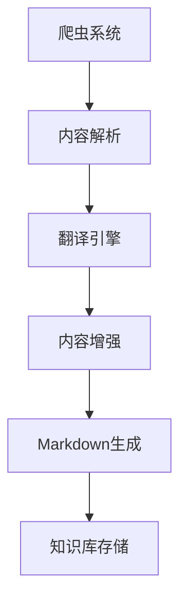
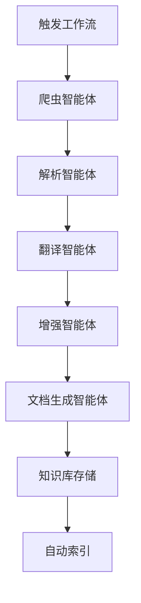

我想要将 cpprefence 网站 爬虫下来 进行翻译为中文，再进行对每一章节内容详解举例并总结，生成md文档，形成自己的知识库。帮我生成一个完整可行的具体方案。

---

### 完整方案：Cppreference 爬虫翻译与知识库构建

#### 整体架构


---

### 具体实现步骤

#### 1. 爬虫系统 (Python)
```python
import requests
from bs4 import BeautifulSoup
from urllib.parse import urljoin
import time
import os

BASE_URL = "https://en.cppreference.com/w/"
OUTPUT_DIR = "raw_content"

def crawl_cppreference():
    os.makedirs(OUTPUT_DIR, exist_ok=True)
    
    # 核心爬取函数
    def crawl_page(url, depth=0, max_depth=3):
        if depth > max_depth:
            return
            
        try:
            response = requests.get(url, timeout=10)
            response.raise_for_status()
            
            soup = BeautifulSoup(response.text, 'html.parser')
            
            # 保存原始HTML
            filename = url.split("/")[-1] or "index.html"
            with open(f"{OUTPUT_DIR}/{filename}.html", "w", encoding="utf-8") as f:
                f.write(response.text)
            
            # 提取内容区域 (根据实际页面结构调整选择器)
            content = soup.select_one("#content")
            if not content:
                return None
                
            # 递归爬取子页面
            for link in content.select("a[href]"):
                href = link["href"]
                if href.startswith("/w/") and "#" not in href:
                    new_url = urljoin(BASE_URL, href)
                    time.sleep(1)  # 礼貌爬取
                    crawl_page(new_url, depth+1)
                    
            return str(content)
            
        except Exception as e:
            print(f"Error crawling {url}: {e}")
            return None

    # 从主页开始爬取
    crawl_page(BASE_URL)

if __name__ == "__main__":
    crawl_cppreference()
```

#### 2. 内容解析器 (Python)
```python
import re
from bs4 import BeautifulSoup

def parse_html_content(html):
    soup = BeautifulSoup(html, 'html.parser')
    
    # 移除不需要的元素
    for element in soup.select(".t-navbar, .t-dsc-see, .t-dsc-header"):
        element.decompose()
    
    # 提取核心内容
    title = soup.find("h1").text.strip()
    sections = []
    
    # 解析每个章节
    for section in soup.select(".t-section, .t-dsc"):
        section_title = section.find("h2") or section.find("h3")
        if not section_title:
            continue
            
        # 提取代码示例
        code_blocks = []
        for pre in section.select("pre"):
            code_blocks.append({
                "lang": "cpp",
                "code": pre.text.strip()
            })
            pre.decompose()
        
        # 提取文本内容
        text_content = section.get_text(separator="\n", strip=True)
        text_content = re.sub(r'\n{3,}', '\n\n', text_content)
        
        sections.append({
            "title": section_title.text.strip(),
            "content": text_content,
            "code_blocks": code_blocks
        })
    
    return {
        "page_title": title,
        "sections": sections
    }
```

#### 3. 翻译引擎 (Python + DeepL API)
```python
import requests
import os

DEEPL_API_KEY = os.getenv("DEEPL_API_KEY")

def translate_text(text, target_lang="ZH"):
    """使用DeepL API翻译文本"""
    endpoint = "https://api-free.deepl.com/v2/translate"
    
    response = requests.post(
        endpoint,
        data={
            "auth_key": DEEPL_API_KEY,
            "text": text,
            "target_lang": target_lang,
            "preserve_formatting": "1"
        },
        timeout=30
    )
    
    if response.status_code == 200:
        return response.json()["translations"][0]["text"]
    else:
        raise Exception(f"Translation failed: {response.text}")
```

#### 4. 内容增强模块 (Python + GPT API)
```python
import openai

openai.api_key = os.getenv("OPENAI_API_KEY")

def enhance_content(title, content):
    """使用GPT进行内容解释和扩展"""
    prompt = f"""
    你是一个C++专家，请对以下C++参考内容进行扩展：
    1. 添加通俗易懂的中文解释
    2. 提供1-2个实用代码示例
    3. 添加注意事项和使用场景说明
    4. 最后用2句话总结核心要点
    
    原始内容标题：{title}
    原始内容：
    {content}
    """
    
    response = openai.ChatCompletion.create(
        model="gpt-4",
        messages=[{"role": "user", "content": prompt}],
        temperature=0.3,
        max_tokens=1500
    )
    
    return response.choices[0].message.content.strip()
```

#### 5. Markdown生成器 (Python)
```python
def generate_markdown(parsed_data):
    """生成结构化Markdown文档"""
    output = f"# {parsed_data['page_title']}\n\n"
    
    for section in parsed_data["sections"]:
        output += f"## {section['title']}\n\n"
        output += f"{section['translated_content']}\n\n"
        
        # 添加增强内容
        output += f"### ✨ 深入解析\n"
        output += f"{section['enhanced_content']}\n\n"
        
        # 添加代码示例
        if section["code_blocks"]:
            output += "### 代码示例\n"
            for i, code in enumerate(section["code_blocks"], 1):
                output += f"```cpp\n// 示例 {i}\n{code['code']}\n```\n\n"
        
        # 添加总结
        output += "### 💡 核心要点\n"
        output += f"{section['summary']}\n\n---\n\n"
    
    return output
```

#### 6. 主工作流
```python
def main_workflow():
    # 1. 爬取内容
    raw_html = crawl_cppreference()
    
    # 2. 解析内容
    parsed_data = parse_html_content(raw_html)
    
    # 3. 翻译和增强
    for section in parsed_data["sections"]:
        # 翻译主要内容
        section["translated_content"] = translate_text(section["content"])
        
        # 增强内容
        enhanced = enhance_content(
            f"{parsed_data['page_title']} - {section['title']}",
            section["translated_content"]
        )
        
        # 分割增强内容
        parts = enhanced.split("核心要点：")
        section["enhanced_content"] = parts[0]
        section["summary"] = parts[1] if len(parts) > 1 else ""
    
    # 4. 生成Markdown
    md_content = generate_markdown(parsed_data)
    
    # 5. 保存到知识库
    filename = f"knowledge_base/{parsed_data['page_title'].replace(' ', '_')}.md"
    with open(filename, "w", encoding="utf-8") as f:
        f.write(md_content)
```

---

### 关键注意事项

1. **爬虫伦理**
   - 遵守 `robots.txt` 规则
   - 设置请求间隔（≥1秒）
   - 使用缓存避免重复爬取
   - 添加 `User-Agent` 标识

2. **翻译质量**
   - 技术术语统一性：创建术语对照表
   - 保留代码和公式原格式
   - 人工审核关键内容

3. **增强内容验证**
   - GPT生成内容需经过编译器验证
   - 添加免责声明："AI生成内容仅供参考"
   - 定期更新知识库

4. **知识库结构示例**
   ```bash
   cpp_knowledge_base/
   ├── standard_library/
   │   ├── containers/
   │   │   ├── vector.md
   │   │   └── map.md
   │   └── algorithms/
   │       ├── sort.md
   │       └── find.md
   ├── language_features/
   │   ├── templates.md
   │   └── lambda.md
   └── index.md  # 自动生成的目录索引
   ```

5. **部署建议**
   - 使用Scrapy框架替代基础爬虫
   - 添加增量爬取功能
   - 使用Celery进行任务队列管理
   - 添加自动生成目录索引的功能

---

### 备选方案

1. **无API方案**
   - 翻译：使用 `translate` 库（基于Google翻译）
   - 增强：使用本地LLM（如LLaMA.cpp）
   ```python
   # 替代翻译方案
   from translate import Translator
   translator = Translator(to_lang="zh")
   section["translated_content"] = translator.translate(section["content"])
   ```

2. **静态站点方案**
   - 将生成的MD文件用MkDocs构建静态网站
   - 添加搜索功能（使用lunr.js）

3. **商业化方案**
   - 使用现成的文档平台（如Read the Docs）
   - 利用Confluence等企业知识库工具

---

此方案可实现自动化抓取、翻译、增强和文档生成，建议先从核心模块（如STL容器）开始试点，再逐步扩展。完整实现约需500-800行Python代码，关键点在于内容解析的准确性和术语一致性处理。

---

### 基于 Dify 的完整解决方案：自动化 Cppreference 知识库构建

利用 Dify 的智能体工作流能力，我们可以构建一个端到端的自动化系统，以下是完整方案：



#### 1. 在 Dify 中创建智能体工作流

##### 工作流配置（YAML 格式）
```yaml
name: cppreference-knowledge-builder
description: 自动化抓取、翻译和增强 Cppreference 内容
steps:
  - name: crawler_agent
    type: tool
    parameters:
      start_url: "https://en.cppreference.com/w/"
      max_depth: 3
      output_dir: "/data/raw_html"
  
  - name: parser_agent
    type: tool
    depends_on: crawler_agent
    parameters:
      input_dir: "/data/raw_html"
      output_dir: "/data/parsed_json"
  
  - name: translator_agent
    type: llm
    depends_on: parser_agent
    model: gpt-4-turbo
    prompt: |
      你是一个专业C++文档翻译专家，请将以下C++参考内容准确翻译成中文：
      - 保留所有技术术语的英文原名（括号中标注中文）
      - 保持代码块和数学公式原样
      - 确保技术准确性
      内容：
      {{ parser_agent.output }}
  
  - name: enhancer_agent
    type: llm
    depends_on: translator_agent
    model: gpt-4-turbo
    prompt: |
      你是一个C++高级工程师，请对以下翻译内容进行增强：
      1. 添加通俗易懂的解释
      2. 补充1-2个实用代码示例
      3. 添加注意事项和使用场景
      4. 总结核心要点（不超过3点）
      
      原始标题: {{ parser_agent.metadata.title }}
      翻译内容:
      {{ translator_agent.output }}
  
  - name: md_generator
    type: tool
    depends_on: enhancer_agent
    parameters:
      template: |
        # {{ title }}
        
        ## 📚 原始参考
        {{ original_summary }}
        
        ## 🌟 增强解析
        {{ enhanced_content }}
        
        ### 代码示例
        {{ code_examples }}
        
        ### 💡 核心要点
        {{ key_points }}
        
        [查看原始文档]({{ source_url }})
  
  - name: knowledge_store
    type: tool
    depends_on: md_generator
    parameters:
      output_dir: "/knowledge_base/{{ category }}/{{ topic }}"
      format: markdown
      index_strategy: auto-categorize
```

#### 2. 创建自定义工具智能体

##### 爬虫智能体 (Python)
```python
import requests
from bs4 import BeautifulSoup
import os
import json
from dify_client import DifyTool

class CppRefCrawler(DifyTool):
    def execute(self, params: dict) -> dict:
        start_url = params['start_url']
        max_depth = int(params.get('max_depth', 2))
        output_dir = params['output_dir']
        
        os.makedirs(output_dir, exist_ok=True)
        crawled = set()
        
        def crawl(url, depth=0):
            if depth > max_depth or url in crawled:
                return
                
            try:
                response = requests.get(url, headers={'User-Agent': 'DifyBot/1.0'})
                soup = BeautifulSoup(response.text, 'html.parser')
                
                # 保存原始HTML
                filename = os.path.join(output_dir, f"{url.split('/')[-1]}.html")
                with open(filename, 'w', encoding='utf-8') as f:
                    f.write(response.text)
                
                # 提取元数据
                title = soup.find('h1').text.strip()
                category = url.split('/')[-2] if len(url.split('/')) > 4 else 'general'
                
                # 查找相关链接
                for link in soup.select('a[href^="/w/"]'):
                    next_url = f"https://en.cppreference.com{link['href']}"
                    if '#cite_' not in next_url:
                        crawl(next_url, depth+1)
                
                crawled.add(url)
                return {'url': url, 'title': title, 'category': category}
                
            except Exception as e:
                return {'error': str(e)}
        
        result = crawl(start_url)
        return {'files': list(crawled), 'metadata': result}
```

##### 解析智能体 (Python)
```python
class CppRefParser(DifyTool):
    def execute(self, params: dict) -> dict:
        input_dir = params['input_dir']
        output_dir = params['output_dir']
        os.makedirs(output_dir, exist_ok=True)
        
        results = []
        
        for file in os.listdir(input_dir):
            if file.endswith('.html'):
                with open(os.path.join(input_dir, file), 'r', encoding='utf-8') as f:
                    soup = BeautifulSoup(f.read(), 'html.parser')
                    
                    # 提取核心内容
                    content = soup.select_one('#content')
                    
                    # 解析章节
                    sections = []
                    for section in content.select('.t-section, .t-dsc'):
                        title = section.find(['h2', 'h3', 'h4'])
                        if not title: continue
                            
                        # 清理内容
                        for elem in section.select('.t-navbar, .t-dsc-see'):
                            elem.decompose()
                            
                        text = section.get_text(separator='\n').strip()
                        code_blocks = [pre.text.strip() for pre in section.select('pre')]
                        
                        sections.append({
                            'heading': title.text.strip(),
                            'level': int(title.name[1]),
                            'content': text,
                            'code_blocks': code_blocks
                        })
                    
                    # 保存结构化数据
                    filename = file.replace('.html', '.json')
                    with open(os.path.join(output_dir, filename), 'w', encoding='utf-8') as f:
                        json.dump({
                            'title': soup.find('h1').text.strip(),
                            'url': f"https://en.cppreference.com/w/{file[:-5]}",
                            'sections': sections
                        }, f, ensure_ascii=False)
                    
                    results.append(filename)
        
        return {'parsed_files': results}
```

#### 3. 部署到 Dify 的工作流

1. **创建工具智能体**：
   - 在 Dify 的 "工具" 页面创建新工具
   - 上传爬虫和解析智能体代码
   - 配置输入/输出参数

2. **配置LLM智能体**：
   - 创建翻译和增强两个LLM智能体
   - 使用预设的提示词模板
   - 设置温度参数为0.3以保证技术准确性

3. **构建工作流**：
   - 按顺序连接各智能体
   - 配置错误处理策略（重试/跳过）
   - 设置速率限制（避免API过载）

4. **知识库集成**：
   ```python
   class KnowledgeStore(DifyTool):
       def execute(self, params: dict) -> dict:
           content = params['content']
           category = params.get('category', 'general')
           topic = params['title'].replace(' ', '_')
           
           # 创建分类目录
           category_dir = os.path.join(params['output_dir'], category)
           os.makedirs(category_dir, exist_ok=True)
           
           # 保存Markdown
           filename = f"{topic}.md"
           with open(os.path.join(category_dir, filename), 'w', encoding='utf-8') as f:
               f.write(content)
           
           # 更新索引
           self.update_index(category, topic, params['url'])
           
           return {'stored_path': os.path.join(category, filename)}
       
       def update_index(self, category, topic, url):
           index_file = os.path.join(params['output_dir'], 'INDEX.md')
           if not os.path.exists(index_file):
               with open(index_file, 'w') as f:
                   f.write("# C++ 知识库索引\n\n")
           
           with open(index_file, 'a', encoding='utf-8') as f:
               f.write(f"- [{category}/{topic}]({url})\n")
   ```

#### 4. 高级优化策略

1. **增量更新机制**：
   ```python
   # 在爬虫智能体中添加
   def get_last_crawl_time(url):
       # 从数据库或文件中获取上次爬取时间
       return last_modified
   
   if datetime.now() - get_last_crawl_time(url) < timedelta(days=7):
       return {'status': 'skipped', 'reason': 'recently_updated'}
   ```

2. **术语一致性管理**：
   - 创建共享术语表工具
   ```python
   class TermManager(DifyTool):
       term_base = {}
       
       def execute(self, params: dict):
           term = params['term']
           if term not in self.term_base:
               # 使用GPT生成标准翻译
               translation = llm_query(f"标准化翻译技术术语: {term}")
               self.term_base[term] = translation
           return self.term_base[term]
   ```
   - 在翻译智能体中调用术语管理工具

3. **质量验证流程**：
   ```yaml
   - name: quality_check
     type: llm
     depends_on: md_generator
     prompt: |
       作为C++专家，请验证以下内容的技术准确性：
       1. 代码示例是否能编译运行
       2. 概念解释是否准确
       3. 是否存在过时信息
       
       文档内容:
       {{ md_generator.output }}
       
       请用JSON格式返回验证结果和修改建议
   ```

#### 5. 部署架构

```
Docker 容器架构：
┌─────────────────┐       ┌─────────────────┐
│   Dify Server   │◄─────►│  Tool Agents    │
│    (主控)       │       │  (Python容器)   │
└─────────────────┘       └─────────────────┘
       │                           │
       ▼                           ▼
┌─────────────────┐       ┌─────────────────┐
│  LLM Gateway    │       │ Knowledge Store │
│ (GPT/Claude API)│       │  (MinIO/S3)     │
└─────────────────┘       └─────────────────┘
```

#### 6. 监控与维护

1. **监控面板**：
   - 跟踪每个智能体的执行时间和成功率
   - 记录术语库增长情况
   - 监控API使用成本

2. **自动维护任务**：
   - 每周验证知识库链接有效性
   - 每月更新C++标准变化部分
   - 季度性质量审计（抽样检查）

3. **人工干预点**：
   - 新C++标准发布时手动触发全量更新
   - 术语争议时人工确认
   - 复杂模板特化内容的手动审核

此方案充分利用了 Dify 的智能体编排能力，将复杂流程分解为可管理的步骤，同时保持了系统的灵活性和可扩展性。部署后可通过 Dify 的 API 或 Webhook 触发工作流，最终生成的知识库可直接用于 MkDocs、Docusaurus 等文档系统。