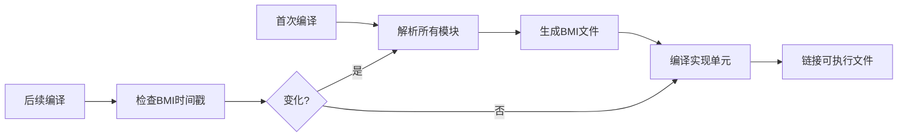
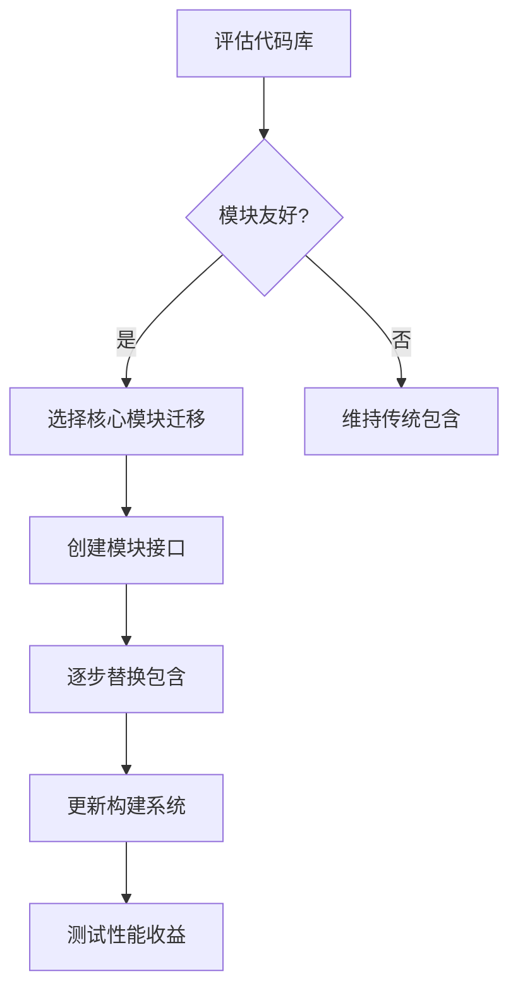

# Rust 中的 Crate 深度解析

在 Rust 生态系统中，**crate** 是一个核心概念，它是 Rust 代码组织和分发的**基本单元**。理解 crate 对于掌握 Rust 开发至关重要。

## 什么是 Crate？

### 定义
Crate 是 Rust 中的**编译单元**和**分发单元**：
- 一个 crate 包含一组相关的 Rust 源代码文件
- 它是 Rust 编译器 `rustc` 的输入单位
- 编译后生成一个库文件（`.rlib`）或可执行文件

### 类比理解
| 概念         | Rust        | 其他语言          |
|--------------|-------------|------------------|
| 最小代码单元 | Crate       | Java 的 JAR 包   |
|              |             | Python 的 Wheel  |
|              |             | C/C++ 的静态库   |
| 项目管理     | Cargo       | Maven/Gradle     |
|              |             | pip/npm          |

## Crate 的类型

### 1. 库 Crate (Library Crate)
- 编译为 `.rlib` 文件（Rust 静态库）
- 没有 `main()` 函数
- 提供可复用的功能组件
- 通过 `cargo new --lib <name>` 创建

**结构示例**:
```
my_library/
├── Cargo.toml    # 元数据和依赖声明
└── src/
    └── lib.rs    # 库的入口点
```

### 2. 二进制 Crate (Binary Crate)
- 编译为可执行文件
- 包含 `main()` 函数作为入口点
- 通过 `cargo new <name>` 创建

**结构示例**:
```
my_app/
├── Cargo.toml
└── src/
    └── main.rs   # 可执行文件的入口
```

### 3. 混合 Crate
- 同时包含库和可执行文件
- 常见结构：
```
project/
├── Cargo.toml
└── src/
    ├── lib.rs    # 库代码
    └── main.rs   # 可执行文件入口
    └── bin/      # 多个可执行文件
        ├── tool1.rs
        └── tool2.rs
```

## Crate 的核心组成

### 1. Cargo.toml - 包清单文件
```toml
[package]
name = "my_crate"
version = "0.1.0"
edition = "2021"

[dependencies]
serde = "1.0"       # 外部依赖
my_other_crate = { path = "../path/to/crate" } # 本地依赖

[dev-dependencies]  # 仅测试依赖
mockall = "0.11"

[features]          # 可选功能
parallel = ["rayon"]

[lib]               # 库配置
name = "mylib"
crate-type = ["cdylib"] # 编译为C兼容动态库
```

### 2. 源代码结构
- **`src/lib.rs`**: 库 crate 的根模块
- **`src/main.rs`**: 二进制 crate 的入口
- **模块系统**:
  ```rust
  // src/lib.rs
  pub mod utils;     // 声明 utils 模块 -> src/utils.rs
  pub mod network {  // 内联模块
      pub fn connect() { /* ... */ }
  }
  ```

## Crate 的关键特性

### 1. 命名空间隔离
- 每个 crate 有独立的命名空间
- 避免全局命名冲突
- 通过 `use` 语句导入：
  ```rust
  use serde::Serialize; // 导入 serde crate 中的 Serialize trait
  ```

### 2. 可见性控制
```rust
pub mod api {            // 公开模块
    pub struct Public;   // 公开结构体
    
    pub(crate) fn internal() {} // 仅当前 crate 可见
    
    mod private_impl {   // 私有模块
        struct Hidden;   // 私有类型
    }
}
```

### 3. 依赖管理
- 依赖在 `Cargo.toml` 中声明
- Cargo 自动处理：
  - 版本解析
  - 依赖下载（来自 crates.io）
  - 编译顺序
  - 特性标志激活

## Crate 的生命周期

1. **开发**:
   ```bash
   cargo new my_project
   cargo build    # 编译 crate
   cargo run      # 运行二进制 crate
   cargo test     # 运行测试
   ```

2. **分发**:
   - 发布到 crates.io:
     ```bash
     cargo publish
     ```
   - 或通过 Git 仓库分发

3. **使用**:
   - 作为依赖添加到 `Cargo.toml`:
     ```toml
     [dependencies]
     my_crate = "1.0.0"
     ```

## Crate 生态系统

### 1. crates.io
- Rust 的官方包注册中心
- 包含超过 10 万个 crate
- 自动文档生成：docs.rs

### 2. 常用 crate 类别
| 类别         | 示例 crate              | 功能描述                  |
|--------------|-------------------------|-------------------------|
| Web 框架     | `actix-web`, `rocket`   | 构建 Web 服务           |
| 异步运行时   | `tokio`, `async-std`    | 异步编程支持            |
| 序列化       | `serde`, `prost`        | 数据序列化/反序列化     |
| CLI 工具     | `clap`, `structopt`     | 命令行参数解析          |
| 数据处理     | `ndarray`, `polars`     | 数值计算和数据分析      |

## 高级 crate 概念

### 1. Crate 特性 (Features)
```toml
[features]
default = ["std"]   # 默认激活的特性
std = []            # 标准库支持
wasm = ["js-sys"]   # WASM特定功能

[dependencies]
js-sys = { version = "0.3", optional = true } # 可选依赖
```
使用特性：
```bash
cargo build --features "wasm" # 激活 wasm 特性
```

### 2. 工作空间 (Workspaces)
管理多个相关 crate：
```toml
# workspace/Cargo.toml
[workspace]
members = ["crate1", "crate2", "cli"]
```

### 3. no_std 支持
创建不依赖标准库的 crate：
```rust
#![no_std] // 禁用标准库

pub fn embedded_function() {
    // 嵌入式系统专用代码
}
```

## 最佳实践

1. **语义化版本控制**:
   - `MAJOR.MINOR.PATCH`
   - 遵循 semver 规范

2. **文档注释**:
   ```rust
   /// 计算两个数的和
   ///
   /// # 示例
   /// ```
   /// assert_eq!(add(2, 3), 5);
   /// ```
   pub fn add(a: i32, b: i32) -> i32 {
       a + b
   }
   ```

3. **合理的模块划分**:
   ```
   src/
   ├── lib.rs
   ├── network/
   │   ├── mod.rs     # 公开接口
   │   ├── tcp.rs
   │   └── udp.rs
   └── utils/
       ├── logging.rs
       └── crypto.rs
   ```

## 总结

Rust 中的 crate 是：
- **编译单元**：Rustc 的最小编译单位
- **分发单元**：代码共享和复用的基本形式
- **封装单元**：提供命名空间隔离和可见性控制
- **依赖单元**：Cargo 管理依赖的基本粒度

理解 crate 的工作机制是掌握 Rust 开发的关键，它体现了 Rust 的模块化设计哲学："通过清晰的边界组织代码，通过显式的依赖管理复杂性"。

# Rust Crate 与 C/C++ 代码组织深度对比

Rust 的 crate 系统和 C/C++ 的传统代码组织方式代表了两种不同的工程哲学。我们将从多个维度进行详细对比：

## 1. 基本概念对比

| **特性**             | **Rust Crate**                          | **C/C++ 传统方式**                   |
|----------------------|----------------------------------------|--------------------------------------|
| **基本单元**         | Crate（包）                            | 文件（.c/.cpp/.h）                   |
| **模块系统**         | 语言内置模块系统                       | 头文件包含（#include）               |
| **编译单元**         | 整个 crate 是单一编译单元              | 每个源文件是独立编译单元             |
| **依赖管理**         | Cargo 统一管理                         | 手动管理或外部工具（CMake, Make）    |
| **接口定义**         | `mod` 和 `pub` 关键字                  | 头文件（.h/.hpp）                    |
| **二进制输出**       | 静态库(.rlib) 或 可执行文件            | .a(静态库), .so/.dll(动态库), 可执行文件 |

## 2. 项目结构对比

### Rust Crate 典型结构
```
my_crate/
├── Cargo.toml         # 元数据和依赖声明
├── src/
│   ├── lib.rs         # 库入口点
│   ├── main.rs        # 二进制入口点
│   ├── utils/         # 模块目录
│   │   ├── mod.rs     # 模块声明
│   │   └── math.rs    # 子模块
│   └── network.rs     # 同级模块
├── tests/             # 集成测试
│   └── integration_test.rs
└── examples/          # 示例代码
    └── basic_usage.rs
```

### C/C++ 典型结构
```
my_project/
├── include/           # 公共头文件
│   └── mylib.h
├── src/               # 实现文件
│   ├── utils.c        # 工具函数
│   ├── math.cpp       # 数学函数
│   └── network.cpp    # 网络功能
├── test/              # 测试代码
│   └── test_math.cpp
├── CMakeLists.txt     # 构建配置
└── Makefile           # 替代构建配置
```

## 3. 依赖管理对比

### Rust (Cargo)
```toml
# Cargo.toml
[dependencies]
serde = "1.0.136"          # 来自 crates.io
nalgebra = { version = "0.32", features = ["serde-serialize"] }
my_local_crate = { path = "../path/to/crate" } # 本地依赖

[dev-dependencies]
mockall = "0.11.0"         # 仅测试依赖
```

### C/C++ (手动/CMake)
```cmake
# CMakeLists.txt
find_package(Boost 1.75 REQUIRED COMPONENTS filesystem system)

# 添加本地库
add_subdirectory(../path/to/lib LOCAL_CRATE)

# 添加外部依赖
include_directories(third_party/some_lib/include)
add_library(some_lib STATIC IMPORTED)
set_target_properties(some_lib PROPERTIES IMPORTED_LOCATION 
                   third_party/some_lib/lib/libsome.a)
```

## 4. 模块系统对比

### Rust 模块系统
```rust
// src/lib.rs
pub mod utils; // 声明 utils 模块 -> src/utils.rs

// src/utils.rs
pub mod math; // 嵌套模块 -> src/utils/math.rs

// 使用模块
use crate::utils::math::add;
```

### C++ 模块系统 (C++20)
```cpp
// math.ixx (模块接口)
export module math;
export int add(int a, int b);

// main.cpp
import math; // 导入模块
```

### C 头文件包含
```c
// utils.h
#ifndef UTILS_H
#define UTILS_H

int add(int a, int b);

#endif

// main.c
#include "utils.h" // 包含头文件
```

## 5. 可见性控制对比

### Rust 精细可见性控制
```rust
pub struct PublicStruct;         // 完全公开

pub(crate) struct CrateVisible;  // 仅当前 crate 可见

mod internal {
    pub(super) struct ModuleVisible; // 仅父模块可见
}
```

### C++ 可见性控制
```cpp
class MyClass {
public:     // 完全公开
    void public_method();
    
protected:  // 子类和友元可见
    void protected_method();
    
private:    // 仅类内可见
    void private_method();
};

// 文件级可见性无直接支持
```

### C 有限可见性
```c
// 头文件中
extern int public_var; // 公开变量

// 源文件中
static int private_var; // 文件内可见
```

## 6. 构建流程对比

### Rust 构建流程 (Cargo)
```bash
cargo build     # 开发构建
cargo build --release # 发布构建
cargo test      # 运行测试
cargo run       # 编译并运行
cargo doc       # 生成文档
```

### C/C++ 构建流程 (CMake/Make)
```bash
# CMake
mkdir build && cd build
cmake .. -DCMAKE_BUILD_TYPE=Release
make -j8
make test
```

```bash
# Make
make all       # 构建
make test      # 测试
make install   # 安装
```

## 7. 包分发对比

| **特性**         | **Rust Crates.io**                  | **C/C++ 包管理**                     |
|------------------|-------------------------------------|--------------------------------------|
| **中央仓库**     | crates.io (官方托管)               | 无标准中央仓库                       |
| **版本控制**     | 语义化版本自动解析                 | 手动版本管理                         |
| **文档托管**     | docs.rs 自动生成文档               | 需自行托管文档                       |
| **依赖解析**     | Cargo 自动解决依赖冲突             | 手动解决依赖冲突                     |
| **跨平台支持**   | 自动处理平台特定依赖               | 需要手动配置条件编译                 |
| **安装方式**     | `cargo install <crate>`            | 源码编译或系统包管理器               |

## 8. 工具链支持对比

### Rust 工具链
- **Cargo**: 一体化工具（构建、测试、文档、发布）
- **rustup**: 工具链管理
- **clippy**: 代码检查
- **rustfmt**: 代码格式化
- **perf**: 性能分析

### C/C++ 工具链
- **编译器**: GCC, Clang, MSVC
- **构建系统**: Make, CMake, Bazel
- **包管理**: vcpkg, Conan, system package managers
- **分析工具**: gprof, Valgrind, perf
- **格式化**: clang-format

## 9. 交叉编译支持

### Rust 交叉编译
```bash
# 安装目标工具链
rustup target add x86_64-unknown-linux-musl

# 交叉编译
cargo build --target=x86_64-unknown-linux-musl
```

### C/C++ 交叉编译
```cmake
# CMake 交叉编译示例
set(CMAKE_C_COMPILER "arm-linux-gnueabihf-gcc")
set(CMAKE_CXX_COMPILER "arm-linux-gnueabihf-g++")
```

## 10. 生态系统对比

### Rust 生态系统特点
- **统一工具链**: 所有开发者使用相同工具
- **自动文档生成**: 文档注释标准化
- **丰富的包仓库**: crates.io 超过 100,000 个 crate
- **强类型接口**: crate 边界有严格类型检查
- **安全保证**: crate 边界防止数据竞争

### C/C++ 生态系统特点
- **成熟稳定**: 数十年积累的库和框架
- **硬件级访问**: 更适合底层系统编程
- **厂商支持**: 硬件厂商提供专用库
- **多样性**: 多种构建系统和包管理选择
- **ABI 兼容性**: 二进制兼容性挑战

## 总结：核心差异与适用场景

| **维度**       | **Rust Crate**                     | **C/C++ 传统方式**               |
|----------------|-----------------------------------|----------------------------------|
| **哲学**       | 安全、一致、开发友好              | 灵活、控制力强、贴近硬件         |
| **学习曲线**   | 较陡峭但一致                      | 平缓但碎片化                     |
| **依赖管理**   | 自动化程度高                      | 手动配置较多                     |
| **构建速度**   | 增量编译优秀                      | 全量编译为主                     |
| **跨平台**     | 语言级支持优秀                    | 需要大量条件编译                 |
| **安全性**     | 内存安全保证                      | 依赖开发者经验                   |
| **适用场景**   | 网络服务、安全关键系统、Wasm      | 操作系统、嵌入式、游戏引擎、HPC  |
| **社区支持**   | 快速增长但较新                   | 成熟稳定但创新较慢               |

### 何时选择 Rust Crate
- 需要高可靠性和内存安全的项目
- 快速构建跨平台应用
- 微服务架构和WebAssembly场景
- 希望减少依赖管理和构建配置时间
- 重视自动化文档和测试集成

### 何时选择 C/C++ 方式
- 操作系统内核和裸机编程
- 极致性能优化的场景
- 与现有C/C++大型代码库集成
- 需要直接与硬件交互的场景
- 对二进制大小有极端要求的嵌入式系统

Rust 的 crate 系统代表了现代语言在代码组织和依赖管理方面的进步，通过标准化工具链和强类型边界解决了C/C++生态中许多痛点。然而，C/C++的传统方式在底层系统编程和与现有生态集成方面仍有不可替代的优势。两者各有适用场景，开发者应根据项目需求做出合适选择。

# C++20 模块系统：深度剖析优势与缺陷

C++20 模块系统是现代 C++ 最重要的革新之一，旨在解决传统头文件包含机制（`#include`）的诸多问题。作为在 C++ 生态中工作多年的开发者，我认为有必要全面分析这一特性的实际价值和当前局限。

## 模块系统的核心优势

### 1. 革命性的编译速度提升
```cpp
// 传统头文件方式 (慢)
#include <vector>
#include <string>
#include "my_header.h" // 每次包含都需要完整解析

// 模块方式 (快)
import std.vector;   // 编译器缓存解析结果
import std.string;
import my_module;
```

**机制对比**：
- 传统 `#include`：每次包含都进行文本替换和重新解析
- 模块 `import`：**一次性解析**，生成二进制模块接口（BMI）缓存
- **实测效果**：大型项目编译速度提升 30-50%（微软报告 Chrome 构建提速 40%）

### 2. 彻底解决宏污染问题
```cpp
// my_module.ixx (模块接口文件)
export module MyModule;

// 宏不会泄漏到模块外部
#define INTERNAL_MACRO 42 

export void public_api();

// main.cpp
import MyModule;

int main() {
    public_api();
    // INTERNAL_MACRO 不可见！彻底解决宏污染
}
```

**关键改进**：
- 模块内部的宏定义**不会影响导入方**
- 结束了几十年来由宏导致的命名冲突问题
- 使 C++ 更符合现代语言的封装理念

### 3. 强封装性与逻辑隔离
```cpp
// 模块接口文件 (math.ixx)
export module math;

// 只导出公共接口
export namespace math {
    double sqrt(double x);
    constexpr double pi = 3.1415926;
}

// 隐藏实现细节
namespace detail {
    double newton_raphson(...) { ... } // 外部不可见
}
```

**封装优势**：
1. **真正意义上的接口/实现分离**
2. 客户端代码只能访问导出符号
3. 避免传统头文件中 `private` 成员仍暴露定义的问题

### 4. 消除头文件重复包含问题
```cpp
// 传统头文件必须使用防护宏
#ifndef MY_HEADER_H
#define MY_HEADER_H
// ... 内容 ...
#endif

// 模块天然防重复
export module UniqueModule; // 不需要防护宏
```

**根本解决**：
- 模块系统内置唯一性保证
- 消除因忘记防护宏导致的诡异编译错误

### 5. 更清晰的代码组织
```cpp
// 模块分区示例 (大型库组织)
// core.ixx
export module Library:core;
export class Core { ... };

// network.ixx
export module Library:network;
import :core; // 导入分区
export class Network { ... };

// 主模块文件
export module Library;
export import :core;
export import :network;
```

**结构化优势**：
- 支持模块分区（Partitions）实现逻辑分组
- 显式依赖声明 (`export import`)
- 比传统头文件更直观的代码组织结构

## 当前主要缺陷与挑战

### 1. 生态系统支持不完善
```cpp
// 实际项目可能遇到的警告
#pragma warning "模块支持在您的编译器中是实验性的"
```

**工具链现状**：
| 编译器   | 支持状态                 | 关键限制                      |
|----------|--------------------------|-----------------------------|
| MSVC     | 最完善 (VS 2019 16.8+)   | 需要 `/std:c++20` 编译选项    |
| Clang    | 部分支持 (Clang 12+)     | 需要 `-fmodules` 标志        |
| GCC      | 实验性 (GCC 11+)         | 需要 `-fmodules-ts`          |

**构建系统问题**：
- CMake 在 3.26 之前对模块支持有限
- 模块编译需要特定顺序（传统并行构建可能失效）
- BMI（二进制模块接口）文件处理复杂

### 2. 与传统代码互操作困难
```cpp
// 混合使用示例 - 危险区域！
import std.vector;   // 新模块
#include "legacy.h"  // 传统头文件
// 可能导致宏冲突和未定义行为
```

**主要挑战**：
1. **全局模块碎片化**：传统头文件被视为"全局模块"部分
2. **宏状态不一致**：模块内外宏定义行为差异
3. **ODR（单一定义规则）风险**：同一实体在不同模块中可能有不同定义

### 3. 陡峭的学习曲线
```cpp
// 模块语法复杂性示例
module;               // 全局模块片段
#include <legacy.h>   // 只能在这里包含传统头文件

export module MyModule;
import std.core;      // 导入标准库模块

export {
    // 导出块
    class MyClass;
    void api_function();
}

namespace detail {
    // 隐藏实现
    class Internal {};
}
```

**学习难点**：
- 三种模块文件类型：接口单元、实现单元、分区单元
- 复杂的导出规则 (`export` vs `export import`)
- 全局模块片段与传统头文件的特殊处理
- 与现有 C++ 知识体系存在断层

### 4. 初始编译性能下降


**性能矛盾**：
- **短期代价**：首次编译需要生成 BMI，可能比传统方式慢
- **长期收益**：后续编译因 BMI 缓存获得显著加速
- **小项目悖论**：小型项目可能看不到明显收益甚至变慢

### 5. 分布式构建挑战
```cpp
// 分布式构建中的模块问题
[机器A] 编译 moduleA -> 生成 moduleA.bmi
[机器B] 需要 moduleA.bmi 编译 moduleB ❌
// BMI 文件必须跨机器同步
```

**关键问题**：
- BMI 文件是编译器特定二进制格式
- 需要确保所有构建节点使用**完全相同的编译器版本**
- 增量构建时 BMI 同步机制复杂
- 对 CI/CD 流水线提出新要求

## 实际应用建议

### 何时使用模块
✅ **新项目开发**：尤其是纯 C++20+ 代码库  
✅ **性能敏感型库**：模板密集的数学/算法库  
✅ **长期维护项目**：逐步替换性能瓶颈模块  
✅ **教学示范项目**：展示现代 C++ 最佳实践  

### 何时暂缓使用
⚠️ **跨平台项目**：编译器支持不一致  
⚠️ **传统代码库**：依赖大量老式头文件  
⚠️ **嵌入式开发**：工具链支持滞后  
⚠️ **紧急交付项目**：避免工具链问题风险  

### 迁移策略


## 未来展望

尽管存在挑战，模块系统代表着 C++ 的未来方向：
- **C++23 改进**：标准库模块 `std` 和 `std.compat`
- **工具链成熟**：各编译器承诺 2024 年前完全支持
- **生态系统演进**：包管理器（vcpkg/Conan）正在适配
- **教育资料增长**：书籍和教程数量快速增加

## 结论：谨慎拥抱未来

**优势总结**：
- ⚡ 编译速度革命性提升
- 🛡️ 解决宏污染历史问题
- 📦 真正意义上的封装
- 🧩 更清晰的代码组织

**当前缺陷**：
- 🛠️ 工具链支持不完善
- 🔀 与传统代码互操作困难
- 📚 学习曲线陡峭
- 🤖 分布式构建挑战

作为开发者，我建议：
1. 在新项目中尝试模块系统
2. 大型项目采用渐进式迁移
3. 关注编译器更新日志
4. 优先在性能关键模块使用

模块系统不是万灵药，但它是 C++ 现代化进程中的重要里程碑。随着工具链成熟和生态演进，我们有理由相信它最终将成为 C++ 开发的主流范式。