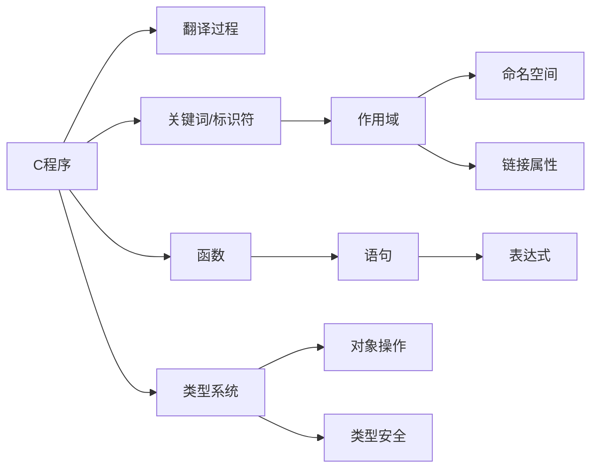

## 基本概念  C语言基础概念 
 
本节定义了在描述C编程语言时所使用的特定术语及相关概念。  

```text
一个C程序是由一系列包含声明的文本文件（通常是头文件和源文件）组成的。这些文件经过翻译后成为可执行程序，当操作系统调用其main函数时执行（除非程序本身是操作系统或其他独立程序，此时入口点由实现定义）。  

在C程序中，某些单词具有特殊含义，它们被称为关键词。其他单词可用作标识符，用于标识对象、函数、结构体、联合体或枚举标签、它们的成员、类型定义名称、标签或宏。  

每个标识符（宏除外）仅在程序中称为其作用域的部分有效，并属于四种命名空间之一。某些标识符具有链接属性，这使得它们在不同作用域或翻译单元中出现时指向同一实体。  

函数的定义包含语句和声明的序列，其中一些包含表达式，这些表达式指定了程序要执行的计算。  

声明和表达式用于创建、销毁、访问和操作对象。C语言中的每个对象、函数和表达式都与一个类型相关联。
```

---

### C语言基础概念详解

#### 1. **C程序组成结构**

C程序由一系列文本文件（头文件和源文件）组成，经过翻译（编译和链接）成为可执行程序，从main函数开始执行（除非是特殊程序如操作系统）。

```c
// main.c
#include <stdio.h> // 头文件包含声明

int main(void) {  // 入口函数
    printf("Hello World");
    return 0;
}
```

- **文本文件**：`.c`源文件包含代码逻辑，`.h`头文件包含声明（函数原型/宏/类型定义）
- **翻译过程**：
  1. 预处理：处理`#include`等指令（`gcc -E main.c -o main.i`）
  2. 编译：生成汇编代码（`gcc -S main.i -o main.s`）
  3. 汇编：生成目标文件（`gcc -c main.s -o main.o`）
  4. 链接：合并库和模块生成可执行文件（`gcc main.o -o app`）
- **执行入口**：操作系统加载可执行文件后从`main`函数开始执行（独立程序如操作系统内核由`_start`等特定入口启动）

---

#### 2. **关键词与标识符**

C语言中有些单词是关键词（保留字），具有特殊含义；其他单词可以作为标识符，用于命名各种实体。

```c
int auto = 10;      // 错误：auto是关键词
float _Decimal32;   // 错误：_Decimal32是保留标识符

// 合法标识符示例
struct Data {        // Data：结构体标签
    int count;       // count：成员标识符
};
typedef struct Data TData; // TData：类型定义名
void func(int param); // func：函数名，param：参数名
```

- **关键词**：C语言保留的32个单词（如`if, for, int, return`），不可用作标识符
- **标识符规则**：
  - 由字母/数字/下划线组成，首字符不能是数字
  - 区分大小写（`count ≠ Count`）
  - 不能与关键词冲突
- **标识符用途**：
  - 变量/函数名（`int count;`）
  - 结构体/联合体标签（`struct Point { ... };`）
  - 成员名（`point.x`）
  - 类型别名（`typedef int INT32;`）
  - 枚举常量（`enum Color { RED };`）
  - goto标签（`error: ...`）

---

#### 3. **作用域与命名空间**

每个标识符（宏除外）都有作用域，即其有效的程序区域，并且属于四种命名空间之一。链接属性允许标识符在不同作用域或翻译单元中引用同一实体。

```c
// 文件作用域
static int file_var;  // 内部链接

void func() {
    int local = 10;   // 块作用域
    { 
        int local = 20; // 嵌套块作用域
        printf("%d", local); // 输出20
    }
    label: // 函数内标签作用域
    goto label;
}

// 四种命名空间示例
struct test { int x; }; // 标签命名空间
void test();            // 函数命名空间（不与结构体冲突）
int test = 10;          // 变量命名空间
enum { test };          // 枚举常量命名空间
```

- **作用域类型**：
  | 类型         | 范围               | 示例                     |
  |--------------|--------------------|--------------------------|
  | 文件作用域   | 从声明处到文件末尾 | `int global;`            |
  | 块作用域     | `{}`内             | `for(int i=0;...)`       |
  | 函数原型作用域| 参数列表内         | `void f(int x);`         |
  | 函数作用域   | goto标签专用       | `error: ...`             |

- **命名空间**：
  1. 标签名空间（`struct/union/enum`标签）
  2. 结构体/联合体成员名空间（每个结构体独立）
  3. 普通标识符名空间（变量/函数/类型别名/枚举常量）
  4. 宏名空间（预处理阶段独立）

- **链接属性**：
  - **外部链接**：`extern int var;`（多文件共享）
  - **内部链接**：`static int var;`（仅当前文件）
  - **无链接**：局部变量/函数参数

---

#### 4. **函数定义与执行**

函数由语句和声明序列组成，其中可能包含表达式，表达式用于指定计算。

```c
// 函数定义结构
int add(int a, int b) { // 声明部分：参数声明
    /* 语句序列 */
    int result;          // 声明语句
    result = a + b;      // 表达式语句
    return result;       // 跳转语句
}
```

- **核心组件**：
  - **声明语句**：引入变量（`int x;`）
  - **表达式语句**：计算值（`y = x*2;`）
  - **控制流语句**：`if/for/while`等
  - **跳转语句**：`return/goto/break`
- **表达式分类**：
  - 算术表达式：`a + b * c`
  - 逻辑表达式：`(x>0) && (y<10)`
  - 赋值表达式：`x = y = 0`
  - 函数调用表达式：`sqrt(2.0)`

---

#### 5. **类型系统与对象操作**

每个对象、函数和表达式都有一个类型，声明和表达式用于操作对象。

```c
// 类型关联示例
int *p = malloc(sizeof(int)); // 创建对象
*p = 42;                      // 访问对象
free(p);                      // 销毁对象

// 类型决定操作合法性
float f = 3.14;
int *ptr = &f; // 错误：int*指针不能指向float
```

- **对象（Object）**：程序操作的存储区域（非面向对象中的对象）
- **类型核心作用**：
  1. 确定存储大小（`sizeof(int)`通常为4字节）
  2. 定义值的表示（`int`用补码，`float`用IEEE754）
  3. 约束合法操作（指针解引用/数组下标/算术运算）
- **类型分类**：
  - **基础类型**：`int/float/char`等
  - **派生类型**：指针/数组/结构体/联合体/函数
  - **限定类型**：`const/volatile`修饰

- **对象生命周期**：
  - **静态存储期**：全局变量（程序运行全程存在）
  - **自动存储期**：局部变量（进入块创建，退出销毁）
  - **动态存储期**：`malloc`分配的内存（手动管理）

---

### 关键概念关联图


理解这些基础概念是掌握C语言的核心，它们共同构成了程序的静态结构（声明/作用域）和动态行为（表达式执行/对象操作）。