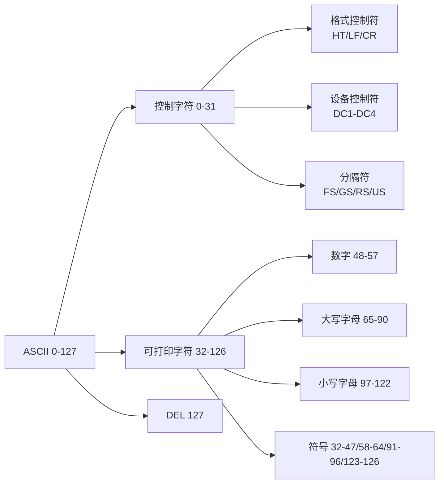

## ASCII码表- C语言基础概念

```text
以下表格包含了所有128个ASCII码的十进制(dec)、八进制(oct)、十六进制(hex)和对应字符(ch)的编码。

| dec | oct | hex | ch                   | dec | oct | hex | ch  | dec | oct | hex | ch  | dec | oct | hex | ch        |
|-----|-----|-----|----------------------|-----|-----|-----|-----|-----|-----|-----|-----|-----|-----|-----|----------|
| 0   | 0   | 00  | NUL (空字符)         | 32  | 40  | 20  | 空格 | 64  | 100 | 40  | @   | 96  | 140 | 60  | `        |
| 1   | 1   | 01  | SOH (标题开始)       | 33  | 41  | 21  | !   | 65  | 101 | 41  | A   | 97  | 141 | 61  | a        |
| 2   | 2   | 02  | STX (正文开始)       | 34  | 42  | 22  | "   | 66  | 102 | 42  | B   | 98  | 142 | 62  | b        |
| 3   | 3   | 03  | ETX (正文结束)       | 35  | 43  | 23  | #   | 67  | 103 | 43  | C   | 99  | 143 | 63  | c        |
| 4   | 4   | 04  | EOT (传输结束)       | 36  | 44  | 24  | $   | 68  | 104 | 44  | D   | 100 | 144 | 64  | d        |
| 5   | 5   | 05  | ENQ (询问)           | 37  | 45  | 25  | %   | 69  | 105 | 45  | E   | 101 | 145 | 65  | e        |
| 6   | 6   | 06  | ACK (确认响应)       | 38  | 46  | 26  | &   | 70  | 106 | 46  | F   | 102 | 146 | 66  | f        |
| 7   | 7   | 07  | BEL (响铃)           | 39  | 47  | 27  | '   | 71  | 107 | 47  | G   | 103 | 147 | 67  | g        |
| 8   | 10  | 08  | BS (退格)            | 40  | 50  | 28  | (   | 72  | 110 | 48  | H   | 104 | 150 | 68  | h        |
| 9   | 11  | 09  | HT (水平制表)        | 41  | 51  | 29  | )   | 73  | 111 | 49  | I   | 105 | 151 | 69  | i        |
| 10  | 12  | 0a  | LF (换行)            | 42  | 52  | 2a  | *   | 74  | 112 | 4a  | J   | 106 | 152 | 6a  | j        |
| 11  | 13  | 0b  | VT (垂直制表)        | 43  | 53  | 2b  | +   | 75  | 113 | 4b  | K   | 107 | 153 | 6b  | k        |
| 12  | 14  | 0c  | FF (换页)            | 44  | 54  | 2c  | ,   | 76  | 114 | 4c  | L   | 108 | 154 | 6c  | l        |
| 13  | 15  | 0d  | CR (回车)            | 45  | 55  | 2d  | -   | 77  | 115 | 4d  | M   | 109 | 155 | 6d  | m        |
| 14  | 16  | 0e  | SO (移出)            | 46  | 56  | 2e  | .   | 78  | 116 | 4e  | N   | 110 | 156 | 6e  | n        |
| 15  | 17  | 0f  | SI (移入)            | 47  | 57  | 2f  | /   | 79  | 117 | 4f  | O   | 111 | 157 | 6f  | o        |
| 16  | 20  | 10  | DLE (数据链路转义)    | 48  | 60  | 30  | 0   | 80  | 120 | 50  | P   | 112 | 160 | 70  | p        |
| 17  | 21  | 11  | DC1 (设备控制1)      | 49  | 61  | 31  | 1   | 81  | 121 | 51  | Q   | 113 | 161 | 71  | q        |
| 18  | 22  | 12  | DC2 (设备控制2)      | 50  | 62  | 32  | 2   | 82  | 122 | 52  | R   | 114 | 162 | 72  | r        |
| 19  | 23  | 13  | DC3 (设备控制3)      | 51  | 63  | 33  | 3   | 83  | 123 | 53  | S   | 115 | 163 | 73  | s        |
| 20  | 24  | 14  | DC4 (设备控制4)      | 52  | 64  | 34  | 4   | 84  | 124 | 54  | T   | 116 | 164 | 74  | t        |
| 21  | 25  | 15  | NAK (否定应答)        | 53  | 65  | 35  | 5   | 85  | 125 | 55  | U   | 117 | 165 | 75  | u        |
| 22  | 26  | 16  | SYN (同步空闲)        | 54  | 66  | 36  | 6   | 86  | 126 | 56  | V   | 118 | 166 | 76  | v        |
| 23  | 27  | 17  | ETB (传输块结束)     | 55  | 67  | 37  | 7   | 87  | 127 | 57  | W   | 119 | 167 | 77  | w        |
| 24  | 30  | 18  | CAN (取消)            | 56  | 70  | 38  | 8   | 88  | 130 | 58  | X   | 120 | 170 | 78  | x        |
| 25  | 31  | 19  | EM (介质结束)         | 57  | 71  | 39  | 9   | 89  | 131 | 59  | Y   | 121 | 171 | 79  | y        |
| 26  | 32  | 1a  | SUB (替换字符)        | 58  | 72  | 3a  | :   | 90  | 132 | 5a  | Z   | 122 | 172 | 7a  | z        |
| 27  | 33  | 1b  | ESC (退出)           | 59  | 73  | 3b  | ;   | 91  | 133 | 5b  | [   | 123 | 173 | 7b  | {        |
| 28  | 34  | 1c  | FS (文件分隔符)      | 60  | 74  | 3c  | <   | 92  | 134 | 5c  | \   | 124 | 174 | 7c  | \|       |
| 29  | 35  | 1d  | GS (组分隔符)        | 61  | 75  | 3d  | =   | 93  | 135 | 5d  | ]   | 125 | 175 | 7d  | }        |
| 30  | 36  | 1e  | RS (记录分隔符)      | 62  | 76  | 3e  | >   | 94  | 136 | 5e  | ^   | 126 | 176 | 7e  | ~        |
| 31  | 37  | 1f  | US (单元分隔符)      | 63  | 77  | 3f  | ?   | 95  | 137 | 5f  | _   | 127 | 177 | 7f  | DEL (删除)|

注：在Unicode中，ASCII字符块被称为U+0000..U+007F基本拉丁字母。

示例代码：
#include <stdio.h>

int main(void)
{
    puts("可打印ASCII字符:");
    for (int i = 32; i < 127; ++i) {
        putchar(i);
        putchar(i % 16 == 15 ? '\n' : ' ');
    }
}

可能的输出：
可打印ASCII字符:
  ! " # $ % & ' ( ) * + , - . /
0 1 2 3 4 5 6 7 8 9 : ; < = > ?
@ A B C D E F G H I J K L M N O
P Q R S T U V W X Y Z [ \ ] ^ _
` a b c d e f g h i j k l m n o
p q r s t u v w x y z { | } ~

（注：保持所有技术术语的英文缩写如NUL、SOH等不变，因为这些是标准术语。对控制字符名称进行了准确的中文翻译，如"退格"、"换行"等。表格格式调整为更适合中文阅读的排版方式，同时保留了原始的技术精确性。）
```

---

### ASCII 码表深度解析

#### 1. **ASCII 基础概念**
ASCII（American Standard Code for Information Interchange）是计算机系统中用于字符编码的标准体系，包含128个字符（0-127），分为两个主要类别：

| **类别**       | **范围** | **字符数** | **特点**                     |
|----------------|----------|------------|------------------------------|
| 控制字符       | 0-31     | 32个       | 不可见，用于设备控制         |
| 可打印字符     | 32-127   | 96个       | 可见字符，包括字母/数字/符号 |
| 扩展ASCII      | 128-255  | 128个      | 非标准，厂商自定义           |

#### 2. **控制字符详解（0-31）**
这些字符不可打印，用于控制设备或格式化文本：

```c
printf("Hello\bWorld"); // 退格符(8)效果: HellWorld
```

| **十进制** | **缩写** | **全称**             | **功能**                     | **现代应用**               |
|------------|----------|----------------------|------------------------------|----------------------------|
| 0          | NUL      | Null                 | 字符串结束标志               | C语言字符串终止符          |
| 7          | BEL      | Bell                 | 触发蜂鸣器                   | 终端警告音                 |
| 8          | BS       | Backspace            | 光标左移一位                 | 键盘退格键                 |
| 9          | HT       | Horizontal Tab       | 水平制表                     | \t 制表符                  |
| 10         | LF       | Line Feed            | 换行                         | Unix/Linux 换行符          |
| 13         | CR       | Carriage Return      | 回车                         | Windows 换行符(CR+LF)      |
| 27         | ESC      | Escape               | 退出/取消                    | 终端控制序列起始           |
| 127        | DEL      | Delete               | 删除字符                     | 键盘删除键                 |

**特殊控制符组**：
- **设备控制符** (DC1-DC4)：17-20，早期用于控制电传打字机
- **分隔符** (FS/GS/RS/US)：28-31，用于数据分层分隔（现代较少使用）

#### 3. **可打印字符详解（32-126）**

```c
char digit = '7'; // 十进制55(0x37)
char letter = 'A'; // 十进制65(0x41)
```

| **字符类型** | **范围** | **示例** | **编码规律**                     |
|--------------|----------|----------|----------------------------------|
| 空格         | 32       | ` `      | 所有可打印字符起点               |
| 数字         | 48-57    | 0-9      | 值 = ASCII码 - 48                |
| 大写字母     | 65-90    | A-Z      | A=65, B=66... 连续递增           |
| 小写字母     | 97-122   | a-z      | a=97, b=98... 比大写字母大32     |
| 标点符号     | 33-47    | !"#$%&'  | 键盘上部符号                     |
| 运算符       | 58-64    | :;<=>?@  | 包含@符号（电邮核心）            |
| 方括号       | 91-96    | [\]^_`   | 包含反引号(`)和竖线(|)           |
| 花括号       | 123-126  | {|}~     | 编程语言中用于代码块             |

**重要编码特性**：
```c
// 大小写转换
char upper = 'A'; // 65
char lower = upper + 32; // 'a'(97)

// 数字字符转换
char digit = '5'; // 53
int value = digit - '0'; // 5
```

#### 4. **编码系统详解**

```c
printf("Hex: %X\n", 'A'); // 输出41
```

| **进制系统** | **示例（字符'A'）** | **特点**                     |
|--------------|---------------------|------------------------------|
| 十进制       | 65                  | 人类常用，编程中字符表示     |
| 八进制       | 101                 | Unix文件权限表示             |
| 十六进制     | 0x41                | 内存地址表示，编程常用       |
| 二进制       | 01000001            | 底层数据存储格式             |

**转换关系**：
```
65 (dec) = 0x41 (hex) = 101 (oct) = 01000001 (bin)
```

#### 5. **Unicode 关系**
ASCII 是 Unicode 的子集：
- ASCII → U+0000 到 U+007F（基本拉丁字母）
- UTF-8 兼容 ASCII：前128字符编码相同
```c
// UTF-8编码中，ASCII字符占1字节
char ascii_str[] = "Hello"; // 每个字符1字节
```

#### 6. **示例代码解析**

```c
#include <stdio.h>

int main(void)
{
    puts("可打印ASCII字符:");
    for (int i = 32; i < 127; ++i) {
        putchar(i);
        putchar(i % 16 == 15 ? '\n' : ' ');
    }
}
```

**执行流程**：
1. 输出标题行
2. 循环变量`i`从32(空格)到126(~)
3. `putchar(i)`：输出当前ASCII字符
4. 条件表达式：每输出16个字符换行
   - `i % 16 == 15`：检测每行第16个字符
   - 真：输出`\n`换行符
   - 假：输出空格分隔符

**输出结构分析**：
```
行1: 32(空格) 33(!) 34(") ... 47(/)
行2: 48(0) 49(1) ... 57(9) 58(:) 59(;)
行3: 64(@) 65(A) ... 79(O)
行4: 80(P) ... 95(_)
行5: 96(`) 97(a) ... 111(o)
行6: 112(p) ... 126(~)
```

#### 7. **编程应用场景**
```c
// 1. 字符串操作
char str[] = "Hello";
int len = 0;
while (str[len] != '\0') len++; // 使用NUL(0)检测结束

// 2. 输入过滤
char c = getchar();
if (c >= 32 && c <= 126) {
    // 有效可打印字符
}

// 3. 协议通信
const char STX = 2;  // 正文开始
const char ETX = 3;  // 正文结束
send_data(STX + payload + ETX);
```

#### 8. **历史演变**
- **1963年**：ASCII 首次发布
- **1967年**：加入小写字母和方括号
- **1986年**：被 ISO/IEC 646 国际标准采纳
- **现代应用**：被 UTF-8 取代但仍为核心子集

#### 9. **特殊字符注意**
| **字符** | **十进制** | **常见陷阱**                          |
|----------|------------|---------------------------------------|
| `\`      | 92         | 转义字符，需双写`"C:\\Path"`          |
| `'`      | 39         | 字符常量边界`char c = '\'';`          |
| `"`      | 34         | 字符串边界`char *s = "\"Quote\"";`    |
| `%`      | 37         | `printf`格式化符需转义`%%`            |

#### 10. **完整参考表**


> ASCII 是计算机世界的基石——128个字符构建了数字通信的基础框架。理解 ASCII 不仅关乎字符编码，更揭示了计算机处理文本的本质：所有文字最终都转化为数字。这种简单而强大的设计，使 ASCII 在诞生60年后仍是现代编码系统的核心组成部分。