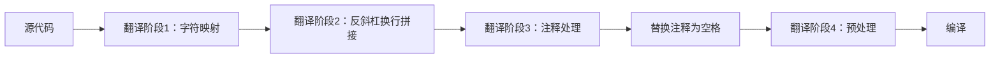

## 注释- C语言基础概念

注释是代码中的一种文档形式。当插入程序中时，编译器会完全忽略它们，其唯一目的是供阅读源代码的人作为笔记使用。

```text
语法
/* 注释 */    (1)
// 注释       (2) (C99起)
1) 通常称为"C风格"或"多行"注释
2) 通常称为"C++风格"或"单行"注释
所有注释会在翻译阶段3被移除，替换为单个空白字符。

C风格注释
通常用于注释大段文本或代码片段，但也可注释单行。将文本包裹在/*和*/之间即可。虽然非C标准内容，但/** **/常用于标识文档块（合法，因为第二个星号被视为注释部分）。
除非出现在字符常量、字符串字面值或其他注释中，/*会开启注释。此类注释内容仅用于识别多字节字符和查找终止符*/。C风格注释不可嵌套。

C++风格注释
通常用于注释单行文本或代码，但可连续使用形成多行注释。在文本前加//并在末尾换行即可。除非出现在字符常量、字符串字面值或其他注释中，//会开启持续到换行符前的注释。

C++风格注释可以嵌套：
// y = f(x); // 调用算法

C风格注释可出现在C++风格注释中：
// y = f(x); /* 调用算法 */

C++风格注释也可出现在C风格注释中（用于排除代码块）：
/*
    y = f(x);   // 调用算法
    z = g(x);
*/(C99起)

注意事项
由于注释在预处理器阶段前就被移除：
- 宏不能用于构成注释
- 未终止的C风格注释不会从#include文件溢出

其他代码排除技术：
#ifndef DEBUG
    #define PRINTF //
#else
    #define PRINTF printf
#endif
...  
PRINTF("Error in file %s at line %i\n", __FILE__, __LINE__);

#if 0
    puts("这段代码不会被编译");
    /* 不冲突的C风格注释 */
    // 不冲突的C++风格注释
#endif

和

if(0) {
    puts("这段代码会被编译但不会执行");
    /* 不冲突的C风格注释 */
    // 不冲突的C++风格注释
}

C99引入//注释时存在极少数不兼容情况：
a = b //*除数:*/ c
+ d; /* C89编译为 a = b / c + d;
        C99编译为 a = b + d; */

示例：
#include <stdio.h>
/* 多行
C风格注释 */

// 单行C++注释

int main(void)
{
  // 被注释的代码
  // puts("Hello");
  
  puts("World"); // 实际执行的代码
  
  // 关于反斜杠+换行的说明
  // 这个注释会延续到下一行 \
  puts("不会执行"); // 可能触发"多行注释"警告
  puts("Hello again");
}

输出：
World
Hello again

标准参考
C17标准(ISO/IEC 9899:2018): 6.4.9节(第54页)
C11标准(ISO/IEC 9899:2011): 6.4.9节(第75页)
C99标准(ISO/IEC 9899:1999): 6.4.9节(第66页)
C89/C90标准(ISO/IEC 9899:1990): 3.1.9节
```

---

### C语言注释机制深度解析

#### 1. **注释的本质与作用**

```c
/* 这是C风格注释 */
// 这是C++风格注释（C99起）
```

- **核心目的**：为开发者提供代码文档，编译器完全忽略注释内容
- **处理阶段**：在**翻译阶段3**被移除（预处理之后，编译之前）
- **替换规则**：注释被替换为**单个空白字符**（保留行号信息）
- **文档功能**：
  - 解释复杂算法逻辑
  - 标记待办事项（`// TODO: 优化此处`）
  - 禁用代码而不删除
  - 生成API文档（配合Doxygen等工具）

#### 2. **C风格注释详解**

```c
/* 多行注释示例
   第二行内容 */
int x = 10; /* 行尾注释 */

/* 非法嵌套示例 */
/* 外层注释 /* 内层注释 */ 外层继续 */ // 错误：注释提前终止
```

- **语法**：`/*`开始，`*/`结束
- **特性**：
  - 可跨多行
  - 不支持嵌套（`/* /* */ */`会导致编译错误）
  - 可出现在代码任意位置（除字符串/字符常量内）
- **特殊形式**：
  ```c
  /** 
   * 文档注释（非标准但广泛使用）
   * @param x 输入值
   */
  ```
- **边界情况**：
  ```c
  char* s = "/* 这不是注释 */"; // 字符串内的符号被保留
  char c = '/'; // 字符常量内的'/'不触发注释
  ```

#### 3. **C++风格注释详解（C99起）**

```c
// 单行注释
int y = 20; // 行尾注释

// 多行连续注释
// 第二行内容

// 反斜杠续行（慎用！）
// 该注释会延续到下一行 \
printf("这行代码会被注释掉!");
```

- **语法**：`//`开始，直到行尾结束
- **特性**：
  - 天然支持嵌套（`// 文本 // 嵌套文本`）
  - 可与C风格注释混合
  - 反斜杠`\`续行是**未定义行为**（编译器可能警告）
- **特殊交互**：
  ```c
  // C风格在C++注释中：完全合法
  // /* 被注释的内容 */
  
  /* C++风格在C注释中：C99起合法 */
  /*
  // 被注释的代码
  */
  ```

#### 4. **关键注意事项**

```c
/* 宏不能生成注释 */
#define COMMENT_START /*
COMMENT_START 这不会成为注释 */

/* 未终止注释不会跨文件 */
#include "header.h" // header.h中的/*不会影响当前文件

/* 条件编译排除代码 */
#if 0
   // 被排除的代码块
   /* 可包含任意注释 */
#endif

/* 运行时排除代码 */
if(0) {
   // 会被编译但不执行
   /* 安全注释 */
}
```

#### 5. **C99兼容性问题**

```c
// C89 vs C99行为差异
int a = b //*除数:*/ c 
         + d;
```

- **C89解释**：
  ```c
  int a = b / c + d;  // "//*除数:*/" 被解释为除法
  ```
- **C99解释**：
  ```c
  int a = b + d;      // 从//到行尾都是注释
  ```
- **解决方案**：
  ```c
  // 明确优先级
  int a = b / (c + d);
  
  // 或拆分语句
  int tmp = c + d;
  int a = b / tmp;
  ```

#### 6. **代码排除技术对比**

| 技术             | 编译阶段 | 执行文件 | 调试可见 | 适用场景               |
|------------------|----------|----------|----------|------------------------|
| `/* */`注释      | 不编译   | 无       | 否       | 永久删除代码           |
| `//`注释         | 不编译   | 无       | 否       | 临时禁用单行           |
| `#if 0`          | 不编译   | 无       | 否       | 排除大块代码           |
| `if(0){ }`       | 编译     | 有       | 是       | 保留代码但跳过执行     |
| 宏替换为`//`     | 不编译   | 无       | 否       | 条件编译调试输出       |

#### 7. **完整示例解析**

```c
#include <stdio.h>
/* 多行
C风格注释 */

// 单行C++注释

int main(void)
{
  // 被注释的代码：puts("Hello");
  
  puts("World"); // 输出World
  
  // 反斜杠续行风险
  // 该注释延续到下一行 \
  puts("不会执行"); // 编译器可能警告
  puts("Hello again");
}
```

**输出分析**：
```
World
Hello again
```
- **关键点**：
  1. 首行`puts("Hello")`被完全注释
  2. 反斜杠续行注释导致`puts("不会执行")`被注释
  3. 最后两行`puts`正常执行

#### 8. **编译器处理流程**


#### 9. **标准演进对比**
| 标准    | 年份 | 注释特性                     | 变化影响                  |
|---------|------|------------------------------|---------------------------|
| C89     | 1989 | 仅`/* */`注释                | 基础支持                  |
| C99     | 1999 | 引入`//`注释                 | 改善单行注释体验          |
| C11     | 2011 | 明确注释替换规则             | 增强跨编译器一致性        |
| C17     | 2018 | 澄清未终止注释的处理         | 消除歧义                  |

**最佳实践**：
1. 对永久文档使用`/** */`文档注释
2. 临时调试用`//`注释单行
3. 排除代码块优先用`#if 0`而非注释
4. 避免在字符串/字符常量外使用`/*`或`//`序列
5. 禁用反斜杠续行注释（启用编译器警告）

> 注释是代码的无声伙伴——它们不应重复代码做了什么，而应解释为什么这样做。精心编写的注释使代码成为可传承的知识载体。