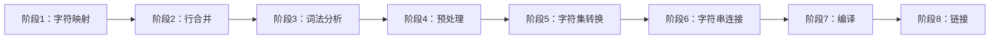

### 深入解析 C 语言翻译阶段（编译过程全解）

#### 一、翻译阶段核心概念
C 语言的编译过程被标准严格定义为 **8 个顺序阶段**，确保源代码到可执行文件的转换具有确定性和可移植性。这些阶段构成编译器的理论模型，实际编译器可能合并阶段但必须保持等效行为。



#### 二、各阶段深度解析与示例

**1. 阶段1：物理源文件到逻辑字符映射**
- **核心操作**：
  - 字节序列 → 源字符集字符（如 UTF-8 → Unicode）
  - 行尾标准化：`\r\n` (Windows) / `\r` (Mac) → `\n` (Unix)
- **源字符集**：96 字符基本集
  ```c
  // 合法基本字符示例
  int main() {
      printf("A-Z a-z 0-9 !@#$%%^&*()_+-=[]{}|;:'\",.<>?/~`"); 
  }
  ```
- **三字符序列（C23前）**：
  ```c
  // C23 前示例
  printf("What??!\n");  // ??! 被替换为 | 
  // 等价于 printf("What|\n");
  ```

**2. 阶段2：行合并（Line Splicing）**
- **规则**：反斜杠`\` + 换行符 → 被删除
- **关键限制**：仅合并两行，不连锁合并
  ```c
  // 行合并示例
  #define LONG_MACRO ma\
  cro_value  // 等价于 #define LONG_MACRO macro_value
  
  char str[] = "Line1\\\nLine2"; 
  // 阶段2后：\\\n → \n，字符串变为 "Line1\nLine2"
  ```

**3. 阶段3：词法分析（Tokenization）**
- **处理流程**：
  1. 替换注释为空格
  2. 折叠空白序列（实现定义）
  3. 应用"最大咀嚼"规则切分标记
- **最大咀嚼规则示例**：
  ```c
  int x = 1;
  int y = x+++x;   // 解析为 x++ + x
  int z = x+++++x; // 错误：解析为 x++ ++ +x（无效）
  
  // 特殊头名识别
  #include <std//**/io.h>  // 错误：注释中断头名
  ```

**4. 阶段4：预处理**
- **核心操作**：
  - 执行 `#define`, `#include` 等指令
  - 递归处理包含文件（重新经历阶段1-4）
  - 删除所有预处理指令
- **宏展开示例**：
  ```c
  #define SQUARE(x) ((x)*(x))
  int result = SQUARE(2+3); // 展开为 ((2+3)*(2+3))
  ```

**5. 阶段5：字符集转换**
- **关键转换**：
  - 字符/字符串字面量 → 执行字符集
  - 处理转义序列：`\n`, `\x41` 等
- **编码问题示例**：
  ```c
  char euro = '\u20AC'; // € 符号
  // 若执行字符集不支持 Unicode，值实现定义
  ```
- **编译器控制**：
  ```bash
  gcc -fexec-charset=UTF-8 -finput-charset=UTF-8 program.c
  ```

**6. 阶段6：字符串连接**
- **规则**：相邻字符串字面量自动连接
  ```c
  char* msg = "Hello " "World!"; 
  // 等价于 "Hello World!"
  ```

**7. 阶段7：编译**
- **核心操作**：
  - 语法分析（构建 AST）
  - 语义分析（类型检查）
  - 生成中间代码/目标代码
- **错误检测示例**：
  ```c
  int x = "hello"; // 阶段7报错：无效初始化
  ```

**8. 阶段8：链接**
- **关键任务**：
  - 解析外部引用
  - 合并多个翻译单元
  - 链接运行时库
- **典型错误**：
  ```c
  // file1.c
  void func(); // 声明
  
  // file2.c
  int main() { func(); } 
  
  // 若未定义 func()，阶段8报链接错误
  ```

#### 三、关键机制深度剖析

**1. 最大咀嚼规则（Max Munch）**
- **原理**：最长可能序列构成标记
- **边界案例**：
  ```c
  int a = 1;
  int b = a-- - --a; // 解析为 a-- - --a
  int c = a---b;     // 解析为 a-- - b
  ```

**2. 字符集转换陷阱**
- **转义序列处理**：
  ```c
  printf("\x41");    // 输出 'A' (ASCII)
  printf("\u03A9");  // 输出 'Ω' (Unicode)
  ```
- **实现定义行为**：
  ```c
  char c = '\u00FF'; // 在Latin-1中为ÿ，UTF-8为2字节
  ```

**3. 预处理边界案例**
- **宏中的注释**：
  ```c
  #define SAFE_DIV(a, b) (b != 0 ? a/b : 0) /* 安全除法 */
  // 阶段3注释被替换为空格，不影响宏定义
  ```

#### 四、现代实践与总结

**1. 现代开发建议**
- **编码标准**：
  ```c
  // 始终使用UTF-8
  #pragma execution_character_set("utf-8") 
  ```
- **防御式编程**：
  ```c
  #if __STDC_VERSION__ >= 202311L
  #define NO_TRIGRAPHS
  #endif
  ```

**2. 阶段问题调试指南**
| 阶段 | 常见问题                  | 调试工具            |
|------|---------------------------|---------------------|
| 1-2  | 编码/行尾问题            | `hexdump -C`        |
| 3-4  | 宏展开错误               | `gcc -E -P`         |
| 5    | 字符显示异常             | 编译器编码选项      |
| 7    | 语法错误                 | 编译器错误输出      |
| 8    | 未定义引用               | `nm` / `ldd`        |

**3. 核心结论总结**
1. **严格顺序性**：8阶段流程确保编译确定性
2. **关键转换点**：
   - 阶段2：反斜杠换行合并
   - 阶段3：最大咀嚼规则
   - 阶段5：字符集转换
3. **现代演进**：
   - C23 移除三字符序列
   - UTF-8 成为首选编码
4. **跨平台要点**：
   - 行尾标准化（阶段1）
   - 执行字符集配置（阶段5）
   - 链接器兼容性（阶段8）

> **终极实践原则**：理解翻译阶段能精准定位编译问题。开发中应：
> 1. 使用 UTF-8 避免编码问题
> 2. 宏定义避免依赖操作符边界
> 3. 检查编译器字符集设置
> 4. 使用 `-E` 选项调试预处理
> 5. 关注 C23 移除三字符序列的影响