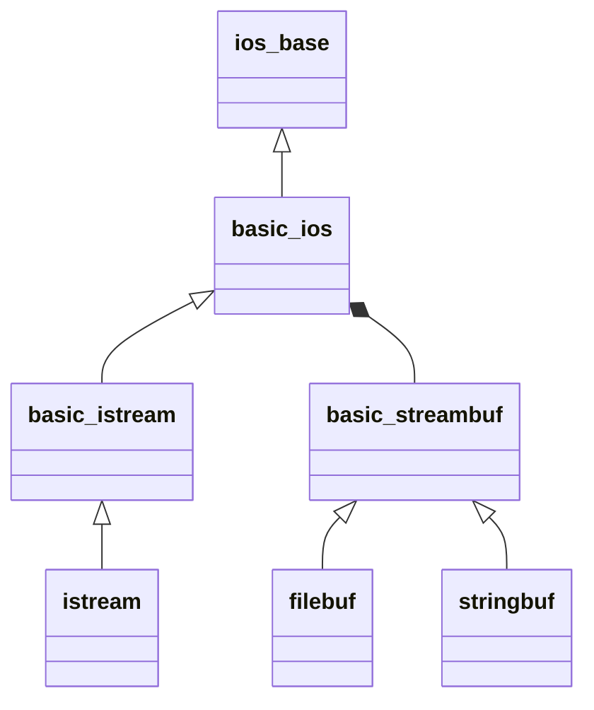
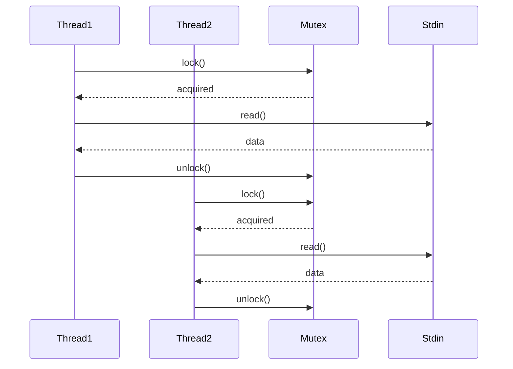

## C 与 C++ 标准输入流全面分析

### 一、C 语言标准输入流 (stdio.h)

#### 1.1 基础输入函数

| 函数 | 描述 | 示例 | 特点 |
|------|------|------|------|
| `getchar()` | 读取单个字符 | `int c = getchar();` | 返回 int 类型，支持 EOF 检测 |
| `fgetc(stdin)` | 从 stdin 读取字符 | `int ch = fgetc(stdin);` | 等同于 getchar() |
| `gets()` | **已弃用** 读取一行 | `char buf[100]; gets(buf);` | 极危险，无长度检查 |
| `fgets()` | 安全行读取 | `fgets(buf, sizeof(buf), stdin);` | 保留换行符，自动截断 |
| `scanf()` | 格式化输入 | `scanf("%d %f", &i, &f);` | 易出错但功能强大 |

#### 1.2 格式化输入函数

```c
int num;
float value;
char str[50];

// 基本用法
scanf("%d %f %49s", &num, &value, str);

// 高级格式控制
scanf("%[^\n]", str);    // 读取整行(不包含\n)
scanf("%*s %d", &num);   // 跳过第一个单词
```

#### 1.3 流控制函数

```c
// 设置缓冲区
char buf[8192];
setvbuf(stdin, buf, _IOFBF, sizeof(buf));

// 流状态操作
clearerr(stdin);   // 清除错误标志
rewind(stdin);     // 重置流位置
```

### 二、C++ 标准输入流 (iostream)

#### 2.1 核心输入对象

| 对象 | 描述 | 头文件 |
|------|------|--------|
| `std::cin` | 标准输入流 | `<iostream>` |
| `std::wcin` | 宽字符输入流 | `<iostream>` |

#### 2.2 基础输入方法

```cpp
// 字符输入
char c;
cin.get(c);         // 读取单个字符
c = cin.get();      // 返回读取的字符
cin.getline(buf, 100); // 读取一行到字符数组

// 字符串输入
string str;
getline(cin, str);  // 读取一行到std::string
```

#### 2.3 格式化输入运算符

```cpp
int i;
double d;
string word;

cin >> i;        // 读取整数
cin >> d;        // 读取浮点数
cin >> word;     // 读取单词(遇空格停止)
cin >> ws;       // 跳过空白字符

// 链式调用
cin >> i >> d >> word;
```

#### 2.4 高级流控制

```cpp
// 设置缓冲区
char buffer[1024];
cin.rdbuf()->pubsetbuf(buffer, sizeof(buffer));

// 状态检查
if(cin.fail()) {
    cin.clear();  // 清除错误状态
    cin.ignore(numeric_limits<streamsize>::max(), '\n'); // 清空缓冲区
}

// 二进制输入
char data[256];
cin.read(data, sizeof(data)); // 原始字节读取
```

### 三、C 与 C++ 输入流对比

| 特性 | C (stdio.h) | C++ (iostream) |
|------|-------------|----------------|
| **类型安全** | ❌ 无类型检查 | ✅ 运算符重载确保类型安全 |
| **缓冲区溢出防护** | 手动控制 | 部分自动防护(std::string) |
| **错误处理** | 返回值检查 | 流状态标志(cin.fail()) |
| **内存管理** | 完全手动 | 半自动(std::string) |
| **线程安全** | C11后支持 | C++11后支持 |
| **扩展性** | 有限 | 可通过重载运算符扩展 |
| **性能** | 通常更快 | 默认较慢(可优化) |
| **易用性** | 简单直接 | 面向对象更易组合 |

### 四、关键问题与解决方案

#### 4.1 缓冲区溢出问题

**C 解决方案**:

```c
// 安全版scanf
char buf[100];
scanf_s("%99s", buf, (rsize_t)sizeof(buf));

// 动态内存分配
char *line = NULL;
size_t len = 0;
ssize_t read = getline(&line, &len, stdin);
```

**C++ 解决方案**:
```cpp
// 使用std::string自动管理内存
std::string input;
std::getline(std::cin, input);

// 设置最大读取长度
char buffer[100];
std::cin.getline(buffer, sizeof(buffer));
```

#### 4.2 流状态污染问题

**C 处理模式**:

```c
int num;
while (scanf("%d", &num) != 1) {
    // 清空错误输入
    while (getchar() != '\n');
    printf("Invalid input, try again: ");
}
```

**C++ 处理模式**:

```cpp
int num;
while (!(cin >> num)) {
    cin.clear();  // 清除错误标志
    cin.ignore(numeric_limits<streamsize>::max(), '\n');
    cout << "Invalid input, try again: ";
}
```

#### 4.3 性能优化技巧

**C 语言优化**:
```c
// 设置大缓冲区
setvbuf(stdin, malloc(1048576), _IOFBF, 1048576);

// 批量读取
char data[4096];
size_t bytes = fread(data, 1, sizeof(data), stdin);
```

**C++ 语言优化**:
```cpp
// 关闭同步提升性能
ios_base::sync_with_stdio(false);
cin.tie(nullptr);

// 使用自定义缓冲区
vector<char> buf(1<<20);
cin.rdbuf()->pubsetbuf(buf.data(), buf.size());
```

#### 4.4 线程安全实践

**C11 线程安全**:
```c
#include <threads.h>
mtx_t stdin_mutex;

void read_thread(void* arg) {
    mtx_lock(&stdin_mutex);
    char line[256];
    fgets(line, sizeof(line), stdin);
    mtx_unlock(&stdin_mutex);
}
```

**C++11 线程安全**:
```cpp
#include <mutex>
std::mutex cin_mutex;

void read_thread() {
    std::string input;
    {
        std::lock_guard<std::mutex> lock(cin_mutex);
        std::getline(std::cin, input);
    }
}
```

### 五、最佳实践指南

#### 5.1 C 语言推荐实践
```c
#include <stdio.h>

int main() {
    // 设置安全缓冲区
    char buf[1024];
    setvbuf(stdin, buf, _IOLBF, sizeof(buf));
    
    // 安全行读取
    char line[256];
    if (fgets(line, sizeof(line), stdin) {
        // 移除换行符
        line[strcspn(line, "\n")] = '\0';
    }
    
    // 安全格式化输入
    int age;
    if (scanf("%d", &age) != 1) {
        fprintf(stderr, "Invalid age input");
        return 1;
    }
    
    return 0;
}
```

#### 5.2 C++ 语言推荐实践
```cpp
#include <iostream>
#include <string>
#include <limits>

int main() {
    // 优化输入性能
    std::ios_base::sync_with_stdio(false);
    std::cin.tie(nullptr);
    
    // 安全读取整数
    int value;
    while (true) {
        std::cout << "Enter an integer: ";
        if (std::cin >> value) break;
        
        std::cin.clear();
        std::cin.ignore(std::numeric_limits<std::streamsize>::max(), '\n');
        std::cout << "Invalid input!\n";
    }
    
    // 安全读取整行
    std::cin.ignore(); // 消耗剩余换行符
    std::string fullname;
    std::cout << "Enter full name: ";
    std::getline(std::cin, fullname);
    
    return 0;
}
```

### 六、高级应用场景

#### 6.1 混合输入处理
```cpp
struct Person {
    std::string name;
    int age;
    double salary;
};

std::istream& operator>>(std::istream& is, Person& p) {
    std::getline(is, p.name);  // 读取整行作为名字
    is >> p.age >> p.salary;
    is.ignore(); // 消耗换行符
    return is;
}

// 使用示例
Person emp;
std::cin >> emp;
```

#### 6.2 自定义解析器
```cpp
class Date {
    int day, month, year;
    friend std::istream& operator>>(std::istream& is, Date& d);
};

std::istream& operator>>(std::istream& is, Date& d) {
    char delimiter;
    is >> d.day >> delimiter 
       >> d.month >> delimiter 
       >> d.year;
    return is;
}

// 使用: cin >> date; // 格式: DD/MM/YYYY
```

#### 6.3 高性能批量处理
```cpp
// 处理GB级日志文件
std::vector<char> buffer(1<<26); // 64MB缓冲
std::cin.rdbuf()->pubsetbuf(buffer.data(), buffer.size());

std::string line;
while (std::getline(std::cin, line)) {
    // 高速处理每行数据
    process(line);
}
```

### 七、跨平台注意事项

| 问题 | Windows | Linux/macOS | 解决方案 |
|------|---------|-------------|----------|
| 换行符 | \r\n | \n | 统一处理为\n |
| 编码 | CP936/GBK | UTF-8 | 使用宽字符或转换 |
| EOF | Ctrl+Z | Ctrl+D | 程序逻辑不依赖特定键 |
| 控制台缓冲 | 行缓冲 | 通常行缓冲 | 显式设置缓冲模式 |
| 二进制输入 | 需特殊处理 | 直接支持 | 使用`setmode`(Windows) |

**跨平台换行处理**:
```cpp
// 移除所有平台换行符
line.erase(std::remove(line.begin(), line.end(), '\r'), line.end());
line.erase(std::remove(line.begin(), line.end(), '\n'), line.end());
```

### 八、输入流核心架构

#### 8.1 系统层与用户层交互


#### 8.2 输入流层次结构
| 层级          | 组件              | 功能描述           |
| ------------- | ----------------- | ------------------ |
| **硬件层**    | 键盘/文件/管道    | 原始数据输入源     |
| **OS内核**    | 终端驱动/文件系统 | 原始字节流处理     |
| **C运行时**   | `FILE`结构体      | 缓冲管理、编码转换 |
| **C++运行时** | `std::streambuf`  | 面向对象缓冲抽象   |
| **应用层**    | `scanf`/`cin`     | 开发者接口         |

### 九、C语言标准输入流深入解析

#### 9.1 `FILE` 结构体详解
```c
struct _IO_FILE {
    int _flags;           // 文件状态标志
    char* _IO_read_ptr;   // 当前读取位置
    char* _IO_read_end;   // 缓冲区结束位置
    char* _IO_read_base;  // 缓冲区起始位置
    // ... 其他20+成员
};
```

#### 9.2 缓冲机制深度分析
**缓冲类型对比表**：
| 缓冲模式   | 刷新条件   | 性能 | 适用场景           |
| ---------- | ---------- | ---- | ------------------ |
| **全缓冲** | 缓冲区满   | 高   | 文件输入、大数据流 |
| **行缓冲** | 换行符或满 | 中   | 终端交互           |
| **无缓冲** | 立即       | 低   | 实时系统、错误输出 |

**缓冲区生命周期**：

```c
// 静态缓冲区
static char buf[BUFSIZ];
setvbuf(stdin, buf, _IOFBF, BUFSIZ);

// 动态缓冲区
char *dyn_buf = malloc(1<<20);
setvbuf(stdin, dyn_buf, _IOFBF, 1<<20);
atexit(free_dyn_buf); // 需要手动管理
```

#### 9.3 格式化输入深度机制
**`scanf` 内部工作流程**：
1. 解析格式字符串
2. 跳过空白字符（除非`%c`,`%[`,`%n`）
3. 根据说明符读取输入
4. 类型转换并存储
5. 返回成功赋值的参数数量

**高级格式说明符**：
```c
// 扫描集示例
char time_str[20];
scanf("%[0-9:APM]", time_str); // 匹配"12:30PM"

// 抑制赋值
scanf("%*s %d", &num); // 跳过第一个单词

// 宽度限定
char name[11];
scanf("%10s", name); // 最多读取10字符
```

#### 9.4 错误处理与流状态
```c
#include <errno.h>

int num;
if (scanf("%d", &num) != 1) {
    if (feof(stdin)) {
        perror("Unexpected EOF");
    } else if (ferror(stdin)) {
        perror("Input error");
    } else {
        fprintf(stderr, "Invalid input format\n");
    }
    clearerr(stdin); // 清除错误标志
}
```

### 十、C++标准输入流深度解析

#### 10.1 流类体系结构


#### 10.2 `std::streambuf` 核心机制
**缓冲区管理模型**：

```
         get area
       +------------+
begin |            | 
      |  input     |
pptr  |  buffer    |
gptr  |------------|
       |            |
       +------------+
         put area
```

**自定义缓冲区实现**：
```cpp
class MemBuf : public std::streambuf {
public:
    MemBuf(char* base, size_t size) {
        setg(base, base, base + size);
    }
};

// 使用示例
char buffer[1024];
MemBuf mem_buf(buffer, sizeof(buffer));
std::istream in(&mem_buf);
```

#### 10.3 输入操作符重载机制
```cpp
// 自定义类型输入支持
struct Point { int x, y; };

std::istream& operator>>(std::istream& is, Point& p) {
    char delim;
    if (is >> delim && delim != '(') {
        is.setstate(std::ios::failbit);
        return is;
    }
    return is >> p.x >> delim >> p.y >> delim;
}

// 使用
Point pt;
if (std::cin >> pt) { ... }
```

#### 10.4 高级流操纵器
```cpp
#include <iomanip>

int hex_value;
std::cin >> std::hex >> hex_value; // 读取十六进制

double precise;
std::cin >> std::setprecision(10) >> precise; // 高精度浮点

// 跳过指定数量字符
std::cin >> std::ws; // 跳过空白
std::cin.ignore(10, ':'); // 跳过直到冒号
```

### 十一、输入流安全漏洞深度分析

#### 11.1 缓冲区溢出攻击模型
```
+-----------------+-----------------+
| 合法数据 (n字节) | 溢出数据        |
+-----------------+-----------------+
^                 ^                 ^
缓冲区起始        缓冲区结束        栈帧返回地址
```

#### 11.2 安全输入函数对比
| 函数              | 安全性 | 跨平台 | 推荐指数   |
| ----------------- | ------ | ------ | ---------- |
| `gets`            | ⚠️ 高危 | 所有   | ❌ 绝对禁用 |
| `scanf("%s")`     | ⚠️ 高危 | 所有   | ❌ 禁用     |
| `fgets`           | ✅ 安全 | 所有   | ★★★★       |
| `getline` (POSIX) | ✅ 安全 | Unix   | ★★★★★      |
| `std::getline`    | ✅ 安全 | 所有   | ★★★★★      |
| `cin.get`         | ✅ 安全 | 所有   | ★★★★       |

#### 11.3 防御性编程技术
**输入验证框架**：
```cpp
template <typename T>
bool safe_input(const std::string& prompt, T& value, 
                std::function<bool(const T&)> validator) {
    while (true) {
        std::cout << prompt;
        if (!(std::cin >> value)) {
            if (std::cin.eof()) return false;
            std::cin.clear();
            std::cin.ignore(std::numeric_limits<std::streamsize>::max(), '\n');
            continue;
        }
        if (validator(value)) return true;
    }
}

// 使用示例
int age;
auto age_valid = [](int a){ return a > 0 && a < 150; };
safe_input("Enter age: ", age, age_valid);
```

### 十二、性能优化深度策略

#### 12.1 系统调用开销分析
```
+----------------------+----------------+
| 操作                 | 时间 (纳秒)    |
+----------------------+----------------+
| 用户态指令           | 1-3            |
| L1缓存访问           | 4-5            |
| 系统调用开销         | 100-500        |
| 磁盘I/O              | 10,000-100,000 |
+----------------------+----------------+
```

#### 12.2 高级缓冲技术
**双缓冲策略**：
```cpp
class DoubleBuffer {
    char buf1[8192], buf2[8192];
    std::istreambuf_iterator<char> it;
public:
    DoubleBuffer(std::istream& is) : it(is) {}
    
    char next() {
        // 实现异步填充缓冲区
        // ...
    }
};

// 使用
DoubleBuffer dbuf(std::cin);
while (char c = dbuf.next()) {
    process(c);
}
```

#### 12.3 内存映射文件输入
```cpp
#ifdef __linux__
#include <sys/mman.h>

void mmap_input(const char* filename) {
    int fd = open(filename, O_RDONLY);
    size_t len = lseek(fd, 0, SEEK_END);
    char* data = (char*)mmap(0, len, PROT_READ, MAP_PRIVATE, fd, 0);
    
    // 直接访问数据
    for (size_t i = 0; i < len; i++) {
        process(data[i]);
    }
    
    munmap(data, len);
    close(fd);
}
#endif
```

### 十三、多线程输入处理

#### 13.1 线程安全架构


#### 13.2 无锁输入队列
```cpp
template<typename T>
class LockFreeQueue {
    struct Node {
        T value;
        std::atomic<Node*> next;
    };
    // 实现细节省略...
};

// 生产者-消费者模型
LockFreeQueue<std::string> input_queue;

void input_thread() {
    std::string line;
    while (std::getline(std::cin, line)) {
        input_queue.enqueue(line);
    }
}

void process_thread() {
    std::string line;
    while (input_queue.dequeue(line)) {
        process(line);
    }
}
```

### 十四、跨平台问题与解决方案

#### 14.1 换行符处理矩阵
| 平台       | 换行符 | 处理策略       |
| ---------- | ------ | -------------- |
| Windows    | `\r\n` | 自动转换为`\n` |
| Unix/Linux | `\n`   | 直接使用       |
| 经典Mac    | `\r`   | 显式转换       |

**统一处理方案**：
```cpp
std::string normalize_newline(const std::string& str) {
    std::string result;
    result.reserve(str.size());
    for (char c : str) {
        if (c != '\r') result += c;
    }
    return result;
}
```

#### 14.2 字符编码处理
```cpp
// UTF-8输入处理
std::string utf8_input;
std::getline(std::cin, utf8_input);

#ifdef _WIN32
// Windows控制台特殊处理
#include <Windows.h>
SetConsoleCP(CP_UTF8);
SetConsoleOutputCP(CP_UTF8);
#endif

// 宽字符输入
std::wstring winput;
std::getline(std::wcin, winput);
```

### 十五、未来演进与趋势

#### 15.1 C++23 输入新特性
```cpp
// 范围安全视图
std::array<char, 100> buf;
std::span view{buf};
std::cin >> view; // 自动边界检查

// 格式库增强
std::string input;
std::cin >> std::scan("{}", input); // 类型安全格式化
```

#### 15.2 Rust-C++ 互操作
```rust
#[no_mangle]
pub extern "C" fn rust_read_line() -> *const c_char {
    let mut input = String::new();
    std::io::stdin().read_line(&mut input).unwrap();
    CString::new(input).unwrap().into_raw()
}
```

```cpp
// C++调用Rust输入函数
extern "C" const char* rust_read_line();

int main() {
    const char* line = rust_read_line();
    // 安全使用
}
```

### 十六、工程最佳实践

#### 16.1 输入处理设计模式
```cpp
class InputHandler {
public:
    virtual ~InputHandler() = default;
    virtual bool handle(std::istream& is) = 0;
};

class IntHandler : public InputHandler {
    int& target;
public:
    bool handle(std::istream& is) override {
        return !!(is >> target);
    }
};

// 组合处理器
InputPipeline pipeline;
pipeline.add_handler(new IntHandler(age));
pipeline.add_handler(new StringHandler(name));
pipeline.execute(std::cin);
```

#### 16.2 输入验证框架
```cpp
template <typename T>
class InputValidator {
    std::function<bool(const T&)> validator;
    T value;
public:
    InputValidator(std::function<bool(const T&)> v) : validator(v) {}
    
    friend std::istream& operator>>(std::istream& is, InputValidator& iv) {
        while (!(is >> iv.value) || !iv.validator(iv.value)) {
            is.clear();
            is.ignore(1000, '\n');
        }
        return is;
    }
    
    operator T() const { return value; }
};

// 使用
InputValidator<int> age_valid([](int a){return a>0 && a<120;});
std::cin >> age_valid;
```

### 十七、总结：输入流技术矩阵

| 维度         | C语言方案        | C++方案                        | 现代最佳实践  |
| ------------ | ---------------- | ------------------------------ | ------------- |
| **基本输入** | `fgets` + 缓冲区 | `std::getline` + `std::string` | C++方案       |
| **格式化**   | `scanf` 宽度限定 | 流操作符重载                   | C++自定义类型 |
| **性能**     | `setvbuf` 大缓冲 | 自定义`streambuf`              | 内存映射文件  |
| **安全**     | `getline`(POSIX) | `std::string`自动管理          | 输入验证框架  |
| **线程安全** | `mtx_lock`       | `std::lock_guard`              | 无锁队列      |
| **错误处理** | 返回值检查       | 流状态管理                     | RAII包装器    |
| **扩展性**   | 有限             | 高度可扩展                     | 处理器管道    |
| **可维护性** | 低               | 高                             | 高级抽象      |

C 和 C++ 提供了多层次的输入流处理机制：

- **C语言**：基于函数式接口，轻量高效但需手动管理安全
- **C++语言**：基于面向对象流，提供更安全的抽象，但需性能调优

黄金法则：

- **永远不要使用 `gets()` 或未限制长度的 `scanf("%s")`**

- C++优先使用 `std::getline` + `std::string`
- 遗留C代码必须使用安全函数和边界检查

- 生产代码必须处理所有可能的错误状态

- 高性能场景需定制缓冲策略结合内存映射和异步I/O
- 始终实现多层输入验证

- 多线程环境必须同步访问标准输入

通过深入理解输入流底层机制，开发者可以构建出安全、高效、可扩展的输入处理系统，满足从嵌入式设备到高性能服务器的各种需求。