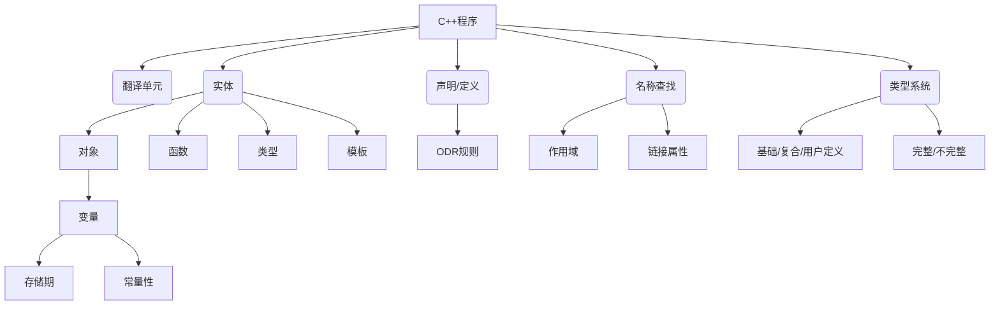

## 基本概念- C++语言基础概念 

本节定义了在描述C++编程语言时所使用的特定术语及相关概念。  

```text
一个C++程序是由一系列包含声明的文本文件（通常是头文件和源文件）组成的。这些文件经过翻译后成为可执行程序，当C++实现调用其main函数时执行。  

在C++程序中，某些单词具有特殊含义，称为关键词。其他单词可用作标识符。注释在翻译过程中会被忽略。C++程序还包含字面量，其字符值由字符集和编码决定。程序中的某些字符必须通过转义序列表示。  

C++程序的实体包括：值、对象、引用、结构化绑定（C++17起）、结果绑定（C++26起）、函数、枚举项、类型、类成员、模板、模板特化、参数包（C++11起）以及命名空间。预处理器宏不属于C++实体。  

声明可以引入实体，将其与名称关联并定义其属性。那些定义了使用实体所需全部属性的声明称为定义。程序中任何被odr使用的非内联函数或变量必须有且仅有一个定义。  

函数的定义通常包含语句序列，其中一些语句包含表达式，这些表达式指定了程序要执行的计算。  

程序中遇到的名称会通过名称查找与引入它们的声明相关联。每个名称仅在程序中称为其作用域的部分有效。某些名称具有链接属性，使得它们在不同作用域或翻译单元中出现时指向同一实体。  

C++中的每个对象、引用、函数和表达式都与一个类型相关联，这些类型可以是基础类型、复合类型或用户定义类型，也可能是完整或不完整类型等。  

已声明的对象以及非静态数据成员之外的已声明引用均称为变量。
```

---

### C++语言基础概念详解

#### 1. **C++程序组成结构**

```cpp
// main.cpp
#include <iostream> // 头文件包含声明

int main() {  // 入口函数
    std::cout << "Hello World"; // 使用标准库输出
    return 0;
}
```

- **文本文件**：与C类似，`.cpp`源文件包含实现，`.hpp`头文件包含声明（C++20模块可替代）
- **翻译过程**：
  1. 预处理：处理`#include`和宏（`g++ -E main.cpp -o main.ii`）
  2. 编译：生成汇编（支持C++特性如模板实例化）
  3. 汇编：生成目标文件
  4. 链接：解析符号引用库（包括C++名称修饰后的符号）
- **执行入口**：标准规定从`main`函数开始（全局对象的构造函数在`main`前执行）其签名可以是：
  1. `int main()`
  2. `int main(int argc, char* argv[])`
  3. 其他实现允许的形式（如`int main(int argc, char** argv)`）

---

#### 2. **关键词、标识符、字面量与转义序列**

```cpp
// 关键词示例（C++20有92个关键词）
constexpr int size = 10;  // constexpr是C++11关键词
class Widget final {};    // final是C++11关键词

// 标识符示例
auto lambda = [](int x) { return x*2; }; // lambda是标识符

// 字面量示例
char16_t ch = u'字';      // Unicode字面量
double pi = 3.14159'26535; // C++14数字分隔符
const char* raw = R"(Raw\nString)"; // 原始字符串字面量

// 转义序列
std::cout << "Line1\nLine2\t\u03A9"; // \n换行, \t制表, \u03A9希腊字母Ω
```

- **关键词**：C++有更多关键词，C++20有92个保留词（如`class`, `template`, `concept`）
- **标识符规则**：
  - 支持Unicode标识符（C++11起）
  - 规则与C类似，不能以数字开头，不能包含运算符字符（如@, $）
- **注释**：
  - `//`单行注释（编译前被移除，可以嵌套）
  - `/* */`多行注释（编译前被移除，不能嵌套）
- **字面量类型**：
  | 类别         | 示例                  | C++标准 |
  |--------------|-----------------------|---------|
  | 整型         | `42`, `0x2A`, `0b1010` | C++14   |
  | 浮点         | `3.14f`, `6.02e23`     |         |
  | 字符         | `'a'`, `u8'字'`        | C++11   |
  | 字符串       | `"Hello"`, `u8"中文"`  | C++11   |
  | 布尔         | `true`, `false`        |         |
  | 指针         | `nullptr`              | C++11   |
  | 用户自定义   | `"Hi"s`（字符串字面量）| C++14   |
- **转义序列**：`\n`（换行），`\t`（制表），`\x41`（十六进制），`\u4E2D`（Unicode）

---

#### 3. **C++实体**

```cpp
// 实体示例
namespace NS { // 命名空间实体
    int value = 10; // 对象实体
    
    void func() {} // 函数实体
    
    struct Data { // 类实体
        int member; // 类成员实体
    };
    
    enum Color { RED }; // 枚举项实体
    
    template<typename T> // 模板实体
    class Box {};
}

auto [x, y] = std::pair(1, 2); // C++17结构化绑定

// 非实体：宏
#define PI 3.14 // 预处理器宏（非C++实体）
```

实体是程序中的核心构建块，包括：
- **值**：如`42`, `3.14`, `'A'`等
- **对象**：内存中具有类型和值的区域（包括内置类型和类类型）
- **引用**：别名（左值引用`int&`，右值引用`int&&`）
- **结构化绑定**（C++17）：解构对象，如`auto [x,y] = std::make_pair(1,2);`
- **结果绑定**（C++26）：提案中，用于处理函数返回的多个值
- **函数**：包括普通函数、成员函数、运算符重载、lambda表达式
- **枚举项**：枚举类型的成员，如`enum Color { RED, GREEN };`中的`RED`
- **类型**：包括基础类型（`int`）、复合类型（`int*`）、用户定义类型（类、枚举）
- **类成员**：类的数据成员或成员函数
- **模板**：泛型编程的基础，包括函数模板和类模板
- **模板特化**：为特定类型定制的模板实现
- **参数包**（C++11）：变长模板参数，如`template <typename... Ts>`
- **命名空间**：用于组织代码，防止名称冲突

注意：**预处理器宏**（如`#define PI 3.14`）在预处理阶段被替换，不属于C++实体。

---

#### 4. **声明与定义**

```cpp
// 声明 vs 定义
extern int global_var; // 声明（非定义）
class MyClass;         // 类声明（前向声明）
void func(int);        // 函数声明

int global_var = 42;   // 定义（分配存储）
class MyClass {        // 类定义
    int member = 0;    // 成员定义
};
void func(int x) {     // 函数定义
    std::cout << x;
}

// ODR（单一定义规则）示例
inline int add(int a, int b) { // 内联函数可多次定义
    return a + b;
}

// 违反ODR
// file1.cpp: int unique = 1;
// file2.cpp: int unique = 2; // 链接错误
```

- **声明**：引入名称和类型，告诉编译器实体的存在和类型
- **定义**：为实体分配存储（变量）或提供完整实现（函数/类）
- **ODR规则**：
  - 非内联函数和变量在整个程序中必须有且仅有一个定义
  - 内联函数/变量（C++17起）可以在多个翻译单元中定义（但必须相同）
  - 类定义在多个翻译单元必须相同，类类型、模板等有特殊ODR规则
- **ODR使用**：当变量/函数被取地址或函数被调用时

---

#### 5. **函数与语句**

```cpp
// 函数结构
auto compute(int a, double b) -> double { // C++11尾置返回类型
    // 语句序列
    constexpr int size = 100; // 声明语句
    double result = a * b;   // 声明+表达式语句
    
    if (result > 100) {      // 控制流语句
        throw std::overflow_error("Too large"); // 跳转语句
    }
    
    return result;            // 返回语句
}
```

- **语句类型**：
  | 类别           | 示例                      | 说明                  |
  |----------------|---------------------------|-----------------------|
  | 表达式语句     | `x = 10;`                 | 带分号的表达式        |
  | 声明语句       | `int x = 5;`              | 引入变量              |
  | 复合语句       | `{ int y; y = x; }`       | 代码块                |
  | 选择语句       | `if/switch`               | 条件分支              |
  | 循环语句       | `for/while/do-while`      | 循环控制              |
  | 跳转语句       | `break/continue/return`   | 流程转移              |
  | 异常处理语句   | `try/catch/throw`         | 异常处理              |

---

#### 6. **名称查找与作用域**

```cpp
namespace NS {
    int value = 10; // 命名空间作用域
}

int value = 20; // 全局作用域

int main() {
    int value = 30; // 块作用域
    
    {
        int value = 40; // 嵌套块作用域
        std::cout << value; // 40（最内层作用域）
    }
    
    std::cout << NS::value; // 10（限定名称查找）
    
    // 名称查找顺序：当前作用域 → 外层作用域 → 命名空间 → 全局
}
```

- **名称查找类型**：
  - **限定查找**：`std::cout`（通过命名空间）
  - **无限定查找**：从当前作用域向外查找
  - **参数依赖查找（ADL）**：`swap(a,b)`自动查找参数所在命名空间
- **作用域类型**：
  | 作用域         | 范围                     | 示例                   |
  |----------------|--------------------------|------------------------|
  | 块作用域       | `{}`内                   | 局部变量               |
  | 类作用域       | 类定义内                 | 类成员                 |
  | 命名空间作用域 | 命名空间内               | 全局/命名空间变量      |
  | 函数作用域     | goto标签                 | `label:`               |
  | 枚举作用域     | 枚举定义内               | `enum Color { RED };`  |
  | 模板参数作用域 | 模板参数列表内           | `template<typename T>`|
- **链接属性**：
  - **外部链接**：`extern`（默认命名空间作用域）
  - **内部链接**：`static`或匿名命名空间
  - **无链接**：局部变量、类成员

---

#### 7. **类型系统**

```cpp
// 类型分类
int i;              // 基础类型
int* p = &i;        // 复合类型（指针）
int arr[10];        // 复合类型（数组）
struct Point {      // 用户定义类型
    int x, y;
};
enum State { ON };  // 枚举类型

// 类型完整性
class Incomplete;   // 前向声明（不完整类型）

void func() {
    Incomplete* ptr;  // 允许：指针可使用不完整类型
    // Incomplete obj; // 错误：不能实例化不完整类型
}
```

- **类型分类**：
  - **基础类型**：`void`, `bool`, 整型(`int`), 浮点(`double`), 字符(`char`)
  - **复合类型**：指针、数组、引用、函数、成员指针
  - **用户定义类型**：类(`class`/`struct`)、枚举(`enum`)、联合(`union`)
- **类型属性**：
  - **完整类型**：大小已知（可实例化）
  - **不完整类型**：大小未知（前向声明的类、未知大小的数组）
- **类型操作**：
  - 创建：`new`运算符、构造函数
  - 销毁：`delete`运算符、析构函数
  - 访问：成员运算符`.`/`->`
  - 操作：运算符重载

---

#### 8. **变量定义**

```cpp
int global_var;          // 变量（全局）

struct S {
    static int s_member; // 静态成员变量（变量）
    int member;          // 非静态数据成员（不是变量）
};

int main() {
    int local = 0;       // 变量（局部）
    int& ref = local;    // 引用（变量，因为非数据成员）
    constexpr int SIZE = 100; // 常量表达式（变量）
    
    S obj;
    obj.member = 10;     // 成员访问（member不是变量）
}
```

- **变量定义**：已声明对象或非成员引用
- **变量特性**：
  1. 具有名称（可通过标识符访问）
  2. 具有存储期（自动/静态/动态）
  3. 具有类型（编译时已知）
  4. 可被赋值（除非`const`限定）
- **非变量实体**：
  - 非静态类成员（`obj.member`）
  - 函数参数（但参数本身是变量）
  - 枚举项（`Color::RED`）
  - 模板参数

---

### C++核心概念关系图


此全面解析覆盖C++标准中的核心概念，结合代码示例和分类表格，揭示了C++程序的静态结构和动态行为机制。