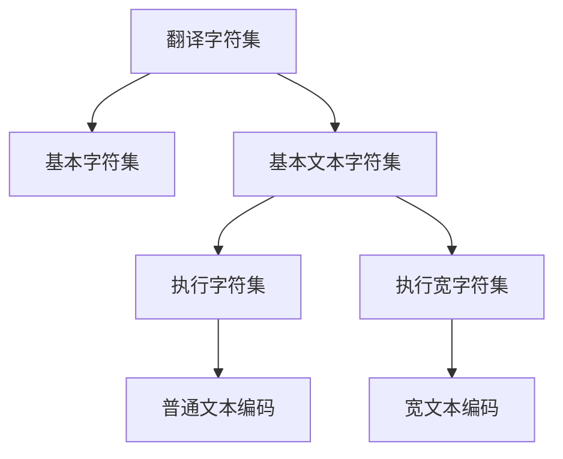

### 深入解析 C++ 字符集与编码体系（C++23/26 标准演进）

#### **1. C++ 字符集架构分层**


#### **2. 核心组件详解**

**2.1 翻译字符集（C++23 起）**
- **定义**：Unicode 的超集，包含：
  - Unicode 代码点（U+0000 到 U+10FFFF）
  - 未分配标量值的特殊字符
- **作用**：源码到内部表示的桥梁
```cpp
// 示例：Unicode 字符直接使用
auto heart = u8"❤";  // UTF-8 编码 (C++17)
auto kanji = U"漢字"; // UTF-32 编码 (C++11)
```

**2.2 基本字符集（C++26 演进）**
- **C++26 扩展**：新增 `$`, `@`, `` ` `` 三字符（共99字符）
- **完整组成**：
  | 类型              | 字符示例                          | 数量 |
  |-------------------|-----------------------------------|------|
  | 空白控制符        | `\t` (U+0009), `\v` (U+000B)      | 4    |
  | 可打印字符        | A-Z, a-z, 0-9, 标点符号           | 95   |
  | **C++26 新增**    | `$` (U+0024), `@` (U+0040)        | +3   |
- **源码编写约束**：
  ```cpp
  // 合法用法（C++26）
  string email = "user@domain.com"; 
  string path = R"(C:\$System)";     // 原始字符串中的$
  ```

**2.3 基本文本字符集**
- **组成** = 基本字符集 + 关键控制符：
  ```cpp
  // 控制字符示例
  char null_char = '\0';    // U+0000
  char bell_char = '\a';    // U+0007
  wchar_t backspace = L'\b';// U+0008
  ```
- **数值特性**：
  - `'0'` 到 `'9'` 连续递增（`'1'-'0' == 1`）
  - `\0` 值为 0（但存储形式不一定是全零位）

**2.4 执行字符集**
- **关键特性**：
  - 超集（包含基本文本字符集）
  - 编码区域设置相关
  - 多字节字符支持
```cpp
// 多字节字符示例（依赖区域设置）
setlocale(LC_ALL, "ja_JP.UTF-8");
wstring_convert<codecvt_utf8<wchar_t>> conv;
wstring wide = conv.from_bytes("日本語"); // 多字节转宽字符
```

#### **3. 文字编码机制**

**3.1 代码单元与编码映射**
| 前缀   | 编码类型          | 字符类型   | 存储大小 | 示例               |
|--------|-------------------|------------|----------|--------------------|
| 无     | 普通文本编码      | char       | 1+字节   | "Hello"           |
| L      | 宽文本编码        | wchar_t    | 2/4字节  | L"Wide"           |
| u8     | UTF-8             | char       | 1-4字节  | u8"😊"            |
| u      | UTF-16 (C++23起)  | char16_t   | 2/4字节  | u"𐍈" (U+10348)   |
| U      | UTF-32 (C++23起)  | char32_t   | 4字节    | U"𝄞" (U+1D11E)    |

**3.2 编码转换实战**
```cpp
// UTF-8 到 UTF-32 转换
#include <codecvt>
#include <locale>

int main() {
    std::u32string utf32 = U"Ω≈√∫"; // UTF-32 直接存储
    
    // 转换到 UTF-8
    std::wstring_convert<std::codecvt_utf8<char32_t>, char32_t> conv;
    std::string utf8 = conv.to_bytes(utf32);
    
    // 输出字节序列
    for (char c : utf8) 
        std::cout << std::hex << (int)(unsigned char)c << ' ';
    // Ω: CE A9, ≈: E2 89 88, √: E2 88 9A, ∫: E2 88 AB
}
```

**3.3 二进制安全处理**
```cpp
// 处理混合编码字符串
void safe_print(const std::string& str) {
    for (size_t i = 0; i < str.size(); ) {
        int len = 1;
        // 检测UTF-8多字节序列
        if ((str[i] & 0x80) != 0) {
            if      ((str[i] & 0xE0) == 0xC0) len = 2;
            else if ((str[i] & 0xF0) == 0xE0) len = 3;
            else if ((str[i] & 0xF8) == 0xF0) len = 4;
        }
        
        std::cout << str.substr(i, len) << " ";
        i += len;
    }
}
// 输入 u8"a✓€" 输出 "a" "✓" "€"
```

#### **4. C++23/26 关键演进**
- **术语更新（C++23）**：
  ```diff
  - 基本源字符集 → 基本字符集
  - 基本执行字符集 → 基本文本字符集
  ```
- **强制 Unicode 编码（C++23）**：
  - `u8`/`u`/`U` 前缀严格对应 UTF-8/16/32
- **新增字符（C++26）**：
  - `$`, `@`, `` ` `` 成为基本字符集成员
  ```cpp
  // C++26 新特性应用
  template<typename T>
  concept Money = requires(T t) {
      { t } -> std::convertible_to<@currency_type>; // @ 作为概念约束符
  };
  ```

#### **5. 跨平台注意事项**
- **宽字符大小差异**：
  ```cpp
  static_assert(sizeof(wchar_t) == 2 || sizeof(wchar_t) == 4, 
                "wchar_t size implementation-defined");
  ```
- **换行符处理**：
  ```cpp
  // 安全写入跨平台换行
  std::ofstream file("log.txt");
  #ifdef _WIN32
      file << "Line1\r\n";
  #else
      file << "Line1\n";
  #endif
  ```
- **编码检测最佳实践**：
  ```cpp
  // BOM 处理 (Byte Order Mark)
  std::ifstream file("data.txt", std::ios::binary);
  char bom[3]{};
  file.read(bom, 3);
  if (bom[0] == '\xEF' && bom[1] == '\xBB' && bom[2] == '\xBF') {
      std::cout << "UTF-8 with BOM";
  }
  ```

### **总结与开发指南**
1. **字符集层级关系**：
   - 翻译字符集 ⊇ 基本字符集 ⊂ 基本文本字符集 ⊂ 执行字符集
2. **现代 C++ 编码原则**：
   - 优先使用 `u8` 前缀保证 UTF-8 兼容
   - 避免依赖 `wchar_t` 大小（用 `char16_t`/`char32_t`）
   - C++26 代码可自由使用 `$` `@` `` ` `` 符号
3. **关键数值保证**：
   - `\0` 值为 0
   - `'0'` 到 `'9'` 连续递增
   - 基本字符单字节表示
4. **兼容性处理**：
   ```cpp
   #if __cplusplus >= 202302L
   // C++23+ Unicode 严格模式
   #define UNICODE_STR(s) u8##s
   #else
   // 传统实现定义编码
   #define UNICODE_STR(s) s
   #endif
   
   std::cout << UNICODE_STR("日本語");
   ```

> **最终结论**：C++ 通过分层字符集模型将源码表示（基本字符集）、执行环境（执行字符集）和物理编码（文字编码）解耦。C++23/26 标准通过拥抱 Unicode 和扩展基本字符集，显著提升了文本处理的现代化程度。开发者应：
> 1. 理解各层字符集的边界
> 2. 新项目优先使用 UTF-8 编码
> 3. 跨平台代码处理宽字符大小差异
> 4. 利用 `std::codecvt` 进行安全编码转换
> 5. 关注 C++26 对 `$` `@` `` ` `` 的新支持