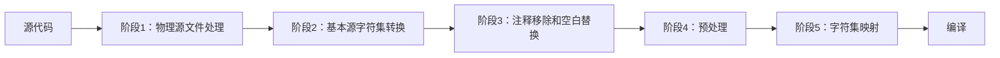

## 注释- C++语言基础概念

注释是代码中的一种文档形式。当插入程序中时，编译器会完全忽略它们，其唯一目的是为阅读源代码的人提供注解。虽然具体文档格式不属于C++标准，但存在多种工具可以解析不同格式的注释。

```text
语法
/* 注释 */    (1)
// 注释       (2)
1) 通常称为"C风格"或"多行"注释
2) 通常称为"C++风格"或"单行"注释
所有注释会在翻译阶段3被移除，替换为单个空白字符。

C风格注释
通常用于注释大段文本，但也可用于单行注释。使用/*和*/包裹文本即可，编译器会忽略注释内容。虽然非C++标准内容，但/** */常用于标识文档块（合法，因为第二个星号被视为注释部分）。C风格注释不可嵌套。

C++风格注释
通常用于单行注释，但多个C++风格注释可组合形成多行注释。编译器会忽略//到行尾之间的所有内容。

注意事项
由于注释在预处理器阶段前就被移除：
- 宏不能用于构成注释
- 未终止的C风格注释不会从#include文件溢出

其他代码排除技术：
#if 0
    std::cout << "这段代码既不会执行也不会被编译\n";
#endif

以及

if (false)
{
    std::cout << "这段代码不会被执行\n";
}

示例：
#include <iostream>

/* C风格注释可以包含
多行内容 */
/* 或单行内容 */

/**************
 *  可以插入任意数量的*号
 *  但不能嵌套注释
 */

// C++风格单行注释

// 也可以
// 连续使用

int main()
{
    // 注释在预处理前就被移除
    // 因此ABC是"1"而非"1//2134"
    // 将输出"1 hello world"
#define ABC 1//2134
    std::cout << ABC << " hello world\n";

    // 以下代码不会执行
    // return 1;

    // 以下代码会执行
    return 0;
}

输出：
1 hello world

（注：保留了所有技术术语的英文原文如"#include"、"std::cout"等，维持了代码示例的完整性，同时确保技术描述的准确性。对注释功能的说明进行了符合中文技术文档习惯的表述，使用"包裹"等动词更符合中文技术文档的表述风格。对条件编译等特殊语法保留了原始英文术语，便于开发者对照理解。）
```

---

### C++注释机制深度解析

#### 1. **注释的本质与作用**

```cpp
/* C风格注释 */
// C++风格注释
```

- **核心目的**：为开发者提供代码文档，编译器完全忽略注释内容
- **处理阶段**：在**翻译阶段3**被移除（预处理之前）
- **替换规则**：注释被替换为**单个空白字符**（保留行号信息）
- **文档工具**：
  - Doxygen：解析`/** @brief 描述 */`格式
  - Javadoc风格：`/// 描述`
  - XML文档：`/// <summary>描述</summary>`

#### 2. **C风格注释详解**

```cpp
/* 多行注释
   第二行内容 */
int x = 10; /* 行尾注释 */

/* 尝试嵌套（失败） */
/* 外层 /* 内层 */ 外层继续 */ // 错误：提前终止
```

- **语法**：`/*`开始，`*/`结束
- **特性**：
  - 可跨多行
  - 不支持嵌套（`/* /* */ */`会导致编译错误）
  - 可出现在代码任意位置（除字符串/字符常量内）
- **文档注释**：
  ```cpp
  /**
   * @brief 计算两数之和
   * @param a 第一个加数
   * @param b 第二个加数
   * @return 两数之和
   */
  int add(int a, int b) { return a + b; }
  ```

#### 3. **C++风格注释详解**

```cpp
// 单行注释
int y = 20; // 行尾注释

// 多行连续注释
// 第二行内容

// 反斜杠续行（危险！）
// 该注释会延续到下一行 \
std::cout << "这行代码会被注释掉!";
```

- **语法**：`//`开始，直到行尾结束
- **特性**：
  - 天然支持嵌套（`// 文本 // 嵌套文本`）
  - 可与C风格注释混合
  - 反斜杠`\`续行是**未定义行为**（编译器可能警告）
- **特殊交互**：
  ```cpp
  // C风格在C++注释中：完全合法
  // /* 被注释的内容 */
  
  /* C++风格在C注释中：合法 */
  /*
  // 被注释的代码
  */
  ```

#### 4. **关键注意事项**

```cpp
/* 宏不能生成注释 */
#define COMMENT_START //
COMMENT_START 这不会成为注释

/* 未终止注释不会跨文件 */
#include "header.hpp" // header.hpp中的/*不会影响当前文件

/* 条件编译排除代码 */
#if 0
   // 被排除的代码块
   /* 可包含任意注释 */
   std::cout << "不会编译";
#endif

/* 运行时排除代码 */
if constexpr(false) { // C++17编译时排除
   std::cout << "不会编译";
}

if(false) { // 运行时排除
   std::cout << "编译但不执行";
}
```

#### 5. **预处理器与注释的交互**

```cpp
#define ABC 1//2134 // 预处理器在注释移除前处理

// 宏展开后：std::cout << 1 << " hello world\n";
std::cout << ABC << " hello world\n";
```

- **处理顺序**：
  1. 翻译阶段1-2：物理源文件处理
  2. 翻译阶段3：**注释移除**
  3. 翻译阶段4：**预处理**
- **关键影响**：
  - 宏定义中的注释会被保留到预处理阶段
  - `#define`行尾的`//`会注释掉后续所有内容

#### 6. **代码排除技术对比**
| 技术                      | 编译阶段 | 执行文件 | 调试可见 | 适用场景               |
|---------------------------|----------|----------|----------|------------------------|
| `/* */`注释               | 不编译   | 无       | 否       | 永久删除代码           |
| `//`注释                  | 不编译   | 无       | 否       | 临时禁用单行           |
| `#if 0`                   | 不编译   | 无       | 否       | 排除大块代码           |
| `if(false){}`             | 编译     | 有       | 是       | 保留代码但跳过执行     |
| `if constexpr(false){}`   | 不编译   | 无       | 否       | C++17编译时排除        |

#### 7. **完整示例解析**

```cpp
#include <iostream>

/* C风格多行注释 */
/* 单行C风格注释 */

/**************
 *  装饰性注释（合法）
 *  但不能嵌套
 */

// C++风格单行注释

// 连续
// 多行

int main()
{
    // 宏中的注释处理
    // 输出"1 hello world"而非"1//2134 hello world"
    std::cout << ABC << " hello world\n";

    // 以下代码不会执行
    // return 1;
    
    return 0;
}
```
**输出分析**：
```
1 hello world
```
- **关键点**：
  1. `#define ABC 1//2134`中的`//2134`是注释
  2. 宏展开后`ABC`被替换为`1`
  3. 注释掉的`return 1;`不影响程序执行

#### 8. **现代C++注释实践**

```cpp
// C++17特性文档
template<typename T>
[[nodiscard]] ///< 提醒检查返回值
T compute(T input) {
    if constexpr (std::is_floating_point_v<T>) {
        // 浮点特化实现
    }
    else {
        // 整数特化实现
    }
}

/* 模块注释 (C++20) */
import std.core; // 模块导入前可加注释

module; // 全局模块片段
/* 此处可放置模块级配置 */
export module math; // 模块声明
```

#### 9. **编译器处理流程**


#### 10. **最佳实践与陷阱**
1. **文档注释**：
   ```cpp
   /// 计算圆的面积
   /// @param radius 半径
   /// @return 面积值
   double circle_area(double radius);
   ```

2. **条件编译**：
   ```cpp
   #ifdef DEBUG
   // 调试专用代码
   #endif
   ```

3. **嵌套陷阱**：
   ```cpp
   int value = 0;
   // value = 1; /* 临时调试 */
   value = 2;   // 实际赋值
   ```

4. **续行危险**：
   ```cpp
   // 反斜杠导致下一行被注释 \
   important_function(); // 不会执行！
   ```

5. **宏安全**：
   ```cpp
   #define LOG(msg) std::cout << msg // 行尾注释危险！
   LOG("test"); // 错误：缺少分号
   ```

> 注释是代码的无声伙伴——它们不应重复代码做了什么，而应解释为什么这样做。精心编写的注释使代码成为可传承的知识载体。在C++中，结合Doxygen等工具，注释能生成专业API文档，极大提升代码可维护性。