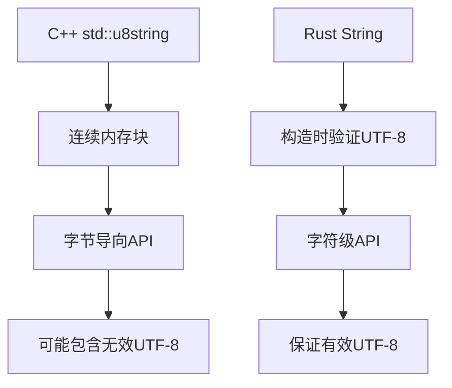
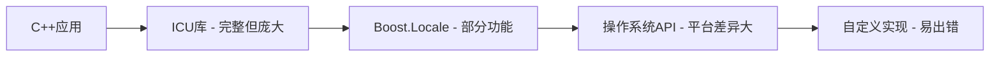
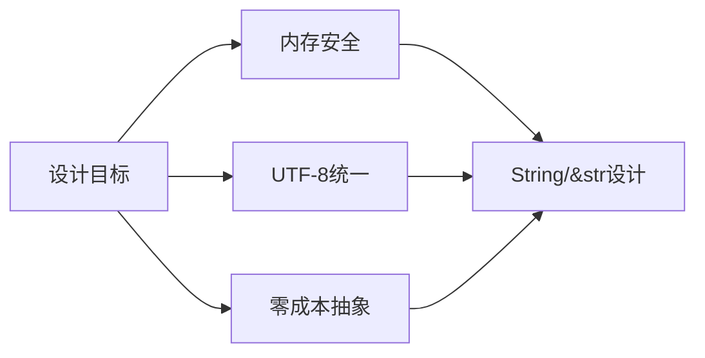

## 变量 String 字符串- Rust 和 C/C++ 的字符串库设计的对比分析

### 一、Rust 中的 `String` 类型详解

#### 1.1 `String` 类型核心特性

**UTF-8 编码**

Rust 的 `String` 采用 **UTF-8 编码**，支持全球所有语言的字符

每个字符占用 1-4 个字节，内存效率高

示例：
```rust
let hello = String::from("你好");
println!("长度: {}", hello.len()); // 输出 6 (每个中文字符占3字节)
```

**动态可增长**

堆分配内存，运行时自动扩容

无需手动管理内存
```rust
let mut s = String::new();
s.push_str("Hello"); // 添加内容
s.push('!');         // 添加字符
println!("{}", s);   // 输出 "Hello!"
```

#### 1.2 创建 `String` 的多种方式

**常用构造方法**

| 方法               | 描述                 | 示例                          |
| ------------------ | -------------------- | ----------------------------- |
| `String::new()`    | 创建空字符串         | `let s = String::new();`      |
| `String::from()`   | 从字面量创建         | `let s = String::from("hi");` |
| `str::to_string()` | 转换 &str 为 String  | `"hi".to_string()`            |
| `to_owned()`       | 创建数据的拥有权副本 | `"hi".to_owned()`             |
| `format!()`        | 格式化创建字符串     | `format!("{} {}", a, b)`      |

**性能对比**

```rust
// 最快：直接分配正确大小
let s = String::with_capacity(100);

// 中等：预知内容时
let s = String::from("固定内容");

// 最慢：多次追加
let mut s = String::new();
s.push_str("部分");
s.push_str("内容");
```

#### 1.4 `String` 与 `&str` 关系

**核心区别**

| 特性         | `String` | `&str`       |
| ------------ | -------- | ------------ |
| **内存位置** | 堆分配   | 栈或静态内存 |
| **所有权**   | 拥有数据 | 借用数据     |
| **可变性**   | 可变     | 不可变       |
| **大小**     | 动态可变 | 固定         |

**相互转换**

```rust
// String -> &str (零成本)
let string = String::from("hello");
let slice: &str = &string;

// &str -> String (需内存分配)
let slice = "world";
let string = slice.to_string();
```

**使用场景**

**使用 `String` 当**：

- 需要修改字符串内容
- 需要传递字符串所有权
- 从用户输入构建字符串

**使用 `&str` 当**：

- 函数参数（更高效）
- 引用静态字符串
- 字符串切片操作

#### 1.5 为什么 `new` 是通用模式？

**设计一致性**

Rust 标准库中的通用约定：
```rust
Vec::new()       // 创建新向量
HashMap::new()   // 创建新哈希表
Thread::new()    // 创建新线程
```

遵循 "零成本抽象" 原则

**类型安全保证**

`new` 函数确保：

- 正确初始化所有字段
- 满足类型不变式
- 返回有效实例

**扩展性设计**

可与其他构造函数组合：
```rust
// 链式调用创建配置好的实例
let v = Vec::with_capacity(10)
        .checked_add(5)
        .unwrap_or_default();
```

#### 1.6 内存管理剖析

**`String` 内部结构**

```rust
pub struct String {
    vec: Vec<u8>, // UTF-8字节序列
}
```
三重字段：
1. 指向堆内存的指针
2. 当前长度（字节数）
3. 当前容量（分配的字节数）

**增长策略**

当长度达到容量时自动扩容：
```
初始：容量=0
首次添加：容量=4
后续扩容：容量 *= 2 (指数增长)
```

优化减少分配次数

**释放机制**

离开作用域时自动释放：
```rust
{
    let s = String::from("临时字符串");
    // 使用 s...
} // 此处自动调用 drop(), 释放内存
```

#### 1.7 最佳实践

**字符串处理技巧**

```rust
// 高效拼接
let s1 = String::from("Hello");
let s2 = String::from(" world");
let combined = s1 + &s2; // 注意 s1 的所有权被转移

// 格式化（避免中间分配）
let formatted = format!("{}{}", s1, s2);
```

**容量预分配**

```rust
// 当知道大致大小时
let mut s = String::with_capacity(256);
for word in words {
    s.push_str(word);
    s.push(' ');
}
```

**处理非UTF-8数据**

```rust
// 使用字节向量处理二进制数据
let bytes: Vec<u8> = vec![0x48, 0x65, 0x6c, 0x6c, 0x6f];

// 安全转换
let s = String::from_utf8_lossy(&bytes); // "Hello"
```

#### 总结: Rust 的设计

Rust 的 `String` 设计体现了语言的核心哲学：
- **安全**：通过所有权系统防止内存错误
- **高效**：UTF-8 编码和智能增长策略
- **明确**：`::` 语法清晰区分关联函数和实例方法
- **一致**：`new` 模式提供统一的对象创建接口

理解 `String::new()` 不仅是学习一个函数调用，更是掌握 Rust 类型系统和内存管理的基础。这种设计使 Rust 能在保证安全的同时，提供与 C++ 相媲美的性能表现。

---

### 二、字符串库设计的深度对比分析

以下是对 Rust 和 C/C++ 字符串库设计的深度对比分析，涵盖内存模型、安全性、编码支持、API 设计、性能及生态等多个维度：

#### 2.1 核心设计哲学
**C/C++ 设计**: 底层控制优先

最小抽象：字符串本质是 `char*`（C）或 `std::string`（C++）包裹的以 `\0` 结尾的字节数组。

信任程序员：不强制内存安全或编码有效性，依赖开发者手动管理。

兼容性优先：C 字符串与系统 API、文件格式、网络协议等高度兼容。

```cpp
// C 字符串示例
#include <stdio.h>
#include <string.h>

int main() {
    // 栈分配的字符数组
    char stack_str[10] = "hello";
    
    // 堆分配的字符串
    char* heap_str = malloc(10);
    strcpy(heap_str, "world");
    
    // 直接内存操作
    *(heap_str + 2) = 'R'; // 修改第三个字符
    
    printf("%s %s\n", stack_str, heap_str); // 输出: hello woRld
    
    free(heap_str); // 必须手动释放
    return 0;
}

// 设计特点：
//   字符数组本质：char* 或 char[]
//   以 \0 终止的内存块
//   完全手动内存管理
//   无编码保证（纯字节操作），字节兼容性
```

**Rust 设计**: 安全抽象优先

安全第一：通过所有权系统、借用检查和运行时验证强制安全。

显式分离：
- `String`：堆分配、可变的 UTF-8 字符串（所有权类型）。
- `&str`：不可变的 UTF-8 字符串切片（借用类型）。

UTF-8 强制：所有字符串操作默认保证有效的 UTF-8 编码。

```rust
// Rust 字符串示例
fn main() {
    // 堆分配的可变字符串
    let mut s = String::from("hello");
    
    // 不可变字符串切片
    let slice: &str = &s[0..2]; // "he"
    
    // 安全修改
    s.push_str(" world");
    s.replace_range(2..3, "L"); // 修改第三个字符
    
    // 自动Unicode处理
    let emoji = "😊";
    println!("{} {} {}", s, slice, emoji); // 输出: heLlo world he 😊
}

// 设计特点：
//   严格区分 String (拥有所有权) 和 &str (借用)
//   强制 UTF-8 编码保证
//   所有权系统防止内存错误
//   自动内存管理
```

#### 2.2 内存模型与生命周期
| **特性**         | **C**                      | **C++ (std::string)**      | **Rust**                     |
| ---------------- | -------------------------- | -------------------------- | ---------------------------- |
| **存储方式**     | `char[]` 或 `char*` + `\0` | 连续字节数组 + 长度 + 容量 | 堆分配字节数组 + 长度 + 容量 |
| **终止符**       | 依赖 `\0`                  | 无终止符（存储长度）       | 无终止符（存储长度）         |
| **生命周期管理** | 手动分配/释放              | RAII（自动释放）           | 所有权系统（编译时检查）     |
| **可变性**       | 直接修改                   | 支持可变                   | `String` 可变，`&str` 不可变 |

**内存布局细节**:

C++ std::string 典型实现（gcc libstdc++）

```cpp
struct std_string {
    union {
        char* ptr;       // 长字符串指针
        char buf[16];    // 短字符串优化缓冲区
    };
    size_t size;         // 当前长度
    size_t capacity;     // 分配容量
};
```

Rust String 内存布局

```rust
pub struct String {
    vec: Vec<u8>, // 内部使用Vec<u8>存储
}

pub struct Vec<T> {
    ptr: NonNull<T>, // 堆指针
    cap: usize,      // 容量
    len: usize,      // 长度
}
```

**生命周期管理示例**:

C++ 迭代器失效问题

```cpp
#include <string>
#include <iostream>

int main() {
    std::string s = "hello";
    auto it = s.begin() + 2; // 指向 'l'
    
    s += " world!"; // 可能导致重新分配
    
    // 危险! 迭代器可能失效
    *it = 'L'; // 未定义行为!
    std::cout << s << std::endl;
}
```

Rust 编译时防止迭代器失效

```rust
fn main() {
    let mut s = String::from("hello");
    let third_char = s.chars().nth(2).unwrap(); // 获取第三个字符
    
    s.push_str(" world!"); // 修改字符串
    
    // 安全使用之前获取的值
    println!("Third char was: {}", third_char); // 输出 'l'
    
    // 编译时防止同时使用可变和不可变引用
    // let slice = &s[0..2];
    // s.push_str("!"); // 错误! 不能同时存在可变和不可变引用
}
```

**关键区别**：

长度存储：C 依赖 `\0` 计算长度（O(n)），而 C++/Rust 存储长度（O(1)）。

内存安全：Rust 的借用检查器防止悬垂指针；C/C++ 需手动避免缓冲区溢出/内存泄漏。

#### 2.3 字符编码处理
| **语言** | **默认编码** | **处理方式**                                                 | **Unicode 支持**                                      |
| -------- | ------------ | ------------------------------------------------------------ | ----------------------------------------------------- |
| C        | 无默认编码   | 字节数组，需外部库（如 libiconv）                            | 无内置支持                                            |
| C++      | 无默认编码   | `std::string` 存储字节；`std::wstring` 支持宽字符（平台相关） | C++11 引入 `char16_t`/`char32_t`，但 API 有限         |
| Rust     | UTF-8        | 强制所有字符串为有效 UTF-8，否则 panic 或返回 `Result`       | 完整 Unicode 支持（通过 `unicode-segmentation` 等库） |

**深度分析**：

Rust 的 UTF-8 强制：
- 优点：统一编码、避免乱码，与网络/Web 标准兼容。
- 缺点：处理非 UTF-8 数据（如二进制）需显式转换（`Vec<u8>` 或 `OsString`）。

Rust 统一 UTF-8 处理

```rust
fn main() {
    let jp = "こんにちは世界"; // UTF-8 编码
    let emoji = "😊✅🌟";
    
    // 安全遍历 Unicode 字符
    for c in jp.chars() {
        print!("{} ", c);
    }
    // 输出: こ ん に ち は 世 界 
    
    // 按字符索引
    if let Some(c) = emoji.chars().nth(1) {
        println!("\nSecond emoji: {}", c); // 输出: ✅
    }
    
    // 处理非 UTF-8 数据
    let bytes = vec![0xFF, 0xFE]; // 无效 UTF-8
    match std::str::from_utf8(&bytes) {
        Ok(s) => println!("Valid: {}", s),
        Err(e) => println!("Invalid UTF-8: {}", e), // 捕获错误
    }
}
```

C/C++ 的灵活性：
- 可处理任意编码（如 GBK、Shift-JIS），但需开发者保证正确性。
- 宽字符（`wchar_t`）在 Windows 为 UTF-16，Linux 为 UTF-32，导致跨平台问题。

C++ 宽字符串问题

```cpp
#include <iostream>
#include <string>
#include <locale>

int main() {
    // Windows 下为 UTF-16，Linux 下为 UTF-32
    std::wstring ws = L"こんにちは世界";
    
    // 跨平台输出问题
#ifdef _WIN32
    std::wcout.imbue(std::locale(""));
    std::wcout << ws << std::endl; // Windows 输出正常
#else
    // Linux 需要转换
    std::wstring_convert<std::codecvt_utf8<wchar_t>> conv;
    std::cout << conv.to_bytes(ws) << std::endl;
#endif
}
```

#### 2.4 安全性对比
| **问题类型**     | **C 风险**          | **C++ 风险**                | **Rust 解决方案**         |
| ---------------- | ------------------- | --------------------------- | ------------------------- |
| **缓冲区溢出**   | 高危（`strcpy` 等） | 可能（错误使用 `data()`）   | 编译时边界检查 + panic    |
| **内存泄漏**     | 常见（忘记 `free`） | RAII 减少但可能（循环引用） | 所有权自动释放            |
| **悬垂指针**     | 常见                | 可能（无效迭代器）          | 借用检查器禁止            |
| **编码无效访问** | 未定义行为          | 未定义行为                  | 运行时 UTF-8 验证 + panic |

**示例：字符串连接**

```c
// C: 缓冲区溢出风险
char dest[10];
strcpy(dest, "hello");
strcat(dest, "world!"); // 溢出！
// Rust: 安全
let mut s = String::from("hello");
s.push_str("world!"); // 自动扩容，无溢出

// 切片边界检查
// let slice = &s[10..]; // 运行时 panic
```

#### 2.5 API 设计理念
**C 设计**：函数式 API（`strlen`, `strcmp`, `strcat`），需手动管理内存。

**C++ 设计**：

- 面向对象设计（`s.append()`, `s.find()`）。
- 提供迭代器，但易失效（如修改时的迭代器失效）。

**Rust 设计**：

- 方法链式调用：`s.trim().to_uppercase().replace("a", "b")`。
- 切片安全：`&str` 是内存安全的子字符串视图（无额外分配）。
- 错误处理：返回 `Result` 而非未定义行为（如 `from_utf8()` 验证编码）。

**关键优势**：

- Rust 的 `&str` 避免了 C++ `std::string_view` 的悬垂风险（编译期检查）。
- 迭代器无失效问题（借用规则禁止并发修改）。

**字符串拼接性能**

C++ 多次拼接问题

```cpp
std::string result;
for (int i = 0; i < 1000; ++i) {
    result += "string"; // 可能多次重新分配
}
// 优化方案: 预分配空间
std::string optimized;
optimized.reserve(6000);
for (int i = 0; i < 1000; ++i) {
    optimized += "string";
}
```

Rust 高效拼接

```rust
fn main() {
    // 使用 String::with_capacity 预分配
    let mut s = String::with_capacity(6000);
    for _ in 0..1000 {
        s.push_str("string");
    }
    
    // 使用 format! 宏（编译器优化）
    let formatted = format!("{}{}{}", "a", "b", "c");
    
    // 使用 join 高效连接
    let parts = vec!["hello", "world"];
    let joined = parts.join(" ");
}
```

**切片操作安全性**

C++ string_view 陷阱

```cpp
#include <iostream>
#include <string>
#include <string_view>

std::string create_string() {
    return "temporary string";
}

int main() {
    std::string_view sv;
    {
        std::string s = create_string();
        sv = s; // 创建视图
    } // s 被销毁
    // 危险! 悬垂指针!
    std::cout << sv << std::endl; // 未定义行为
}
```

Rust 安全切片

```cpp
fn create_string() -> String {
    String::from("temporary string")
}

fn main() {
    let slice;
    {
        let s = create_string();
        slice = &s[0..5]; // 创建切片
        println!("Inside: {}", slice); // 安全
    } // s 被丢弃
    
    // 编译错误! 生命周期检查
    // println!("Outside: {}", slice); 
}
```

#### **2.6 性能优化**
| **方面**       | **C/C++**                       | **Rust**                                      |
| -------------- | ------------------------------- | --------------------------------------------- |
| **长度计算**   | C: O(n)（扫描 `\0`）; C++: O(1) | O(1)（存储长度）                              |
| **内存分配**   | 手动优化（内存池等）            | 自动扩容（类似 C++ vector）                   |
| **SSO**        | C++17 引入短字符串优化（SSO）   | 标准库实现 SSO（如 rustc 的 `SmallString`）   |
| **零成本抽象** | 部分（内联、模板）              | 极致追求（如 `&str` 编译后等同 `(ptr, len)`） |
| **并发安全**   | 需手动同步                      | 编译期禁止数据竞争（`String` 非 `Sync`）      |

**短字符串优化 (SSO) 实现**

C++ SSO 示例

```cpp
#include <iostream>
#include <string>

void print_memory(const std::string& s) {
    std::cout << "Content: " << s 
              << ", Size: " << s.size()
              << ", Capacity: " << s.capacity()
              << ", Addr: " << (void*)s.data() << std::endl;
}

int main() {
    std::string short_str = "short"; // 通常使用栈缓冲区
    std::string long_str = "this is a very long string that exceeds SSO buffer size";
    
    print_memory(short_str); // 地址可能在栈空间
    print_memory(long_str);  // 地址在堆空间
}
```

Rust SSO 实现

```rust
fn main() {
    let short = "short".to_string();
    let long = "this is a very long string that exceeds typical SSO size".to_string();
    
    println!("Short: len={}, capacity={}", short.len(), short.capacity());
    println!("Long: len={}, capacity={}", long.len(), long.capacity());
    
    // 内存地址比较
    println!("Short ptr: {:p}", short.as_ptr());
    println!("Long ptr: {:p}", long.as_ptr());
    
    // Rust 标准库实现中，短字符串通常直接存储在指针位置
}
```

**零成本抽象案例**：字符串迭代

Rust 高效字符迭代

```rust
fn count_uppercase(s: &str) -> usize {
    s.chars().filter(|c| c.is_uppercase()).count()
}

// 编译后等价于：
fn count_uppercase_optimized(s: &str) -> usize {
    let bytes = s.as_bytes();
    let mut count = 0;
    let mut i = 0;
    while i < bytes.len() {
        let (c, size) = std::str::from_utf8_unchecked(&bytes[i..]).chars().next().unwrap();
        if c.is_uppercase() {
            count += 1;
        }
        i += size;
    }
    count
}
```

**性能注意事项**：

- Rust 的 UTF-8 验证有轻微运行时开销（但通常一次验证多次使用）。
- C/C++ 可绕过安全换取速度（如直接操作内存），Rust 需 `unsafe` 块实现同等操作。

#### 2.7 与系统/外部交互
**C 兼容性**：

- Rust：通过 `std::ffi::CString` 提供零终止字符串，无缝衔接 C API。
- C++：`std::string::c_str()` 直接返回 C 兼容指针。

**操作系统交互**：

- Windows API 使用 UTF-16：Rust 需转换（`OsString` → `String`），C++ 可用 `std::wstring`。

C++ 与 Windows API

```cpp
#include <windows.h>
#include <string>

int main() {
    std::wstring ws = L"Hello from C++";
    
    // 直接使用宽字符串
    MessageBoxW(NULL, ws.c_str(), L"Message", MB_OK);
    
    // ANSI 版本需要转换
    std::string s = "ANSI string";
    MessageBoxA(NULL, s.c_str(), "ANSI Message", MB_OK);
}
```

Rust 与 Windows API

```rust
use winapi::um::winuser::{MessageBoxW, MB_OK};
use std::ffi::OsStr;
use std::os::windows::ffi::OsStrExt;

fn main() {
    let text = "Hello from Rust";
    
    // 转换为 UTF-16
    let text_wide: Vec<u16> = OsStr::new(text)
        .encode_wide()
        .chain(Some(0).into_iter())
        .collect();
    
    unsafe {
        MessageBoxW(
            std::ptr::null_mut(),
            text_wide.as_ptr(),
            OsStr::new("Rust Message").encode_wide().chain(Some(0)).collect::<Vec<_>>().as_ptr(),
            MB_OK,
        );
    }
}
```

**FFI 支持**：

- Rust 的 `#[repr(C)]` 结构体可安全传递字符串到 C。
- C++ 的 `std::string` 布局未标准化，跨语言传递需序列化。

#### 2.8 生态与工具链
**C/C++**：

- 丰富的历史库（如 ICU、Boost.StringAlgo）。
- 静态分析工具（Clang-Tidy）辅助检测字符串错误。

**Rust**：

- 标准库覆盖基础操作（`contains`, `split`, `replace`）。
- 强大的第三方库：`regex`：高性能正则表达式、`unicode-segmentation`：Unicode 分词、`serde`：序列化时自动处理编码。
- 编译器错误提示（如建议使用 `to_string()` 替代 `to_owned()`）。

#### 总结：设计取舍与适用场景
| **维度**     | **C/C++ 优势**                 | **Rust 优势**                      |
| ------------ | ------------------------------ | ---------------------------------- |
| **控制力**   | 直接内存操作，无运行时检查     | 安全抽象下接近底层的性能           |
| **安全性**   | 依赖经验（易出错）             | 编译时保障（默认安全）             |
| **编码支持** | 处理任意字节数据（无强制验证） | 统一 UTF-8 简化现代应用开发        |
| **学习曲线** | 简单语法（但陷阱多）           | 所有权/借用概念需适应              |
| **适用场景** | 内核开发、嵌入式、传统系统接口 | Web 服务、CLI 工具、安全关键型系统 |

**结论**：

- 选择 C/C++：当需要最大程度控制内存布局、与遗留系统交互或避免 UTF-8 开销时。
- 选择 Rust：当安全性、并发正确性和现代 Unicode 支持为优先考量时。
- 趋势：Rust 的设计代表了字符串处理的现代方向——通过类型系统在零成本抽象下强制安全，而 C++ 在 C++20/23 中通过 `std::u8string` 等逐步向 UTF-8 靠拢。

---

### 三、C++20 `std::u8string`：向UTF-8靠拢的渐进式改进

C++20引入的`std::u8string`是C++向现代字符串处理迈出的重要一步，但它与Rust的字符串设计仍有本质区别。以下深入分析其设计理念、实现细节和局限性：

#### 3.1 `std::u8string`的核心设计

**类型定义与编码表示**

```cpp
// C++20 新类型
using u8string = std::basic_string<char8_t>;  // 专门用于UTF-8编码的字符串类型

// 使用示例
std::u8string utf8_str = u8"你好世界 🌍";  // 前缀u8表示UTF-8字面量
```

**底层实现机制**

- 存储单元：使用`char8_t`类型（C++20新增），明确表示UTF-8代码单元
- 内存布局：与传统`std::string`完全相同，只是字符类型不同
- 兼容性：保持与现有`std::string`相同的API和行为

**核心设计困境**

向后兼容的紧箍咒

- 必须兼容C风格字符串（`char*` + `\0`终止符）
- 必须兼容现有`std::string` API和ABI
- 无法改变基础内存布局

编码混乱的遗产

- 无默认编码标准（ASCII，Latin-1，UTF-8，系统本地编码并存）
- 宽字符`wchar_t`尺寸平台相关（Windows：16位，Unix：32位）

安全与性能的权衡

- 零成本抽象原则禁止添加运行时检查
- 无法引入所有权等破坏性创新

#### 3.2 与传统 C++ 字符串的关键区别

| 特性           | 传统 `std::string`               | `std::u8string` (C++20)    |
| -------------- | -------------------------------- | -------------------------- |
| **字符类型**   | `char`                           | `char8_t`                  |
| **编码语义**   | 未指定编码（通常被视为字节序列） | 明确表示UTF-8编码          |
| **字面量前缀** | 无或`L`（宽字符）                | `u8`                       |
| **系统交互**   | 依赖本地编码                     | 明确UTF-8                  |
| **类型安全**   | 弱（可隐式转换）                 | 强（禁止隐式转换到`char*`) |

#### 3.3 向前兼容的代价与局限

**缺乏运行时验证**

```cpp
// 可以创建无效UTF-8序列（无编译或运行时检查）
char8_t invalid_utf8[] = {0xC0, 0x80};  // 无效的2字节序列
std::u8string str(invalid_utf8);        // 接受但内容无效

// Rust对比：编译时或运行时报错
let s = String::from_utf8(vec![0xC0, 0x80]); // 返回Result，需处理错误
```

**API未针对Unicode优化**

```cpp
std::u8string emoji = u8"😊✅🌟";

// 仍按字节操作（而非Unicode字素簇）
size_t len = emoji.length();  // 返回12（字节数），而非3（表情符号数）

// 正确遍历需要复杂逻辑：
auto it = emoji.begin();
while (it != emoji.end()) {
    // 手动解码UTF-8序列...
}
```

**迭代器陷阱**

```cpp
auto it = emoji.begin();
char8_t first = *it++; // 获取首字节(0xF0)
char8_t second = *it;  // 获取次字节(0x9F) - 无组合检查
```

**与传统API的互操作问题**

```cpp
void legacy_print(const char* str);

std::u8string modern_str = u8"New C++";
legacy_print(modern_str.c_str());  // 错误！类型不匹配

// 需要显式转换（可能不安全）
legacy_print(reinterpret_cast<const char*>(modern_str.c_str()));
```

#### 3.4 与Rust字符串设计的对比

**安全机制对比**

| **特性**        | **C++ `std::u8string`**          | **Rust `String`**               |
| --------------- | -------------------------------- | ------------------------------- |
| **编码保证**    | 类型暗示UTF-8，但不验证          | 运行时强制有效UTF-8             |
| **内存安全**    | 与传统string相同（可能悬垂指针） | 所有权系统防止内存错误          |
| **Unicode支持** | 需要外部库（如ICU）              | 标准库原生支持（`chars()`迭代） |
| **切片安全**    | `std::u8string_view`仍可能悬垂   | `&str`有生命周期检查            |
| **错误处理**    | 未定义行为（访问无效位置）       | 返回Result或panic               |
| **边界安全**    | `operator[]` 无检查              | `get_unchecked` 需显式unsafe    |
| **并发安全**    | 需手动同步                       | `Send`但不`Sync`，编译时防竞争  |

**内存模型差异**



**性能关键路径对比**

```cpp
// C++ 遍历UTF-8字符串
size_t count_chars(const std::u8string& s) {
    size_t count = 0;
    for (auto it = s.begin(); it != s.end(); ) {
        // 手动解码UTF-8序列
        uint8_t c = *it++;
        if (c <= 0x7F) count++;
        else if ((c & 0xE0) == 0xC0) it += 1;
        else if ((c & 0xF0) == 0xE0) it += 2;
        else if ((c & 0xF8) == 0xF0) it += 3;
        count++;
    }
    return count;
}
```

```rust
// Rust 等价的字符计数
fn count_chars(s: &str) -> usize {
    s.chars().count()  // 编译优化为高效内联代码
}
```

#### 3.5 C++ 字符串生态的深层挑战

**碎片化Unicode支持**



**ABI稳定性约束**

主要编译器(MSVC/GCC/Clang)的`std::string`布局不同

SSO(Small String Optimization)实现不兼容：

```cpp
// GCC实现 (通常16字节缓冲)
struct string {
    char* ptr;
    size_t size;
    size_t capacity;
    char local_buf[16]; 
};

// MSVC实现 (16字节联合)
struct string {
    union {
        char* ptr;
        char buf[16];
    };
    size_t size;
    size_t capacity;
};
```

**多语言互操作困境**

```cpp
// 跨语言边界示例
extern "C" void c_function(const char* str);

void call_c_from_cpp() {
    std::u8string utf8_str = u8"Hello";
    
    // 危险转换：假设执行环境支持UTF-8
    c_function(reinterpret_cast<const char*>(utf8_str.c_str()));
}
```

#### 3.6 C++23/26 的改进方向

**标准库增强**：

```cpp
// 标准Unicode库提案(P1629)
std::u8string s = u8"Hello";
// 字素簇迭代
auto first_grapheme = s.graphemes().front();  // 未来可能支持
// 规范化支持
auto nfc_str = s.normalize(NFC);
```

**互操作改进**：

```cpp
// 类型安全转换提案
std::u8string utf8 = u8"text";
std::string legacy = std::as_legacy_string(utf8); 

// 带错误处理的转换
auto result = std::checked_convert_to_utf8(legacy_str);
if (result) {
    use(*result);
} else {
    handle_error(result.error());
}
```

**编码感知IO**：

```cpp
// 提案中的编码指定
std::ofstream utf8_file("data.txt", std::ios::utf8);
utf8_file << u8str;  // 自动处理编码

// 提案：编码指定
std::u8ofstream file("data.txt");
file << u8"UTF-8内容"; // 自动处理BOM和编码转换

// 区域设置整合
std::locale::global(std::locale("en_US.UTF-8"));
std::cout << u8"Multilingual text: 你好, привет!";
```

#### 3.7 设计哲学差异的本质

**C++与Rust的设计范式**

| **设计维度** | **C++ 哲学**                  | **Rust 哲学**            |
| ------------ | ----------------------------- | ------------------------ |
| **兼容性**   | 绝对优先（不破坏现有代码）    | 必要时破坏性变更         |
| **安全模型** | "信任程序员" + 逃生舱(unsafe) | "默认安全" + 显式unsafe  |
| **创新成本** | 高（受ABI/API约束）           | 低（无历史包袱）         |
| **抽象代价** | 零成本抽象                    | 零成本抽象 + 安全强制    |
| **错误处理** | 异常/错误码/未定义行为        | Result类型 + 恐慌(panic) |

**C++：渐进兼容优先**


**Rust：安全重构优先**



**渐进式演进 vs 革命性设计**

`std::u8string`代表了C++在**保持向后兼容**前提下向现代字符串处理的演进：

- **积极意义**：类型系统开始区分编码，促进UTF-8普及
- **局限性**：未解决核心安全问题，Unicode支持仍依赖外部库
- **未来**：需要结合概念(Concepts)、范围(Ranges)等新特性构建完整解决方案

而Rust的字符串设计体现了**统一架构**的优势：
- 内存安全、编码保证和Unicode支持深度集成
- 零成本抽象实现高性能
- 通过所有权系统消除常见错误模式

两种路径反映了不同的设计取舍：C++选择**渐进兼容**，Rust选择**安全重构**。对于需要与现代Web生态深度集成的项目，Rust的字符串设计提供了更一致的体验；而对于需要与遗留系统交互的场景，C++的渐进式改进仍具有实用价值。

#### 结论：两种演进路径的理性选择

**何时选择 C++ 方案**

遗产系统维护：需要与C API或旧代码深度交互

资源受限环境：无法承担UTF-8验证开销的硬实时系统

二进制兼容需求：跨编译器/版本共享库的复杂场景

非文本数据处理：处理原始字节流的底层协议

**何时选择 Rust 方案**

新网络服务开发：HTTP/WebSockets等原生UTF-8协议

安全关键系统：金融、医疗等不容许内存错误的领域

跨平台应用：需要一致的Unicode处理行为

开发效率优先：减少调试编码/内存问题的时间成本

**未来展望**

C++ 的 `std::u8string` 是向正确方向的重要一步，但受制于语言的设计约束，它更像是"UTF-8兼容"而非"UTF-8原生"解决方案。而Rust的字符串设计代表了现代系统编程语言的发展方向：**通过类型系统在编译期将安全性和正确性内化为语言的基本属性**。

两种路径将在未来十年并存：C++在需要深度控制和对历史兼容的领域继续发挥作用，而Rust将在需要强安全保障和现代Unicode支持的新兴领域持续扩大优势。最终选择应基于具体项目的约束条件和技术目标，而非单纯的技术偏好。


