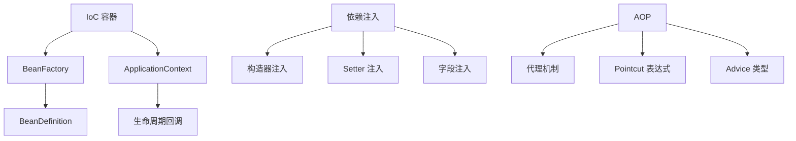
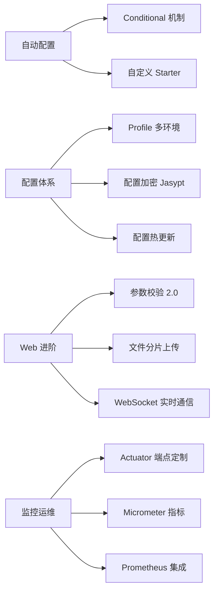
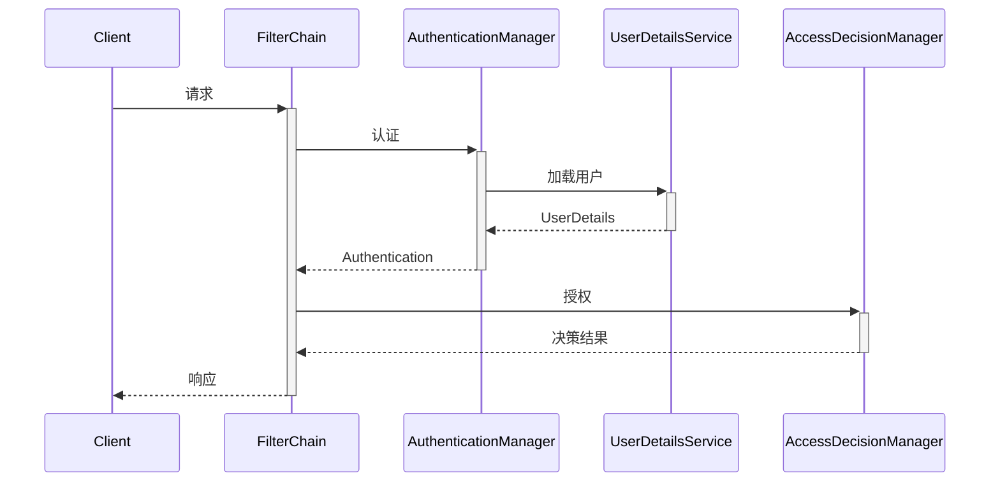
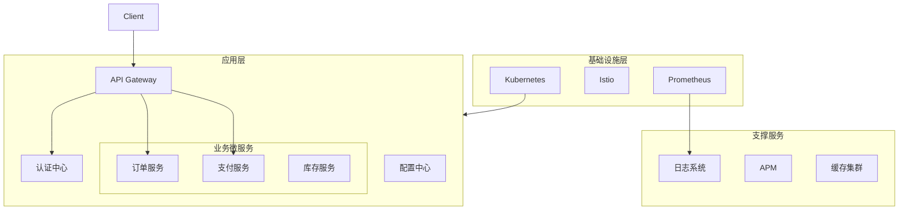

### 超详细 Spring 全栈学习路径（从入门到架构师）

---

#### **阶段 0：基础准备 (2-3周)**
| **模块**         | **核心内容**                                                                 | **工具/技术**                     | **实践任务**                                                                 |
|------------------|-----------------------------------------------------------------------------|----------------------------------|-----------------------------------------------------------------------------|
| **Java 核心**     | - Java 17+ 特性（Record, Text Blocks, Pattern Matching）<br>- 函数式编程（Lambda, Stream API）<br>- 模块化（JPMS）<br>- 并发编程（CompletableFuture, Virtual Thread） | JDK 17+, JShell                 | 实现多线程文件处理系统                                                      |
| **构建工具**      | - Maven 生命周期/插件体系<br>- Gradle Kotlin DSL<br>- 多模块项目管理<br>- Nexus 私服配置              | Maven 3.9+, Gradle 8.5+         | 搭建企业级多模块项目骨架                                                    |
| **数据库基础**    | - SQL 高级（窗口函数, CTE）<br>- 事务隔离级别<br>- 索引优化原理<br>- 数据库设计范式                 | PostgreSQL, MySQL 8.0           | 设计电商数据库模型（用户/商品/订单）                                        |
| **网络协议**      | - HTTP/2 特性<br>- WebSocket 协议<br>- RESTful HATEOAS 规范<br>- gRPC 基础     | Postman, Wireshark              | 实现 RESTful API 版本控制                                                   |
| **Linux 基础**    | - Shell 脚本编程<br>- 系统性能监控（top/vmstat）<br>- 容器基础命令            | Ubuntu/CentOS, Docker            | 部署 Java 应用到 Docker 容器                                               |

---

#### **阶段 1：Spring 核心原理 (3-4周)**


**Spring 核心概念**
1. IoC 容器与 Bean 生命周期
2. 依赖注入（构造器注入 vs Setter 注入）
3. 注解驱动开发：@Component, @Autowired, @Qualifier
4. AOP 原理与实践（日志/事务切面）

**核心学习点：**
1. **容器扩展机制**：
    - `BeanFactoryPostProcessor` 动态修改 BeanDefinition
    - `BeanPostProcessor` 干预 Bean 初始化
    - `FactoryBean` 特殊对象创建

2. **高级依赖注入**：
    - `@Qualifier` 精细控制
    - `@Lazy` 延迟加载
    - `@Lookup` 方法注入
    - Java Config vs XML 配置

3. **AOP 深度实践**：
    - AspectJ 注解与 XML 配置
    - Load-Time Weaving（LTW）
    - 自定义注解实现切面

**实践项目**： 实现轻量级 IOC 容器（模拟 Spring 核心）、用纯 Spring Framework 创建控制台应用管理简单对象依赖

---

#### **阶段 2：Spring Boot 深度实践 (4-5周)**

**模块化学习路线：**


**Spring Boot 入门**
1. **快速启动**
    - 使用 start.spring.io 初始化项目
    - 理解自动配置原理（spring-boot-autoconfigure）
    - 配置文件：application.yml 多环境配置
    - 常用 Starter 包：Web, Data JPA, Security

2. **Web 开发基础**
    - 创建 REST 控制器：@RestController, @RequestMapping
    - 请求处理：@GetMapping, @PostMapping, @PathVariable
    - 参数验证：@Valid + Hibernate Validator
    - 异常处理：@ControllerAdvice

**关键实践：**
1. **自动配置原理**：
    - 调试 `spring-boot-autoconfigure` 源码
    - 实现数据库连接池自动配置

2. **响应式编程**：
    - WebFlux 非阻塞模型
    - R2DBC 响应式数据库
    - RSocket 双向通信

3. **测试体系**：
    - `@SpringBootTest` 切片测试
    - Testcontainers 集成测试
    - MockMvc 控制器测试

**项目实战**：高并发实时日志监控系统、构建图书管理 API（CRUD 操作）

---

#### **阶段 3：数据持久化全景 (4周)**

**技术矩阵对比：**
| **技术**          | **适用场景**                | **核心特性**                                      | **性能优化**                     |
|-------------------|---------------------------|-------------------------------------------------|---------------------------------|
| Spring Data JPA   | OLTP 业务系统              | 方法名查询、EntityGraph、审计功能                  | 二级缓存、批处理                 |
| MyBatis Plus      | 复杂 SQL 场景              | Lambda 查询、分页插件、SQL 注入防护               | 连接池调优                       |
| Spring Data JDBC  | 轻量级 ORM                 | 聚合根设计、DDD 友好                              | N+1 查询优化                    |
| R2DBC             | 响应式系统                 | 非阻塞 I/O、背压支持                              | 连接池配置                       |
| Redis Repository  | 高频读场景                 | 自动序列化、TTL 管理                              | 管道/Pipeline                  |

**技术学习重点**
1. Spring JDBC: JdbcTemplate 使用、RowMapper 封装
2. Spring Data JPA: 实体类映射 @Entity、Repository 接口<br>- 方法名查询、@Query 注解<br>- 关联关系（OneToMany/ManyToOne）
3. 事务管理: @Transactional 声明式事务控制
4. NoSQL: Spring Data Redis/MongoDB 集成

**高级主题：**
- 分布式事务（Seata）
- 多数据源动态路由
- 分库分表（ShardingSphere）
- 事件溯源（Event Sourcing）

**实战**：实现电商订单+库存事务系统、为图书系统添加分类管理（一对多关系）和 Redis 缓存

---

#### **阶段 4：安全与系统集成 (3周)**

**Spring Security 架构：**


**安全与高级特性**
1. **Spring Security**
   - 认证流程（AuthenticationManager）
   - 基于 Token 的 JWT 认证
   - 方法级安全 @PreAuthorize
   - OAuth2 社交登录集成

2. **高级特性**
   - 异步处理：@Async + CompletableFuture
   - 调度任务：@Scheduled
   - Actuator 监控端点
   - 自定义 Starter 开发

**安全技术栈：**
1. **认证协议**：
    - OAuth 2.1（RFC 6749）
    - OpenID Connect
    - SAML 2.0

2. **高级防护**：
    - CSRF 同步器令牌模式
    - CSP 内容安全策略
    - JWT 安全加固（JWS/JWE）

3. **微服务安全**：
    - OAuth2 Resource Server
    - Keycloak 集成
    - SPIFFE/SPIRE 服务身份

**集成方案：**
- Quartz 分布式调度
- Spring Integration 消息通道
- Camunda 工作流引擎

**实战**：实现 SSO 统一认证中心、为 API 添加 JWT 认证 + 用户权限控制

---

#### **阶段 5：云原生微服务 (6-8周)**

**Spring Cloud 2023 技术栈：**
| **组件**               | **功能**                     | **替代方案**       |
|------------------------|----------------------------|-------------------|
| Spring Cloud Gateway   | API 网关                   | Kong, APISIX      |
| Spring Cloud Loadbalancer | 客户端负载均衡             | Ribbon (维护模式) |
| Spring Cloud Circuitbreaker | 熔断降级                 | Resilience4j      |
| Spring Cloud Config    | 配置中心                   | Nacos, Consul     |
| Spring Cloud Sleuth    | 链路追踪                   | OpenTelemetry     |
| Spring Cloud Stream    | 消息驱动                   | RocketMQ, Kafka   |

**微服务与云原生**
1. **Spring Cloud**
    - 服务注册与发现（Eureka/Nacos）
    - 配置中心（Spring Cloud Config）
    - 服务调用（OpenFeign）
    - 熔断降级（Resilience4j）

2. **云原生技术栈**
    - Docker 容器化部署
    - Kubernetes 基础编排
    - 分布式追踪（Sleuth/Zipkin）
    - Serverless 集成（Spring Cloud Function）

**云原生进阶：**
1. **服务网格**：
    - Istio 流量管理
    - Envoy 边车代理
    - Dapr 多语言运行时

2. **Serverless**：
    - Knative 部署
    - Spring Cloud Function
    - AWS Lambda 集成

3. **GitOps 实践**：
    - Argo CD 持续部署
    - Kustomize 配置管理
    - Helm Chart 打包

**实战项目**：跨境电商平台（商品/订单/支付/物流）、构建电商微服务系统（商品/订单/支付服务）

---

#### **阶段 6：性能工程与架构 (4周)**

**性能优化体系：**


**性能优化与测试**
1. **性能调优**
    - 连接池配置（HikariCP）
    - N+1 查询优化
    - 响应式编程（WebFlux）
    - GraalVM 原生镜像编译

2. **全面测试**
    - 单元测试：Mockito + @WebMvcTest
    - 集成测试：@SpringBootTest + Testcontainers
    - 性能测试：JMeter 压测

**优化工具箱：**
1. **JVM 调优**：
    - G1/ZGC 选择
    - JFR 监控分析
    - 内存泄漏排查

2. **数据库优化**：
    - 执行计划分析
    - 索引优化策略
    - 连接池配置（HikariCP）

3. **高并发设计**：
    - CQRS 架构
    - 事件驱动架构
    - 分库分表策略

4. **原生编译**：
    - GraalVM 构建
    - Native Image 限制
    - Buildpack 集成

**测试工具链：**
- JMeter 压测
- Gatling 脚本测试
- Chaos Monkey 混沌工程

---

#### **阶段 7：项目实战与架构设计**

**企业级项目架构：**


**综合实战项目：**
1. **智能物流系统**：
    - Spring Boot 3.2 + Spring Cloud
    - 大数据集成（Flink）
    - GIS 地理信息处理

2. **金融交易平台**：
    - 低延迟架构（Disruptor）
    - 分布式事务（Saga）
    - FIX 协议集成

3. **物联网平台**：
    - MQTT 协议支持
    - 时序数据库（InfluxDB）
    - 边缘计算框架

---

### 学习资源矩阵

| **类型**       | **推荐资源**                                                                 |
|----------------|-----------------------------------------------------------------------------|
| **官方文档**   | [Spring Framework 6](https://docs.spring.io/spring-framework/reference/) <br> [Spring Boot 3.2](https://spring.io/projects/spring-boot) |
| **书籍**       | 《Spring 实战（第6版）》<br>《Spring 微服务实战（第2版）》<br>《云原生Java》             |
| **视频课程**   | Spring Academy（官方）<br>Udemy: Spring Boot 3 Masterclass<br>Coursera: Cloud Native |
| **社区**       | Spring 中国社区<br>GitHub spring-projects<br>Stack Overflow 高频问题                  |
| **工具链**     | IntelliJ IDEA Ultimate<br>Docker Desktop<br>k9s（K8s CLI）<br>Grafana 监控        |

---

### 学习路线执行建议

1. **环境标准化**：
   ```bash
   # 推荐开发环境
   JDK: Temurin 17.0.8+7
   IDE: IntelliJ IDEA 2023.3+
   Container: Docker 24.0+ with BuildKit
   ```

2. **知识管理**：
    - 用 Obsidian 构建知识图谱
    - 在 GitHub 建立学习仓库（代码+笔记）
    - 定期撰写技术博客

3. **能力认证路径**：
   ```mermaid
   timeline
       2024 Q2 ： Spring Core 认证
       2024 Q3 ： Kubernetes CKAD
       2024 Q4 ： AWS/Azure 云架构师
   ```

4. **开源贡献**：
    - 从文档翻译开始（spring-projects）
    - 提交 Bug 报告
    - 开发 Starter 组件

遵循此路径，每天投入 2-3 小时学习，可在 8-10 个月内完成从 Spring 新手到架构师的蜕变。重点在于每个模块的深度实践和系统性思考！
